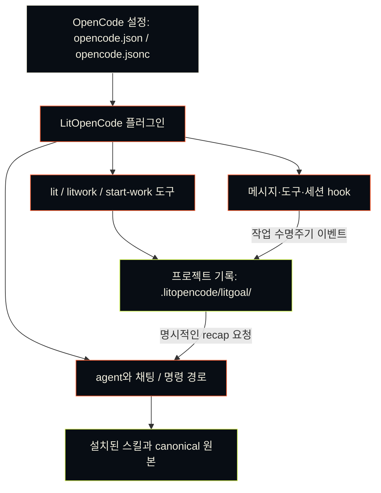

<p align="center"><picture><source media="(prefers-reduced-motion: reduce)" srcset="https://cdn.jsdelivr.net/npm/@litfamily/litopencode@1.0.9/docs/assets/cover-motion-still.webp" /></picture></p>

<p align="center"></p>

<details>
<summary>ASCII 로고 복사</summary>

```text
                             ▄▄▄▄
                   ▗███▌   ▗██████▖
 ▗▄▄▄▄▄          ▗▟████▌   ▝██████▘
 ▐█████        ▗▟██████▌    ▝▀▜█▀▘
 ▐█████      ▗▟███████▄▄▄▄▄▄▄▄▄▄▄▄▄▄▄▄▄▄▄▄
 ▐█████    ▗▟█████████████████████████ ▐█▀
 ▐█████    ████████████████████████████▀
 ▐█████    ██▛▘   ▄ ▄▄▄▄▖▄▄▄▄▄▄▄▄▄▄▄▄▄▖
 ▐█████    ▀    ▄██ ████▌█████████████▌
 ▐█████       ▄████ ████▌█████████████▌
 ▐█████     ▄█████▛                                 litopencode
 ▐█████  ▗▟█████▀▘       ▄▄▄▄▄     ▗▖
 ▐█████ ▐█████▀          █████     ▐▛▀
 ▐█████ ▐███▀            █████
 ▐█████ ▐█▀              █████
 ▐█████ ▝                █████
 ▐█████▄▄▄▄▄▄▄▖          █████
 ▐███████████▛           █████
 ▐██████████▀            █████

```

</details>

# LitOpenCode

[English](https://cdn.jsdelivr.net/npm/@litfamily/litopencode@1.0.9/README.md) · [한국어](https://cdn.jsdelivr.net/npm/@litfamily/litopencode@1.0.9/README-Ko-KR.md)

> **불씨를 건네받았다.**<br>
> **이제, 당신의 작업에 옮길 차례다.**

<p align="center"></p>
<p align="center"></p>

<p align="center">
<a href="#설치"></a>
<a href="https://cdn.jsdelivr.net/npm/@litfamily/litopencode@1.0.9/LICENSE"></a>
</p>

<p align="center">
<a href="https://cdn.jsdelivr.net/npm/@litfamily/litopencode@1.0.9/docs/reference-Ko-KR.md"> 문서</a> &nbsp; <a href="#설치">설치</a> &nbsp; <a href="#스킬-한눈에-보기">스킬</a> &nbsp; <a href="#ignition-motion"> Ignition</a> &nbsp; <a href="https://cdn.jsdelivr.net/npm/@litfamily/litopencode@1.0.9/LICENSE"> MIT</a>
</p>

## LitOpenCode란

LitOpenCode는 OpenCode에 워크플로 agent, 슬래시 명령, 로컬 근거 기록을 더합니다.

## 설치

Node.js/npm과 OpenCode가 준비된 환경에서 실행하세요.

scoped 패키지를 Node.js/npm과 OpenCode가 준비된 환경에서 설치하세요.

```sh
LIT_PACKAGE='@litfamily/litopencode@latest'
npm exec --package "$LIT_PACKAGE" -- litopencode install
```

OpenCode를 재시작하고 `Tab` 키를 눌러 `lit-loop`를 선택합니다. 모델 접근과 인증은
OpenCode의 provider 설정을 사용합니다. 설치 과정에서 모델, 권한, 출력 스타일을
선택할 수 있으며 기본 권한은 safe/ask-first입니다.

OpenAI provider를 사용하는 새 설치는 계획·검토에 GPT-6 Astra (`gpt-6-astra`)/`xhigh`, 실행·연구에 GPT-6 Luna (`gpt-6-luna`)/`max`를 기본으로 사용합니다. 설치 중 지원되는 모델과 추론 수준을 선택할 수 있습니다.

```sh
npm exec --package @litfamily/litopencode@latest -- litopencode install --dry-run  # 변경 사항 미리 보기
npm exec --package @litfamily/litopencode@latest -- litopencode install --yes     # 기본값 사용, 저장된 선택 유지
```

설치 도구는 OpenCode 설정 루트에 플러그인과 native 명령·스킬 파일을 등록합니다.
route 파일은 `~/.config/opencode/litopencode.json`이며 `XDG_CONFIG_HOME`을 지정하면
설정 루트가 달라집니다. 기존 custom route는 사용자 소유로 유지됩니다.
custom root, 모델 선택, 터미널 정책, 무인 설치는 [상세 안내](https://cdn.jsdelivr.net/npm/@litfamily/litopencode@1.0.9/docs/reference-Ko-KR.md#설치)를 참고하세요.

이 checkout의 패키지는 `@litfamily/litopencode@1.0.9`입니다. registry의 `@latest`는 다를 수 있으므로
정확한 버전이 필요하면 `npm view @litfamily/litopencode version`으로 확인하세요.

## 처음 사용하기

작은 작업 하나부터 시작하세요. 빈 작업 폴더를 OpenCode에서 열고, `lit-loop`를
선택한 뒤 채팅에 다음을 입력합니다.

```text
lit 외부 의존성 없이 index.html 하나로 할 일 목록을 만들고, 추가와 완료 표시를 확인한 뒤 다음 할 일을 남겨줘.
```

첫 결과는 `index.html`입니다. 직접 열어 항목 추가와 완료 표시를 확인하세요.

작업을 다시 시작할 때는 `/lit-recap`으로 기록을 읽고 이어갈 일을 확인합니다.

`/lit`도 같은 워크플로를 시작합니다. 계획 검토가 필요한 작업은 `lit-plan`에서 계획을
작성하고 승인한 뒤 `/start-work`로 실행하며 `/review-work`로 마무리합니다.
승인된 계획은 `lit-implement`가 실행합니다. planner는 명시적인 사용자 승인을 기다립니다.
파일 편집이나 shell 실행 권한은 없습니다.

진행 상황과 근거는 `.litopencode/litgoal/`에 저장합니다. OpenCode에는 native goal
primitive가 없으므로 이 프로젝트별 로컬 기록으로 작업을 재개합니다. 정적 스킬은
문서에 명시된 경로로 선택했을 때 작업 지침을 제공합니다.

## 주요 기능

> **불씨를 건네받았다.**<br>
> **이제, 당신의 작업에 옮길 차례다.**

고치고 싶은 버그 하나. 만들고 싶은 화면 하나. 끝내고 싶은 프로젝트 하나.

시작은 짧은 한 줄이면 됩니다. 어려운 건 그다음입니다. 대화가 길어지고 세션이
바뀌면, 어디까지 했는지부터 다시 짚어야 합니다. 어떤 결정을 내렸는지,
무엇을 확인했는지, 다음에는 무엇을 해야 하는지.

**LIT은 그 불씨를 남깁니다.** 목표와 계획, 확인한 결과, 다음에 할 일을 프로젝트에
기록합니다. 다음 세션에서 그 기록을 읽고 작업을 이어갈 수 있도록.

**대화가 끝난 자리에서, 다음 작업이 시작되도록.**

 다른 LitFamily 제품을 설치하지 않아도 독립적으로 사용할 수 있습니다.
“꺼지지 않는 불”은 프로그램이 끝없이 돌아간다는 뜻이 아닙니다.
**세션이 끝나도, 이어갈 작업을 남긴다는 뜻입니다.**

```text
계획하기 → 만들기 → 확인하기 → 다음 작업에 건네기
```

### 실제 경로와 편집 이미지

`lit` 또는 `/lit`으로 범위가 정해진 작업을 시작하고, `handoff` 또는 `/lit-handoff`로 확인한 결과와 다음 단계를 건넵니다. `lit-plan`은 계획을 준비하고, `/start-work <승인된 계획>`은 승인한 계획을 실행하며, `/review-work`는 변경과 근거를 검토하고, `/litresearch`는 제공된 출처 기반 조사 경로를 사용합니다. 기대하는 효과는 다음 세션이 이어갈 수 있는 프로젝트별 목표·근거·다음 단계 기록입니다. 호스트 제약도 분명합니다. 모델 실행과 권한 질문은 OpenCode가 담당하고 plugin은 경로와 기록을 제공하므로, 경로를 선택했다는 사실만으로 실행이나 화면 확인을 증명할 수 없습니다.

Lit 경로가 활성화되면 답변이 굵은 점화 문구로 시작합니다. 플러그인은 글리프를 지원하는 환경에서 다섯 줄의 micro 로고와 마지막 `🔥 LIT IGNITED · <discipline> 🔥` 문구를 6초 동안 경고 토스트로 표시하도록 요청합니다. 글리프를 지원하지 않으면 문구만 표시합니다.

<p align="center"></p>

<p align="center"><a href="https://cdn.jsdelivr.net/npm/@litfamily/litopencode@1.0.9/docs/assets/readme/ignition-film.mp4"></a></p>

포스터를 선택하면 선택형 영상을 엽니다. README에서 자동 재생하지 않습니다.

소스 트리의 `docs/assets/cover.svg`는 편집 가능한 저대역폭 대체 표지이며, 위 WebP는 제품 강조 표지입니다.

소스 트리에는 편집 가능한 저대역폭 벡터 대체 표지 `docs/assets/cover.svg`가 남아 있습니다.

### OpenCode 안에서 어떻게 동작하나요?

OpenCode는 설정 파일에서 플러그인을 불러옵니다. agent와 채팅·명령 경로는
워크플로와 설치된 스킬을 선택합니다. 도구와 작업 수명주기 hook이 프로젝트에
기록을 남기며, 돌아왔을 때 그 기록을 읽고 작업을 이어갈 수 있습니다.



### 디자인 제작과 README

OpenCode 네이티브 스킬 `frontend-ui-ux`는 충분한 구현 요청을 받으면 작업 화면을 만들고 렌더링을 확인합니다. 중요한 방향이 모호할 때만 질문하며 답변을 보존합니다. 검토·계획 요청은 읽기 전용입니다.

네이티브 스킬 도구에서 `readme-studio`를 선택하면 실제 저장소 정보로 README와 표지를 제작합니다. 로컬 글꼴의 윤곽선, Remotion/HyperFrames 예제, 정적·동적 출력 절차가 함께 설치됩니다. 이미지 생성 도구가 없으면 `IMAGE_GENERATION_UNAVAILABLE`을 알리고 제공된 배경으로 이어갑니다. 공개 GitHub/npm 렌더링 검증은 별도 단계입니다. 전용 슬래시 명령은 없습니다.

개념도, 로컬 검증, 안전한 다이어그램 가져오기와 이미 설치된 도구를 이용한 내보내기에는 OpenCode 네이티브 스킬 선택기에서 `lit-diagram-drawer`를 선택하세요. 제품 화면은 `frontend-ui-ux`, 측정된 과학 데이터 그림은 `lit-scientific-visualization`이 담당합니다. 범위가 정해진 다이어그램 제작 요청 뒤에 `lit`을 붙이면 작성 전에 이 네이티브 스킬을 불러오도록 안내합니다. 별도 슬래시 명령이나 독립된 다이어그램 채팅 경로는 없습니다.

### 워드 보고서와 파워포인트 발표자료

`lit-docx`는 마크다운 원본을 보존하며 편집 가능한 워드 보고서를 만들고, `lit-pptx`는 발표자료를 파워포인트로 컴파일합니다. 보고서나 발표자료 요청에 `lit`을 붙이면 OpenCode가 알맞은 네이티브 스킬을 불러오도록 안내하며, 둘 다 요청하면 두 스킬을 사용합니다. 한국어 보고서 기본값은 korean-generic, 발표자료 기본값은 AZURE-PRO와 Pretendard입니다. 고정된 의존성은 처음 사용할 때 LitOpenCode 전용 캐시에 설치합니다. 구조·품질 검사 뒤 LibreOffice가 있으면 렌더링 결과를 눈으로 확인합니다. 출판사 프로필, DOCX 편집과 PDF 변환, 템플릿 학습, 글꼴 포함 방법은 설치된 스킬에 설명되어 있습니다. `litopencode doctor`는 설치 없이 준비 상태를 보여 줍니다.

### 문장 다듬기와 브라우저 작업

긴 글을 다듬거나 명시적으로 검토할 때 `/lit-humanizer`를 사용합니다. 의미와 작성자의 목소리, 필요한 한정 표현을 보존합니다. `/lit-korean`, `/text-naturalization`, `/text-neutralization`, `/korean-ai-slop-remover`도 같은 경로로 연결됩니다. 지원하는 텍스트 파일은 저장 전에 명확한 작성 잔여 표현을 검사하고, 스타일 경고는 참고 정보로 전달합니다. DOCX·PPTX와 사용할 수 있는 PDF 텍스트는 생성 후 확인합니다.

`browser-drive`는 [vercel-labs/agent-browser](https://github.com/vercel-labs/agent-browser)의 `agent-browser` 엔진을 사용합니다. 검증된 최소 버전은 0.34.0이며, 형식이 올바른 이후 버전은 검증 기준 이후 버전으로 표시합니다. 엔진이 없다면 직접 `npm install -g agent-browser`와 `agent-browser install`을 실행한 뒤 `node skills/browser-drive/scripts/capability-probe.mjs`로 확인하세요. LitOpenCode가 자동 설치하지는 않습니다.

## 스킬 한눈에 보기

스킬마다 만들어 내는 결과, 여는 방법, 얻는 것을 한 줄씩 정리했습니다.

<table>
<tr><th>이렇게 됩니다</th><th>스킬</th><th>얻는 것</th></tr>
<tr>
<td></td>
<td><code>litwork</code> · <code>workflow-loop</code><br /><sub><code>lit</code> · <code>/litwork</code></sub></td>
<td>요청에 <code>lit</code>만 붙이세요. 작업이 틀 잡기, 근거 찾기, 계획, 실행, 검증, 리뷰, 정리 순서로 진행됩니다.</td>
</tr>
<tr>
<td></td>
<td><code>durable-litgoal</code><br /><sub><code>/litgoal</code> · <code>/lit-goal</code></sub></td>
<td>OpenCode에 목표 기능이 없을 때, 확인 가능한 기준이 붙은 목표 하나를 디스크에 남깁니다.</td>
</tr>
<tr>
<td></td>
<td><code>lit-plan</code><br /><sub><code>/lit-plan</code></sub></td>
<td>승인 관문에서 멈추는 체크리스트를 만듭니다. lit-plan 에이전트는 파일 수정도, 셸 명령도 할 수 없습니다.</td>
</tr>
<tr>
<td></td>
<td><code>start-work</code><br /><sub><code>/start-work</code></sub></td>
<td>승인된 계획을 조각마다 실행합니다. 권한이나 버전이 어긋나면 멈춥니다.</td>
</tr>
<tr>
<td></td>
<td><code>review-work</code><br /><sub><code>/review-work</code></sub></td>
<td>리뷰 다섯 갈래가 심각한 문제부터 보여주고, 갈래마다 통과·실패·미실행을 적습니다.</td>
</tr>
<tr>
<td></td>
<td><code>litresearch</code><br /><sub><code>lit research &lt;question&gt;</code> · <code>/litresearch</code></sub></td>
<td>여러 차례로 나눠 조사하고, 주장마다 근거 기록과 불확실성을 남깁니다.</td>
</tr>
<tr>
<td></td>
<td><code>doctor-installer</code><br /><sub><code>litopencode install</code> · <code>litopencode doctor</code></sub></td>
<td>LitOpenCode를 OpenCode에 설치합니다. <code>--dry-run</code>은 바뀔 내용만 보여주고 아무것도 쓰지 않습니다.</td>
</tr>
<tr>
<td></td>
<td><code>lit-fetch</code><br /><sub><code>/lit-fetch</code> · <code>litopencode fetch-public &lt;url&gt; --json</code></sub></td>
<td>보안 검사를 거쳐 공개 페이지를 가져오고, 결과를 이름 붙은 판정으로 돌려줍니다.</td>
</tr>
<tr>
<td></td>
<td><code>lit-init</code><br /><sub><code>/lit-init</code></sub></td>
<td>필요한 폴더에만 짧은 AGENTS.md 안내서를 만듭니다.</td>
</tr>
<tr>
<td></td>
<td><code>lit-crucible</code><br /><sub><code>/lit-crucible</code></sub></td>
<td>계획 전에 요구사항을 반박해 봅니다. 반박을 견딘 위험만 계획으로 넘어갑니다.</td>
</tr>
<tr>
<td></td>
<td><code>refactor</code><br /><sub><code>/refactor</code></sub></td>
<td>동작을 테스트로 고정한 채 코드 구조를 바꿉니다. 단계마다 확인합니다.</td>
</tr>
<tr>
<td></td>
<td><code>lit-burnoff</code><br /><sub><code>/lit-burnoff</code></sub></td>
<td>테스트로 동작을 먼저 묶어 두고, 변경분에 붙은 AI식 군더더기를 걷어냅니다.</td>
</tr>
<tr>
<td></td>
<td><code>lit-burnoff-file</code><br /><sub><code>/lit-burnoff-file</code></sub></td>
<td>방금 수정한 파일 하나를 그 변경분 기준으로 정리합니다.</td>
</tr>
<tr>
<td></td>
<td><code>lit-code</code><br /><sub><code>/lit-code</code></sub></td>
<td>최소한의 코드부터 씁니다. Given/When/Then 테스트와 정리 기록을 남깁니다.</td>
</tr>
<tr>
<td></td>
<td><code>debugging</code><br /><sub><code>/debugging</code></sub></td>
<td>버그를 재현하고, 가설을 세 개 이상 세워 확인한 뒤, 확인된 원인만 고칩니다.</td>
</tr>
<tr>
<td></td>
<td><code>lit-commit</code><br /><sub><code>/lit-commit</code></sub></td>
<td>변경을 저장소 스타일에 맞는 작은 커밋으로 나눕니다. 관계없는 작업은 건드리지 않습니다.</td>
</tr>
<tr>
<td></td>
<td><code>lsp</code><br /><sub><code>/lsp</code></sub></td>
<td>OpenCode가 이미 가진 언어 서버에서 진단을 읽습니다. LitOpenCode는 서버를 따로 넣지 않습니다.</td>
</tr>
<tr>
<td></td>
<td><code>lsp-setup</code><br /><sub><code>/lsp-setup</code></sub></td>
<td>어떤 파일 형식에 언어 서버가 없으면 설치 명령 하나를 제안하고, 승인을 기다립니다.</td>
</tr>
<tr>
<td></td>
<td><code>rules</code><br /><sub><code>/rules</code></sub></td>
<td>저장소 규칙을 두 갈래로 읽습니다. 세션 시작 때 한 번, 파일을 수정할 때 다시 한 번.</td>
</tr>
<tr>
<td></td>
<td><code>deep-interview</code><br /><sub><code>/deep-interview</code></sub></td>
<td>하지 않을 일과 결정 범위가 분명해질 때까지 한 번에 한 질문씩 묻습니다.</td>
</tr>
<tr>
<td></td>
<td><code>structural-search</code><br /><sub><code>/structural-search</code></sub></td>
<td>확인된 엔진으로 문법 구조를 찾습니다. 그렇지 않은 결과에는 TEXTUAL 표시를 붙입니다.</td>
</tr>
<tr>
<td></td>
<td><code>browser-drive</code><br /><sub><code>/browser-drive</code></sub></td>
<td>브라우저 드라이버를 먼저 확인한 뒤 실제 페이지를 조작합니다. 드라이버가 없으면 그렇다고 말합니다.</td>
</tr>
<tr>
<td></td>
<td><code>lit-humanizer</code><br /><sub><code>/lit-humanizer</code></sub></td>
<td>딱딱한 AI 문장을 한국어나 영어로 다시 씁니다. 사실과 단서는 남기고 군더더기는 뺍니다.</td>
</tr>
<tr>
<td></td>
<td><code>lit-recap</code><br /><sub><code>/lit-recap</code></sub></td>
<td>읽기 전용 요약입니다. 끝난 일, 진행 중인 일, 막힌 곳, 증거 위치, 다음 단계를 보여줍니다.</td>
</tr>
<tr>
<td></td>
<td><code>lit-comprehend</code><br /><sub><code>/lit-comprehend</code></sub></td>
<td>에이전트가 쓴 작업을 이해하도록 돕는 설명 페이지입니다. 직관, 흐름 설명, 짧은 퀴즈 순서입니다.</td>
</tr>
<tr>
<td></td>
<td><code>lit-handoff</code><br /><sub><code>handoff</code> · <code>/lit-handoff</code></sub></td>
<td><code>handoff</code>라고 치면 다음 세션이 읽고 이어갈 인수인계 파일이 생깁니다.</td>
</tr>
<tr>
<td></td>
<td><code>lit-scientific-visualization</code><br /><sub><code>/lit-scientific-visualization</code></sub></td>
<td>학술지 규격 그림을 벡터와 600 DPI로 내보냅니다. 그래프 종류는 데이터 성격에 맞춰 고릅니다.</td>
</tr>
<tr>
<td></td>
<td><code>lit-diagram-drawer</code><br /><sub><code>skill picker</code></sub></td>
<td>슬라이드와 문서에 넣을 다이어그램을 편집 가능한 형태로 그리고, 검사한 뒤 PNG와 SVG로 내보냅니다.</td>
</tr>
<tr>
<td></td>
<td><code>lit-pptx</code><br /><sub><code>skill picker</code></sub></td>
<td><code>lit</code>으로 발표자료를 요청하면 Markdown 원고에서 편집 가능한 PowerPoint 파일을 만듭니다. 기본은 AZURE-PRO이고, 품질 검사와 렌더링 확인을 거칩니다. 스킬 선택기에서도 열 수 있습니다.</td>
</tr>
<tr>
<td></td>
<td><code>lit-docx</code><br /><sub><code>skill picker</code></sub></td>
<td><code>lit</code>으로 보고서를 요청하면 서식을 갖춘 Word 파일과 원고 Markdown이 나옵니다. 한국어는 korean-generic 서식을 쓰고, 문체 검사와 렌더링 확인이 뒤따릅니다. 스킬 선택기에서도 열 수 있습니다.</td>
</tr>
<tr>
<td></td>
<td><code>autoresearch</code><br /><sub><code>/autoresearch</code> · <code>/autoresearch-&lt;mode&gt;</code></sub></td>
<td>승인된 예산 안에서 실험을 반복합니다. 한 번에 하나만 바꾸고, 결과에 따라 남기거나 되돌립니다.</td>
</tr>
<tr>
<td></td>
<td><code>autoconference</code><br /><sub><code>/autoconference</code> · <code>/autoconference-&lt;mode&gt;</code></sub></td>
<td>예산을 정한 연구 회의입니다. 연구자와 리뷰어가 따로 일하고, 종합에는 반대 의견도 남깁니다.</td>
</tr>
<tr>
<td></td>
<td><code>wikify</code><br /><sub><code>/wikify-ingest</code> · <code>/wikify-query</code></sub></td>
<td>검토를 거친 프로젝트 지식을 디스크에 두고, 나중 질문에 출처와 함께 답합니다.</td>
</tr>
<tr>
<td></td>
<td><code>frontend-ui-ux</code><br /><sub><code>skill picker</code></sub></td>
<td>실제로 동작하는 화면을 만들고, 측정 프로브로 일곱 가지 보기에서 확인합니다. 네 가지 폭, 다크 모드, 모션 줄이기, 200% 확대입니다. 스킬 선택기에서 엽니다.</td>
</tr>
<tr>
<td></td>
<td><code>readme-studio</code><br /><sub><code>skill picker</code></sub></td>
<td>사실에 맞는 README와 확인을 거친 커버, 윤곽선 글자를 만듭니다. 스킬 선택기에서 엽니다.</td>
</tr>
<tr>
<td></td>
<td><code>lit-typographic-motion</code><br /><sub><code>skill picker</code></sub></td>
<td><code>lit</code>으로 영상을 요청하면 트리트먼트를 먼저 쓰고, 무대 페이지를 그리거나 글자를 움직입니다. 영상은 검사와 눈으로 보는 확인을 거쳐 넘깁니다. 스킬 선택기에서도 열 수 있습니다.</td>
</tr>
<tr>
<td></td>
<td><code>visual-qa</code><br /><sub><code>skill picker</code></sub></td>
<td>실제 화면을 증거로 확인하고, 쓰기 권한은 늘리지 않습니다. 스킬 선택기에서 엽니다.</td>
</tr>
<tr>
<td></td>
<td><code>agent-roster</code> · <code>reference-benchmark-claims</code> · <code>native-goal-verdict</code> · <code>search-workflow-ideas</code> · <code>release-guardrails</code> · <code>comment-checker</code> · <code>tool-guards</code><br /><sub>자동 실행</sub></td>
<td>알아서 돌아갑니다. LitOpenCode 에이전트를 등록하고, 수정 뒤 주석을 확인하고, 범위 없는 “항상 더 낫다” 주장을 막습니다.</td>
</tr>
</table>

## A/B 결과

과제마다 가볍게 던지는 한국어 한 줄을 프롬프트로 썼습니다. lit 쪽은 같은 문장 끝에 ` lit`만 붙였습니다. 두 쪽 모두 2026-09-26(UTC)에 OpenCode 1.18.32와 `openai/gpt-6-sol`, 추론 강도 `high`로 실행했습니다. 기준선은 분리된 프로필의 순정 OpenCode이고, lit 쪽은 배포 전 로컬 빌드의 LitOpenCode를 썼습니다. 한 쌍은 양쪽 결과를 하나씩 비교합니다. 기준선은 한 번만 실행했고, lit 쪽은 제품을 고친 뒤의 마지막 실행 결과입니다. 블라인드 심사(Claude Opus 5.5)는 제품 표식을 지운 두 결과를 순서를 바꿔 두 번 비교했고, 두 판정이 엇갈리면 무승부로 셌습니다. 그다음 메인테이너가 두 결과를 나란히 보고 최종 판정을 내렸습니다.

S3·S4·S11은 인터페이스 라운드, S5·S8·S9는 오피스 라운드 결과이며 같은 과제의 이전 실행을 대신합니다.

| 과제 | 프롬프트 | 최종 판정 | 블라인드 심사 (같은 라운드) |
|---|---|---|---|
| S1 터미널 할 일 CLI | 터미널에서 쓰는 할 일 관리 CLI 만들어줘 | **LitOpenCode 승** | 기준선 승 |
| S2 API 서버 버그 | 이 API 서버 가끔 이상하게 동작하는데 고쳐줘 | **LitOpenCode 승** (블라인드 심사 결과, 눈으로 검토하지 않음) | LitOpenCode 승 |
| S3 가계부 대시보드 | 개인 가계부 대시보드 웹페이지 만들어줘 | **LitOpenCode 승** | LitOpenCode 승 |
| S4 카페 랜딩페이지 | 동네 카페 브랜드 랜딩페이지 만들어줘 | **LitOpenCode 승** | 기준선 승 |
| S5 자료 기반 보고서·발표자료 | sources 폴더 자료로 보고서랑 발표자료 만들어줘 | **LitOpenCode 승** | LitOpenCode 승 |
| S6 Node 22→24 조사 | Node 22에서 24로 올릴 때 달라지는 거 조사해줘 | **LitOpenCode 승** | 무승부 |
| S7 주문·결제·배송 구조도 | 주문-결제-배송 서비스 구조도 그려줘 | **LitOpenCode 승** | LitOpenCode 승 |
| S8 분기 실적 발표자료 | 분기 실적 발표자료 만들어줘 | **LitOpenCode 승** | 기준선 승 |
| S9 신제품 기획서 | 신제품 기획서 써줘 | **LitOpenCode 승** | 무승부 |
| S11 회의실 예약 웹앱 | 회의실 예약 웹앱 만들어줘 | **LitOpenCode 승** | 무승부 |
| 합계 | | **10승** | 4승 3무 3패 |

모션 스킬 `lit-typographic-motion`은 첫 A/B 이후 새로 만들었고, 아직 A/B 결과가 없습니다. 이 README 맨 위 표지는 LitFamily 모션 스킬로 만들었습니다.

### 양쪽이 만든 결과

- **S1.** 두 CLI 모두 처음부터 끝까지 동작했습니다. lit 쪽은 열린 항목·완료 항목 필터와 `--file` 옵션을 더했고 자체 테스트 4개를 통과했습니다(기준선은 3개). 심사는 편집 명령이 있고 저장 폴더를 스스로 만드는 기준선을 골랐지만, 메인테이너는 테스트 4개를 모두 통과한 lit을 택했습니다.
- **S2.** lit은 숨은 오류 6개를 모두 고쳤고(기준선은 5개), README의 잘못된 실행 명령을 바로잡았으며, 항목을 만들면 `201`을 돌려줍니다. 시간대 회귀 테스트는 `TZ`를 따로 지정한 별도 프로세스에서 실행됩니다. 메인테이너가 검토하지 않은 쌍이라 심사 결과를 그대로 썼습니다.
- **S3.** 기준선 대시보드는 화면과 차트가 더 많지만, 맨 위 잔액에 고정 금액을 더해 자기 수입·지출 수치와 맞지 않습니다. lit은 숫자가 서로 맞고, 예시 데이터를 표시해 지울 수 있게 했으며, 다크 모드도 동작합니다. axe 접근성 검사에 걸린 요소는 lit 15개, 기준선 111개였습니다.
- **S4.** 기준선은 가격이 붙은 사진 메뉴와 필터, 주소·영업시간·연락처까지 갖춰 완성된 카페 사이트처럼 보입니다. lit은 픽셀 아트 커피잔을 넣은 콘셉트 페이지 ‘골목의 온도’를 만들었지만, 받은 정보가 없던 주소와 영업시간을 ‘준비 중’으로 남겼고 답변에 규칙 코드가 적힌 점검 표를 붙였습니다. 심사는 이 두 가지를 감점해 기준선을 골랐고, 메인테이너는 lit 페이지를 택했습니다.
- **S5.** lit은 편집 가능한 워드 보고서와 6장짜리 파워포인트 발표자료를 각각 마크다운 원본과 함께 만들고 렌더링 결과를 확인했습니다. 기준선은 보고서와 Marp 호환 발표자료를 마크다운으로만 남겼습니다. 확인한 사실 11개는 양쪽 모두 맞았고 틀린 것은 없었으며, 심사는 lit의 장식적인 표지 슬라이드, 어긋난 글머리표, 남겨 둔 점검 파일을 지적했습니다.
- **S6.** lit의 답에는 `--trace-deprecation`, 롤백 계획, 배포 파이프라인 점검처럼 바로 따라 할 수 있는 단계가 더 많았습니다. 공식 출처 링크 비율은 80% 대 57%, 서로 다른 링크는 10개 대 7개였고, 기준선은 ‘확인할 것’ 열을 둔 간결한 개요였습니다. 심사의 두 판정이 엇갈려 무승부가 됐습니다.
- **S7.** lit은 내부 서비스 경계, 외부 결제 대행사와 택배사, 실패 경로를 담은 편집 가능한 HTML 구조도를 렌더링해 넘겼습니다. 기준선은 데이터베이스, 메시지 브로커, 게이트웨이까지 더 많은 인프라를 설명했지만 Mermaid 코드를 대화에만 남겼습니다. lit은 필요한 브라우저를 쓸 수 없어 PNG를 내보내지 못했다고 밝혔습니다.
- **S8.** 회사명도 실적 수치도 주어지지 않았습니다. 기준선은 입력 칸을 둔 깔끔한 10장짜리 템플릿을 만들었고, lit은 가상 회사를 세워 차트 3개가 들어간 7장짜리 발표자료를 만들면서 모든 수치를 가정이라고 표시했습니다. 심사는 lit의 검은 테두리 상자, 제각각인 막대 색, 장식용 원을 감점해 기준선을 골랐고, 메인테이너는 lit을 택했습니다.
- **S9.** 기준선은 기획서를 대화창에만 쓰고 파일을 만들지 않았습니다. lit은 의사결정 기준, 단위 경제성, 손익분기 계산을 담은 5쪽짜리 편집 가능한 워드 기획서를 썼고, 심사는 ‘예시 가정’ 표시가 너무 잦다고 봤습니다. 심사는 무승부였지만, 메인테이너는 기준선이 문서 파일조차 만들지 못했다는 점을 들어 lit을 택했습니다.
- **S11.** lit 앱에는 겹치는 예약, 시간 칸, 손상된 저장 데이터를 다루는 테스트와 다크 모드가 있고, 답변에 따르면 페이지에서 예약 흐름을 직접 확인했습니다. 기준선은 시간표를 지어낸 예약으로 채우고 회의실 사진을 인터넷에서 불러오며, 가짜 워크스페이스 전환기 같은 장식을 더했습니다. 심사의 두 판정이 엇갈려 무승부가 됐습니다.

### 화면과 문서

인터페이스 라운드, 데스크톱 화면:

| 과제 | 기준선 | LitOpenCode |
|---|---|---|
| S3 |  |  |
| S4 |  |  |
| S11 |  |  |

<details>
<summary>휴대전화 화면</summary>

| 과제 | 기준선 | LitOpenCode |
|---|---|---|
| S3 |  |  |
| S4 |  |  |
| S11 |  |  |

</details>

S5, lit 발표자료입니다. 기준선은 마크다운만 남겨 렌더링된 결과가 없습니다.


S8, 기준선 발표자료와 lit 발표자료입니다.


S9, lit 기획서 페이지입니다. 기준선은 파일 없이 대화창에만 답했습니다.


S7, lit 구조도입니다.


## 명령어

### 작은 lit 작업부터 시작하기

프롬프트에 `lit`을 붙이거나 `/lit`을 입력해 LitOpenCode 워크플로를 선택하세요. 모델과 권한 질문은 OpenCode가 담당하고 plugin은 프로젝트 기록을 남깁니다.

| 프롬프트 또는 경로 | 효과 |
| --- | --- |
| `lit` 또는 `/lit` | 확인 기준이 있는 작은 작업을 시작합니다. |
| `handoff` 또는 `/lit-handoff` | 현재 결과와 다음 할 일을 다음 세션으로 건넵니다. |
| `lit-plan` | 구현 전에 계획을 준비합니다. |
| `/start-work <승인된 계획>` | 승인한 계획을 실행합니다. |
| `/review-work` | 변경과 근거를 검토합니다. |
| `/litresearch` | 출처를 남기는 제공된 조사 경로를 사용합니다. |

경로를 선택했다는 사실만으로 모델 실행이나 화면 확인을 증명할 수 없습니다.

패키지의 참조 원본은 `vendor/handoff/`와 `vendor/scientific-visualization/`의
canonical 경로를 사용합니다. 번호가 붙은 license·provenance 파일명은 출처 기록으로
그대로 보존합니다.

### 주요 경로

| 경로 | 용도 |
| --- | --- |
| `/lit` 또는 `/litwork` | 범위가 분명한 작업 구현과 검증 |
| `/lit-plan` → `/start-work` → `/review-work` | 계획, 승인, 실행, 검토 |
| `/litresearch` 또는 `/lit-research` | 출처 근거를 남기는 연구, 순차 대체 경로 지원 |
| `/lit-handoff` | 작업 재개 맥락 저장. 정확히 `handoff`만 입력해도 연결 |
| `/lit-recap` | 로컬 상태의 짧은 요약 |
| `/lit-code`, `/debugging`, `/refactor` | 코딩, 디버깅, 리팩터링 지침 |
| `/lit-korean` | 의미를 유지하며 한국어 문장 다듬기 |
| `/lit-scientific-visualization` | 패키지에 포함된 과학 시각화 워크플로 |

Autoresearch, Autoconference, Wikify, UI/UX는 [전체 경로 안내](https://cdn.jsdelivr.net/npm/@litfamily/litopencode@1.0.9/docs/reference-Ko-KR.md#주요-명령)에,
두 가지 rule 처리 경로는 [규칙 엔진 상세 안내](https://cdn.jsdelivr.net/npm/@litfamily/litopencode@1.0.9/docs/reference.md#safety-and-updates)에서 확인하세요.
이전 스킬 이름은 한 릴리스 동안 별칭으로 연결됩니다. [마이그레이션 안내](https://cdn.jsdelivr.net/npm/@litfamily/litopencode@1.0.9/docs/migration.md#skill-id-renames)를 확인하세요.

## 안전과 업데이트

- `lit-plan`의 `edit`, `bash`, `task`는 계속 거부됩니다. `balanced`와 `yolo`는 명시적으로
  선택해야 하며 planner 보호나 하위 agent의 재귀 위임 금지를 해제하지 않습니다.
- 공개 자료를 검색할 때는 목적지, redirect, byte 한도를 검사합니다. 가져온 본문은 데이터로 취급합니다.
- 대화형 시작과 install/doctor 성공 후 foreground 업데이트 검사가 실행될 수 있습니다.
  `--no-auto-update` 또는 `LITOPENCODE_NO_AUTO_UPDATE=1`로 자동 업데이트를 끌 수 있습니다.
- 스킬 학습 결과는 명시적인 apply 명령이 있어야 반영됩니다. 학습의 review·변경·rollback·curator는
  POSIX를 지원하며 Windows에서는 해당 경계를 차단합니다. 설치, doctor, 수동 조회에는
  이 제한이 적용되지 않습니다. [학습 루프 상세 안내](https://cdn.jsdelivr.net/npm/@litfamily/litopencode@1.0.9/docs/reference.md#skill-learning-loop).

## 문제 해결

모델의 완료 보고와 실제 동작이 다르면 그 차이를 알려주세요.

패키지와 설정 상태를 확인하려면 다음 진단 명령을 실행하세요.

```sh
npm exec --package @litfamily/litopencode@latest -- litopencode doctor
```

[설치와 모델 설정 안내](https://cdn.jsdelivr.net/npm/@litfamily/litopencode@1.0.9/docs/reference-Ko-KR.md#설치)를 참고하세요.

`install`과 `doctor`는 `<root>/skills`가 심볼릭 링크일 때 그 사실과 git 저장소 경고를
보고하며, `~/.agents/skills`, `~/.claude/skills`, 프로젝트 스킬 디렉토리에 같은 이름의
스킬이 있으면 함께 알려줍니다. 자세한 내용은
[심볼릭 링크된 native 스킬 루트와 다른 위치의 같은 이름 스킬](https://cdn.jsdelivr.net/npm/@litfamily/litopencode@1.0.9/docs/reference-Ko-KR.md#심볼릭-링크된-native-스킬-루트와-다른-위치의-같은-이름-스킬)을
참고하세요.

## 제거

`litopencode uninstall` 명령은 없습니다. OpenCode의 `opencode.jsonc` 또는 custom root의
`opencode.json`에서 `plugin` 배열의 `@litfamily/litopencode`·`@litfamily/litopencode@<version>` 항목을 제거하세요.
전역 설치를 했다면 npm binary도 제거합니다.

```sh
npm uninstall -g @litfamily/litopencode
```

설치된 명령·스킬 파일은 소유 관계를 확인한 뒤 설치 도구가 관리하는 복사본만 제거하세요.
사용자가 만든 파일과 수정 내용은 보존합니다. route가 필요하면 `litopencode.json`을,
작업을 재개할 계획이라면 프로젝트의 `.litopencode/` 기록을 남기세요. 제거 후 OpenCode를
재시작합니다. [제거 상세 안내](https://cdn.jsdelivr.net/npm/@litfamily/litopencode@1.0.9/docs/reference-Ko-KR.md#제거).

## 라이선스

MIT

## 링크

### 문서

- [워크플로 상세 안내](https://cdn.jsdelivr.net/npm/@litfamily/litopencode@1.0.9/docs/reference-Ko-KR.md): 모델, 권한, host 연결, 명령, 검증 방법
- [English reference](https://cdn.jsdelivr.net/npm/@litfamily/litopencode@1.0.9/docs/reference.md): 전체 스킬 목록, 학습 루프, 규칙 엔진 포함
- [마이그레이션 안내](https://cdn.jsdelivr.net/npm/@litfamily/litopencode@1.0.9/docs/migration.md)
- [터미널 마크와 활성화 확인 문구](https://cdn.jsdelivr.net/npm/@litfamily/litopencode@1.0.9/docs/lit-mark.md)
- [Changelog](https://cdn.jsdelivr.net/npm/@litfamily/litopencode@1.0.9/CHANGELOG.md)
- 출시 담당자 체크리스트 (저장소 전용)

- [기여 안내](https://cdn.jsdelivr.net/npm/@litfamily/litopencode@1.0.9/CONTRIBUTING.md) · [지원](https://cdn.jsdelivr.net/npm/@litfamily/litopencode@1.0.9/SUPPORT.md) · [보안 제보](https://cdn.jsdelivr.net/npm/@litfamily/litopencode@1.0.9/SECURITY.md)
- [행동 규범](https://cdn.jsdelivr.net/npm/@litfamily/litopencode@1.0.9/CODE_OF_CONDUCT.md) · [개인정보와 네트워크 동작](https://cdn.jsdelivr.net/npm/@litfamily/litopencode@1.0.9/docs/privacy.md)

### LITFAMILY


LitClaude · LitHermes · LitCodex · LitOpenCode · LitGrok.
다섯 중장갑 머신으로 다섯 제품을 표현한 일러스트입니다. 각 제품은 자신이 지원하는 도구에서 독립적으로 동작합니다.

### Ignition motion

[](https://cdn.jsdelivr.net/npm/@litfamily/litopencode@1.0.9/docs/assets/readme/ignition-film.mp4)

[10초 영상 보기](https://cdn.jsdelivr.net/npm/@litfamily/litopencode@1.0.9/docs/assets/readme/ignition-film.mp4) · [애니메이션 GIF](https://cdn.jsdelivr.net/npm/@litfamily/litopencode@1.0.9/docs/assets/readme/ignition-readme.gif) · [Lucide 아이콘 라이선스](https://cdn.jsdelivr.net/npm/@litfamily/litopencode@1.0.9/docs/assets/readme/Lucide-LICENSE.txt) · [ASCII 글꼴 라이선스](https://cdn.jsdelivr.net/npm/@litfamily/litopencode@1.0.9/docs/assets/readme/JetBrainsMono-OFL.txt)
