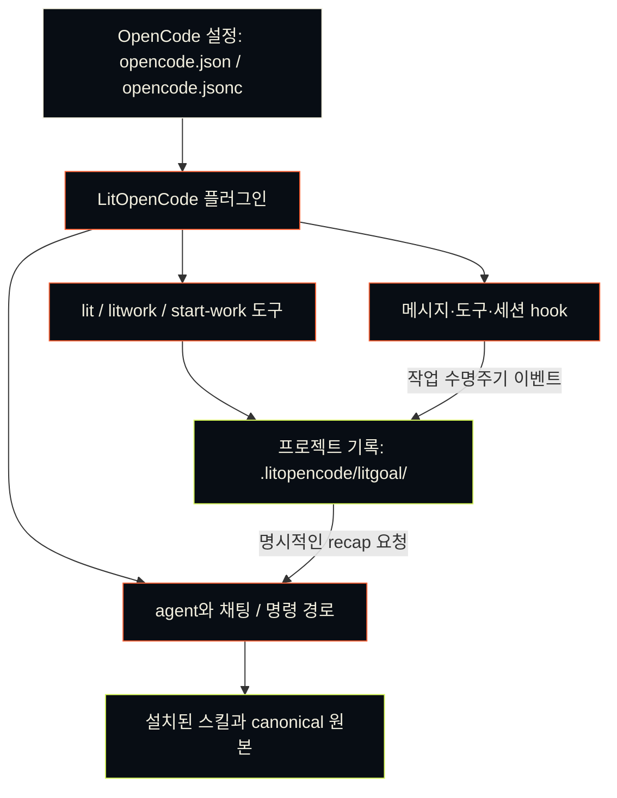

<p align="center"><picture><source media="(prefers-reduced-motion: reduce)" srcset="./docs/assets/cover-motion-still.webp" /></picture></p>

<p align="center"></p>

<details>
<summary>ASCII 로고 복사</summary>

```text
                             ▄▄▄▄
                   ▗███▌   ▗██████▖
 ▗▄▄▄▄▄          ▗▟████▌   ▝██████▘
 ▐█████        ▗▟██████▌    ▝▀▜█▀▘
 ▐█████      ▗▟███████▄▄▄▄▄▄▄▄▄▄▄▄▄▄▄▄▄▄▄▄
 ▐█████    ▗▟█████████████████████████ ▐█▀
 ▐█████    ████████████████████████████▀
 ▐█████    ██▛▘   ▄ ▄▄▄▄▖▄▄▄▄▄▄▄▄▄▄▄▄▄▖
 ▐█████    ▀    ▄██ ████▌█████████████▌
 ▐█████       ▄████ ████▌█████████████▌
 ▐█████     ▄█████▛                                 litopencode
 ▐█████  ▗▟█████▀▘       ▄▄▄▄▄     ▗▖
 ▐█████ ▐█████▀          █████     ▐▛▀
 ▐█████ ▐███▀            █████
 ▐█████ ▐█▀              █████
 ▐█████ ▝                █████
 ▐█████▄▄▄▄▄▄▄▖          █████
 ▐███████████▛           █████
 ▐██████████▀            █████

```

</details>

# LitOpenCode

[English](./README.md) · [한국어](./README-Ko-KR.md)

> **불씨를 건네받았다.**<br>
> **이제, 당신의 작업에 옮길 차례다.**

<p align="center"></p>
<p align="center"></p>

<p align="center">
<a href="#설치"></a>
<a href="./LICENSE"></a>
</p>

<p align="center">
<a href="./docs/reference-Ko-KR.md"> 문서</a> &nbsp; <a href="#설치">설치</a> &nbsp; <a href="#스킬-한눈에-보기">스킬</a> &nbsp; <a href="#ignition-motion"> Ignition</a> &nbsp; <a href="./LICENSE"> MIT</a>
</p>

LitOpenCode는 OpenCode에 워크플로 agent, 슬래시 명령, 로컬 근거 기록을 더합니다.

OpenCode는 지금 쓰던 그대로 쓰면 됩니다. 프롬프트 끝에 `lit`을 붙이거나 `/lit`을 입력하면 LitOpenCode가 일에 맞는 워크플로를 고릅니다. 모델을 돌리고 권한을 묻는 일은 지금처럼 OpenCode가 하고, 플러그인은 프로젝트에 기록을 남깁니다.

## 왜 만들었나

고치고 싶은 버그 하나. 만들고 싶은 화면 하나. 끝내고 싶은 프로젝트 하나.

시작은 한 줄이면 됩니다. 어려운 건 그다음입니다. 대화가 길어지거나 세션이 끝나면 어디까지 했는지부터 다시 짚어야 합니다. 무엇을 정했고, 무엇을 확인했고, 다음에 무엇을 할지.

LitOpenCode는 그 내용을 프로젝트에 남깁니다. 목표와 계획, 확인한 결과, 다음에 할 일을 적어 두니 다음 세션이 그 기록을 읽고 이어서 작업할 수 있습니다.

```text
계획하기 → 만들기 → 확인하기 → 다음 작업에 건네기
```

“꺼지지 않는 불”이란 세션이 끝나도 다음 세션이 이어받을 수 있게 작업을 남겨 두는 일입니다. 지금 쓰는 도구 안에서 그대로 돌아가고, 다른 LitFamily 제품을 설치할 필요도 없습니다.

## 설치

Node.js와 npm, 그리고 OpenCode가 있으면 됩니다. 다음을 실행하세요.

```sh
LIT_PACKAGE='@litfamily/litopencode@latest'
npm exec --package "$LIT_PACKAGE" -- litopencode install
```

OpenCode를 다시 시작하고 `Tab` 키를 눌러 `lit-loop`를 고르세요.

설치하는 동안 어떤 모델을 쓸지, 에이전트에게 권한을 얼마나 줄지, 답변을 어떤 모양으로 받을지 묻습니다. 권한은 `safe`에서 시작하는데, 무언가 하기 전에 OpenCode가 먼저 물어보는 설정입니다. 로그인과 API 키는 OpenCode에 이미 설정해 둔 모델 제공자(provider) 쪽 것을 그대로 씁니다.

OpenAI 제공자를 쓰면 새로 설치했을 때 계획과 검토는 GPT-6 Astra(`gpt-6-astra`)가 `xhigh`로, 만들기와 조사는 GPT-6 Luna(`gpt-6-luna`)가 `max`로 맡습니다. 지원되는 다른 모델과 추론 수준은 설치 중에 고를 수 있습니다.

바뀔 내용을 먼저 보고 싶거나 질문 없이 설치하려면 둘 중 하나를 붙이세요.

```sh
npm exec --package @litfamily/litopencode@latest -- litopencode install --dry-run  # 변경 사항 미리 보기
npm exec --package @litfamily/litopencode@latest -- litopencode install --yes     # 기본값 사용, 저장된 선택 유지
```

`--dry-run`은 무엇이 바뀔지만 보여 주고 아무것도 쓰지 않습니다. `--yes`는 질문을 건너뛰고 기본값으로 설치하되, 예전에 저장해 둔 선택은 그대로 둡니다.

설치가 하는 일은 많지 않습니다. OpenCode 설정에 플러그인을 등록하고, LitOpenCode의 명령과 스킬 파일을 OpenCode 설정 폴더에 복사합니다. 어떤 일에 어떤 모델을 쓸지 정한 route는 `~/.config/opencode/litopencode.json`에 저장됩니다. `XDG_CONFIG_HOME`을 지정하면 설정 폴더가 통째로 그쪽으로 옮겨 갑니다. 이미 손봐 둔 route는 건드리지 않습니다. 설정 폴더를 직접 정하는 방법, 모델 선택, 터미널 정책, 무인 설치는 [상세 안내](./docs/reference-Ko-KR.md#설치)에 있습니다.

이 체크아웃의 패키지 버전은 `@litfamily/litopencode@1.0.13`입니다. registry의 `@latest`와 다를 수 있으니, 정확한 버전이 중요하면 `npm view @litfamily/litopencode version`으로 확인하세요.

## 첫 작업

작게 시작하세요. 빈 폴더를 OpenCode에서 열고 `lit-loop`를 고른 다음 채팅에 이렇게 보냅니다.

```text
lit 외부 의존성 없이 index.html 하나로 할 일 목록을 만들고, 추가와 완료 표시를 확인한 뒤 다음 할 일을 남겨줘.
```

첫 결과는 `index.html`입니다. 직접 열어서 항목을 추가하고 완료 표시를 해 보세요.

나중에 돌아왔을 때는 `/lit-recap`이 기록을 읽고 다음 할 일을 알려 줍니다.

`/lit`도 같은 워크플로를 시작합니다. 규모가 큰 일은 계획부터 세우는 편이 좋습니다. `lit-plan`을 골라 계획을 읽고 승인한 뒤 `/start-work`로 실행하고, `/review-work`로 마무리합니다. planner는 계획만 세웁니다. 명시적인 사용자 승인을 기다리고, 파일을 고치거나 셸 명령을 실행할 방법이 없습니다. 승인하고 나면 `lit-implement`가 계획을 실제로 수행합니다.

진행 상황과 확인한 결과까지, 기록은 모두 프로젝트의 `.litopencode/litgoal/`에 쌓입니다. OpenCode에는 세션을 넘어 목표를 보관할 곳이 따로 없어서, 다음 세션은 이 폴더를 보고 어디까지 했는지 압니다. 작업 지침만 담긴 스킬도 있는데, 문서에 나온 경로로 그 스킬을 부르면 지침이 작업에 적용됩니다.

## 설치 후 화면에서 보이는 것

LitOpenCode가 화면에 무엇을 출력하는지 미리 볼 수 있도록 그림 네 장을 준비했습니다. 설치가 잘 끝났을 때 어떤 모습인지 낯설지 않게 해 줍니다. 각 그림에는 실제 캡처인지 예시 화면인지 밝혀 두었습니다. 그림마다 다크와 라이트 버전이 있고 내용은 같으며, 브라우저 테마에 맞는 쪽이 보입니다. Jev 힌트의 그림은 [화면에서 보이는 것](#화면에서-보이는-것)에 따로 있습니다.

**설치.** `litopencode install`은 번호가 붙은 다섯 단계를 보여 주고, 끝난 단계마다 체크 표시를 붙인 뒤 초록색 상자로 마무리합니다. 상자에는 설치가 끝났다는 말과 다음에 할 일이 적혀 있습니다. OpenCode를 다시 시작하고 Tab을 눌러 lit-loop를 고르면 됩니다.

<p align="center"><picture><source media="(prefers-color-scheme: dark)" srcset="./docs/assets/readme/install-output-dark.webp" /></picture></p>

*빈 설정 폴더를 쓰는 격리한 셸에서 실제 `litopencode install --yes`를 실행해 캡처했습니다. 이 명령은 단계 위에 큰 로고 배너도 출력하지만 그림에서는 뺐습니다. 마지막 줄은 명령을 실행한 컴퓨터의 상태를 알려 줍니다.*

**상태 점검.** `litopencode doctor`는 긴 JSON 보고서를 출력합니다. 설치가 제대로 연결됐는지는 그중 install 블록이 알려 주므로, 그림에서는 `jq`로 세 줄만 뽑았습니다. 세 값이 모두 true이면 플러그인과 스킬에 문제가 없다는 뜻입니다.

<p align="center"><picture><source media="(prefers-color-scheme: dark)" srcset="./docs/assets/readme/doctor-output-dark.webp" /></picture></p>

*같은 격리한 셸에서 실제 `litopencode doctor`를 실행해 캡처했고, 세 항목은 `jq`로 뽑았습니다.*

**첫 프롬프트.** Lit 워크플로가 프롬프트를 받으면 OpenCode 오른쪽 위에 알림이 6초 동안 뜹니다. 다섯 줄짜리 작은 LIT 마크와 LIT IGNITED 문구, 시작된 워크플로 이름이 담겨 있습니다. 경로가 시작됐는지 가장 빨리 알 수 있는 표시입니다. 결과는 작업이 끝난 뒤 직접 확인하세요. 자세한 내용은 [경로가 시작될 때 보이는 것](#경로가-시작될-때-보이는-것)에 있습니다.

<p align="center"><picture><source media="(prefers-color-scheme: dark)" srcset="./docs/assets/readme/ignition-toast-dark.webp" /></picture></p>

*예시 화면입니다. 알림 문구는 플러그인이 쓰는 점화 알림 함수에서 나왔고, 화면은 OpenCode가 그렸습니다. 모델은 실행하지 않았습니다. 여기서는 lit-loop이며, 다른 워크플로가 시작되면 그 이름이 들어갑니다.*

**계획 에이전트.** `lit-plan`은 계획을 세우면서 프로젝트를 읽기만 합니다. 어떤 권한이 막혀 있는지는 OpenCode에 직접 물어볼 수 있습니다. `opencode debug agent lit-plan`이 OpenCode가 보는 에이전트 정보를 출력하고, `jq`로 거부된 권한만 남겼습니다. 목록에 edit, bash, task가 있으므로 계획 에이전트는 파일을 고치거나 셸 명령을 실행하거나 다른 에이전트에게 일을 넘길 수 없습니다. question, plan_enter, plan_exit도 같은 목록에 나옵니다.

<p align="center"><picture><source media="(prefers-color-scheme: dark)" srcset="./docs/assets/readme/planner-permissions-dark.webp" /></picture></p>

*같은 격리한 셸에서 빈 설정 폴더에 LitOpenCode를 설치한 뒤 실제 `opencode debug agent lit-plan`을 실행해 캡처했고, 거부된 권한은 `jq`로 남겼습니다.*

## 움직이는 화면으로 보기

22초, 한 단어입니다. 영상은 커다란 `lit`으로 시작해 그 단어를 프롬프트 안으로 줄여 넣고, LitOpenCode가 그다음에 하는 일을 따라갑니다. 알림이 워크플로를 알리고, 계획 에이전트는 edit, bash, task가 잠긴 모습을 보여 주고, 각 단계가 기록에 남고, 새 세션이 그 기록을 읽고 이어갑니다. 영상 속 창은 이 문서가 설명하는 내용을 그린 그림이며, 실제 세션을 캡처한 화면은 아닙니다. 글꼴은 [Pretendard](./docs/assets/readme/promo-source/Pretendard-OFL.txt)이고, 공개 글꼴 라이선스(OFL)에 따라 썼습니다.

<p align="center"><picture><source media="(prefers-reduced-motion: reduce)" srcset="./docs/assets/readme/promo-still.webp" /></picture></p>

[영상을 MP4로 보기](./docs/assets/readme/promo-ko.mp4)

## 스킬 한눈에 보기

스킬마다 만들어 내는 결과, 여는 방법, 얻는 것을 한 줄씩 정리했습니다.

<table>
<tr><th>이렇게 됩니다</th><th>스킬</th><th>얻는 것</th></tr>
<tr>
<td></td>
<td><code>litwork</code> · <code>workflow-loop</code><br /><sub><code>lit</code> · <code>/litwork</code></sub></td>
<td>요청에 <code>lit</code>만 붙이세요. 작업이 틀 잡기, 근거 찾기, 계획, 실행, 검증, 리뷰, 정리 순서로 진행됩니다.</td>
</tr>
<tr>
<td></td>
<td><code>durable-litgoal</code><br /><sub><code>/litgoal</code> · <code>/lit-goal</code></sub></td>
<td>OpenCode에 목표 기능이 없을 때, 확인 가능한 기준이 붙은 목표 하나를 디스크에 남깁니다.</td>
</tr>
<tr>
<td></td>
<td><code>lit-plan</code><br /><sub><code>/lit-plan</code></sub></td>
<td>승인 관문에서 멈추는 체크리스트를 만듭니다. lit-plan 에이전트는 파일 수정도, 셸 명령도 할 수 없습니다.</td>
</tr>
<tr>
<td></td>
<td><code>start-work</code><br /><sub><code>/start-work</code></sub></td>
<td>승인된 계획을 한 조각씩 실행하고, 승인이나 계획 버전이 낡았으면 멈춥니다.</td>
</tr>
<tr>
<td></td>
<td><code>review-work</code><br /><sub><code>/review-work</code></sub></td>
<td>변경을 다섯 방향에서 검토해 심각한 문제부터 보여 주고, 방향마다 통과·실패·미실행을 적습니다.</td>
</tr>
<tr>
<td></td>
<td><code>litresearch</code><br /><sub><code>lit research &lt;question&gt;</code> · <code>/litresearch</code></sub></td>
<td>여러 차례에 걸쳐 조사하고, 주장마다 출처와 아직 불확실한 점을 함께 남깁니다.</td>
</tr>
<tr>
<td></td>
<td><code>doctor-installer</code><br /><sub><code>litopencode install</code> · <code>litopencode doctor</code></sub></td>
<td>LitOpenCode를 OpenCode에 설치합니다. <code>--dry-run</code>은 바뀔 내용만 보여주고 아무것도 쓰지 않습니다.</td>
</tr>
<tr>
<td></td>
<td><code>lit-fetch</code><br /><sub><code>/lit-fetch</code> · <code>litopencode fetch-public &lt;url&gt; --json</code></sub></td>
<td>요청이 어디로 갈 수 있는지 먼저 확인한 뒤 공개 페이지를 가져오고, 성공, 페이지 없음, 유료 구독 필요처럼 결과를 이름으로 알려 줍니다.</td>
</tr>
<tr>
<td></td>
<td><code>lit-init</code><br /><sub><code>/lit-init</code></sub></td>
<td>필요한 폴더에만 짧은 AGENTS.md 안내서를 만듭니다.</td>
</tr>
<tr>
<td></td>
<td><code>lit-crucible</code><br /><sub><code>/lit-crucible</code></sub></td>
<td>계획 전에 요구사항을 반박해 봅니다. 반박을 견딘 위험만 계획으로 넘어갑니다.</td>
</tr>
<tr>
<td></td>
<td><code>refactor</code><br /><sub><code>/refactor</code></sub></td>
<td>동작을 테스트로 고정한 채 코드 구조를 바꿉니다. 단계마다 확인합니다.</td>
</tr>
<tr>
<td></td>
<td><code>lit-burnoff</code><br /><sub><code>/lit-burnoff</code></sub></td>
<td>테스트로 동작을 먼저 묶어 두고, 변경분에 붙은 AI식 군더더기를 걷어냅니다.</td>
</tr>
<tr>
<td></td>
<td><code>lit-burnoff-file</code><br /><sub><code>/lit-burnoff-file</code></sub></td>
<td>방금 수정한 파일 하나를 그 변경분 기준으로 정리합니다.</td>
</tr>
<tr>
<td></td>
<td><code>lit-code</code><br /><sub><code>/lit-code</code></sub></td>
<td>필요한 만큼만 코드를 쓰고, Given/When/Then 테스트와 함께 무엇을 정리했는지 적어 둡니다.</td>
</tr>
<tr>
<td></td>
<td><code>debugging</code><br /><sub><code>/debugging</code></sub></td>
<td>버그를 재현하고, 가설을 세 개 이상 세워 확인한 뒤, 확인된 원인만 고칩니다.</td>
</tr>
<tr>
<td></td>
<td><code>lit-commit</code><br /><sub><code>/lit-commit</code></sub></td>
<td>변경을 저장소 스타일에 맞는 작은 커밋으로 나눕니다. 관계없는 작업은 건드리지 않습니다.</td>
</tr>
<tr>
<td></td>
<td><code>lsp</code><br /><sub><code>/lsp</code></sub></td>
<td>OpenCode가 이미 쓰는 언어 서버에서 오류와 경고를 읽어 옵니다. 언어 서버를 따로 설치하지는 않습니다.</td>
</tr>
<tr>
<td></td>
<td><code>lsp-setup</code><br /><sub><code>/lsp-setup</code></sub></td>
<td>어떤 파일 형식에 언어 서버가 없으면 설치 명령 하나를 제안하고, 승인을 기다립니다.</td>
</tr>
<tr>
<td></td>
<td><code>rules</code><br /><sub><code>/rules</code></sub></td>
<td>저장소 규칙을 두 갈래로 읽습니다. 세션 시작 때 한 번, 파일을 수정할 때 다시 한 번.</td>
</tr>
<tr>
<td></td>
<td><code>deep-interview</code><br /><sub><code>/deep-interview</code></sub></td>
<td>하지 않을 일과 결정 범위가 분명해질 때까지 한 번에 한 질문씩 묻습니다.</td>
</tr>
<tr>
<td></td>
<td><code>structural-search</code><br /><sub><code>/structural-search</code></sub></td>
<td>검색 엔진이 제대로 도는지 먼저 확인하고 문법 구조로 코드를 찾습니다. 글자만 맞춰 찾은 결과에는 TEXTUAL 표시를 붙입니다.</td>
</tr>
<tr>
<td></td>
<td><code>browser-drive</code><br /><sub><code>/browser-drive</code></sub></td>
<td>브라우저 드라이버를 먼저 확인한 뒤 실제 페이지를 조작합니다. 드라이버가 없으면 그렇다고 말합니다.</td>
</tr>
<tr>
<td></td>
<td><code>lit-humanizer</code><br /><sub><code>/lit-humanizer</code></sub></td>
<td>딱딱한 AI 문장을 한국어나 영어로 다시 씁니다. 사실과 단서는 남기고 군더더기는 뺍니다.</td>
</tr>
<tr>
<td></td>
<td><code>lit-recap</code><br /><sub><code>/lit-recap</code></sub></td>
<td>읽기 전용 요약입니다. 끝난 일, 진행 중인 일, 막힌 곳, 증거 위치, 다음 단계를 보여줍니다.</td>
</tr>
<tr>
<td></td>
<td><code>lit-comprehend</code><br /><sub><code>/lit-comprehend</code></sub></td>
<td>에이전트가 쓴 작업을 이해하도록 돕는 설명 페이지입니다. 직관, 흐름 설명, 짧은 퀴즈 순서입니다.</td>
</tr>
<tr>
<td></td>
<td><code>lit-handoff</code><br /><sub><code>handoff</code> · <code>/lit-handoff</code></sub></td>
<td><code>handoff</code>라고 치면 다음 세션이 읽고 이어갈 인수인계 파일이 생깁니다.</td>
</tr>
<tr>
<td></td>
<td><code>lit-scientific-visualization</code><br /><sub><code>/lit-scientific-visualization</code></sub></td>
<td>학술지 규격 그림을 벡터와 600 DPI로 내보냅니다. 그래프 종류는 데이터 성격에 맞춰 고릅니다.</td>
</tr>
<tr>
<td></td>
<td><code>lit-diagram-drawer</code><br /><sub><code>skill picker</code></sub></td>
<td>슬라이드와 문서에 넣을 다이어그램을 편집 가능한 형태로 그리고, 검사한 뒤 PNG와 SVG로 내보냅니다.</td>
</tr>
<tr>
<td></td>
<td><code>lit-pptx</code><br /><sub><code>skill picker</code></sub></td>
<td><code>lit</code>으로 발표자료를 요청하면 Markdown 원고에서 편집 가능한 PowerPoint 파일을 만듭니다. 기본은 AZURE-PRO이고, 품질 검사와 렌더링 확인을 거칩니다. 스킬 선택기에서도 열 수 있습니다.</td>
</tr>
<tr>
<td></td>
<td><code>lit-docx</code><br /><sub><code>skill picker</code></sub></td>
<td><code>lit</code>으로 보고서를 요청하면 서식을 갖춘 Word 파일과 원고 Markdown이 나옵니다. 한국어는 korean-generic 서식을 쓰고, 문체 검사와 렌더링 확인이 뒤따릅니다. 스킬 선택기에서도 열 수 있습니다.</td>
</tr>
<tr>
<td></td>
<td><code>autoresearch</code><br /><sub><code>/autoresearch</code> · <code>/autoresearch-&lt;mode&gt;</code></sub></td>
<td>승인된 예산 안에서 실험을 반복합니다. 한 번에 하나만 바꾸고, 결과에 따라 남기거나 되돌립니다.</td>
</tr>
<tr>
<td></td>
<td><code>autoconference</code><br /><sub><code>/autoconference</code> · <code>/autoconference-&lt;mode&gt;</code></sub></td>
<td>예산을 정한 연구 회의입니다. 연구자와 리뷰어가 따로 일하고, 종합에는 반대 의견도 남깁니다.</td>
</tr>
<tr>
<td></td>
<td><code>wikify</code><br /><sub><code>/wikify-ingest</code> · <code>/wikify-query</code></sub></td>
<td>검토를 거친 프로젝트 지식을 디스크에 두고, 나중 질문에 출처와 함께 답합니다.</td>
</tr>
<tr>
<td></td>
<td><code>frontend-ui-ux</code><br /><sub><code>skill picker</code></sub></td>
<td>실제로 동작하는 화면을 만들고, 측정 프로브로 일곱 가지 보기에서 확인합니다. 네 가지 폭, 다크 모드, 모션 줄이기, 200% 확대입니다. 스킬 선택기에서 엽니다.</td>
</tr>
<tr>
<td></td>
<td><code>readme-studio</code><br /><sub><code>skill picker</code></sub></td>
<td>사실에 맞는 README와 확인을 거친 커버, 윤곽선 글자를 만듭니다. 스킬 선택기에서 엽니다.</td>
</tr>
<tr>
<td></td>
<td><code>lit-typographic-motion</code><br /><sub><code>skill picker</code></sub></td>
<td><code>lit</code>으로 영상을 요청하면 트리트먼트를 먼저 쓰고, 무대 페이지를 그리거나 글자를 움직입니다. 영상은 검사와 눈으로 보는 확인을 거쳐 넘깁니다. 스킬 선택기에서도 열 수 있습니다.</td>
</tr>
<tr>
<td></td>
<td><code>visual-qa</code><br /><sub><code>skill picker</code></sub></td>
<td>실제 화면을 보고 본 것을 그대로 보여 줍니다. 파일을 고칠 권한은 받지 않습니다. 스킬 선택기에서 엽니다.</td>
</tr>
<tr>
<td></td>
<td><code>agent-roster</code> · <code>reference-benchmark-claims</code> · <code>native-goal-verdict</code> · <code>search-workflow-ideas</code> · <code>release-guardrails</code> · <code>comment-checker</code> · <code>tool-guards</code><br /><sub>자동 실행</sub></td>
<td>알아서 돌아갑니다. LitOpenCode 에이전트를 등록하고, 수정 뒤 주석을 확인하고, 범위 없는 “항상 더 낫다” 주장을 막습니다.</td>
</tr>
</table>

## 명령어

프롬프트에 `lit`을 붙이거나 슬래시 명령을 입력하면 됩니다. 자주 쓰는 것은 이 정도입니다.

| 입력 | 하는 일 |
| --- | --- |
| 프롬프트 끝의 `lit`, `/lit`, `/litwork` | 범위가 분명한 작업을 시작해 구현하고, 확인한 내용을 기록합니다. |
| `lit-plan` 또는 `/lit-plan` | 구현 전에 계획을 세웁니다. |
| `/start-work <승인된 계획>` | 승인한 계획을 실행합니다. |
| `/review-work` | 변경 내용과 근거를 검토합니다. |
| `handoff` 또는 `/lit-handoff` | 현재 결과와 다음 할 일을 다음 세션에 넘깁니다. |
| `/lit-recap` | 로컬 기록을 짧게 요약해 보여 줍니다. |
| `/litresearch` 또는 `/lit-research` | 주장마다 출처를 남기며 조사합니다. OpenCode가 허용하면 보조 에이전트가 나눠서 동시에 조사하고, 아니면 차례로 진행합니다. |
| `/lit-code`, `/debugging`, `/refactor` | 코딩, 디버깅, 리팩터링 지침을 씁니다. |
| `/lit-korean` | 의미는 그대로 두고 한국어 문장을 다듬습니다. |
| `/lit-scientific-visualization` | 패키지에 들어 있는 과학 시각화 워크플로를 씁니다. |

`handoff`만 단독으로 입력해도 `/lit-handoff`와 똑같이 동작합니다. 대화가 차오를 때 인수인계를 대신 써 주길 원하면 [자동 인수인계](#자동-인수인계)를 보세요.

경로는 작업을 준비할 뿐이고, 실제 작업은 OpenCode 안의 모델이 합니다. 답변에 어떤 단계를 실행했다거나 화면 확인을 통과했다고 나오면, 믿기 전에 파일이나 페이지를 직접 열어 확인하세요.

Autoresearch, Autoconference, Wikify, UI/UX는 [전체 경로 안내](./docs/reference-Ko-KR.md#주요-명령)에, 저장소 규칙을 두 갈래로 읽는 규칙 엔진은 [규칙 엔진 상세 안내](./docs/reference.md#safety-and-updates)에 있습니다. 예전 스킬 이름은 한 릴리스 동안 별칭으로 계속 동작합니다. 목록은 [마이그레이션 안내](./docs/migration.md#skill-id-renames)를 보세요.

## 동작 방식

OpenCode는 설정 파일을 읽을 때 플러그인을 불러옵니다. 그 뒤로 프롬프트나 명령을 보내면 LitOpenCode가 알맞은 워크플로와 거기에 필요한 설치 스킬을 고릅니다. 작업이 진행되는 동안 도구와 훅이 일어난 일을 프로젝트에 적어 두고, 나중에 돌아오면 그 기록을 읽고 이어 갑니다.



### 경로가 시작될 때 보이는 것

Lit 경로가 시작됐는지는 바로 알 수 있습니다. 답변이 굵은 점화 문구로 시작하고, OpenCode 화면에 경고 모양의 알림이 6초 동안 뜹니다. 터미널이 마크의 특수 문자를 제대로 표시하면 다섯 줄짜리 작은 로고 아래에 `🔥 LIT IGNITED · <discipline> 🔥` 문구가, 그렇지 않으면 그 문구만 나옵니다. 어느 쪽이든 워크플로가 시작됐다는 표시이니, 결과는 작업이 끝난 뒤 직접 확인하세요.

<p align="center"></p>

<p align="center"><a href="./docs/assets/readme/ignition-film.mp4"></a></p>

포스터를 누르면 영상이 열립니다. 직접 고르기 전에는 재생되지 않습니다.

### 디자인, README, 다이어그램

`frontend-ui-ux`는 화면을 만드는 스킬입니다. 원하는 것을 충분히 구체적으로 말하면 실제로 동작하는 화면까지 만들고, 렌더링해서 직접 살펴봅니다. 중요한 디자인 선택이 걸릴 때만 묻고, 받은 답은 기억해 둡니다. 검토나 계획을 부탁하면 읽기만 하고 파일은 건드리지 않습니다.

`readme-studio`는 저장소에 실제로 있는 내용으로 README를 쓰고, 표지도 내 컴퓨터에서 만듭니다. 전용 슬래시 명령이 없어서 OpenCode의 스킬 도구에서 고릅니다. 글자를 윤곽선으로 바꾸는 도구, 버전을 고정한 Remotion·HyperFrames 예제, 정적·동적 출력 절차가 함께 설치됩니다. 이미지 생성 도구가 없으면 `IMAGE_GENERATION_UNAVAILABLE`로 알리고, 사용자가 준 배경으로 이어 갑니다. GitHub나 npm에서 최종적으로 어떻게 보이는지는 따로 확인해야 합니다.

`lit-diagram-drawer`는 개념도를 그리고, 내 컴퓨터에서 검사한 뒤 내보냅니다. 렌더러와 브라우저가 이미 있으면 아무것도 새로 설치하지 않고, 기존 다이어그램도 안전하게 가져옵니다. OpenCode 스킬 선택기에서 고르거나, 범위가 분명한 다이어그램 요청 끝에 `lit`을 붙이면 됩니다. 그러면 워크플로가 그리기 전에 이 스킬을 불러오라고 OpenCode에 안내합니다. 전용 슬래시 명령이나 채팅 경로는 따로 없습니다. 제품 화면은 `frontend-ui-ux`, 측정한 과학 데이터 그림은 `lit-scientific-visualization`이 맡습니다.

### 워드 보고서와 발표자료

`lit-docx`는 마크다운 원고로 편집 가능한 워드 보고서를 만들고, `lit-pptx`는 발표자료를 편집 가능한 파워포인트로 컴파일합니다. 보고서나 발표자료 요청에 `lit`을 붙이면 OpenCode가 알맞은 스킬을 불러오도록 안내하고, 둘 다 요청하면 두 스킬을 모두 씁니다.

한국어 보고서는 따로 정하지 않으면 korean-generic 서식을 쓰고, 발표자료는 AZURE-PRO 디자인과 Pretendard 글꼴로 시작합니다. 두 스킬 모두 처음 쓸 때 필요한 도구를 정해진 버전으로 LitOpenCode 전용 캐시에 설치합니다. 완성 파일과 함께 마크다운 원고도 남기고, 구조·품질 검사를 거칩니다. LibreOffice가 있으면 렌더링된 페이지도 눈으로 확인하게 합니다. 출판사 서식, 기존 DOCX 편집, PDF 변환, 템플릿 학습, 글꼴 포함 방법은 설치된 스킬에 설명되어 있습니다. 준비가 됐는지 보려면 `litopencode doctor`를 실행하세요. 상태만 알려 주고 아무것도 설치하지 않습니다.

### 글 다듬기와 브라우저

글을 제대로 고쳐 써야 하거나 꼼꼼히 검토받고 싶을 때는 `/lit-humanizer`를 쓰세요. 의미와 글쓴이의 목소리, 꼭 필요한 한정 표현은 그대로 둡니다. 예전 명령인 `/lit-korean`, `/text-naturalization`, `/text-neutralization`, `/korean-ai-slop-remover`도 계속 쓸 수 있고 같은 곳으로 연결됩니다. 에이전트가 쓰는 글도 살펴봅니다. 지원하는 텍스트 파일을 저장하려는데 초안 흔적이 뚜렷하면 저장을 막고, 확신이 낮은 문체 신호는 참고 의견으로만 알려 줍니다. 워드·파워포인트 파일과 텍스트를 뽑아낼 수 있는 PDF는 만들어진 직후에 확인합니다.

`browser-drive`를 쓰려면 [vercel-labs/agent-browser](https://github.com/vercel-labs/agent-browser)의 `agent-browser` 엔진을 직접 설치해야 합니다. `npm install -g agent-browser`와 `agent-browser install`을 실행한 뒤 `node skills/browser-drive/scripts/capability-probe.mjs`로 확인하세요. 검증된 최소 버전은 0.34.0입니다. 형식이 올바른 더 새 버전도 받아들이고, 검증한 버전보다 새것이라고 표시합니다.

## 자동 인수인계

대화가 길어지면 모델의 컨텍스트 창이 차고, 넘친 내용은 잊힙니다. 자동 인수인계는 그렇게 되기 전에 지금까지의 진행 상황을 저장해 둡니다. 기본은 꺼져 있고, 몇 퍼센트에서 시작할지는 직접 정합니다. LitOpenCode가 정해 둔 기본 퍼센트는 없습니다.

켜 두면 LitOpenCode가 컨텍스트 창이 얼마나 찼는지 지켜봅니다. 대화가 정한 퍼센트에 닿고 진행 중인 차례가 끝나면, 모델에게 인수인계 파일을 쓰라고 요청합니다. 그다음 파일이 정말 저장됐는지 확인하고, 대화를 압축하고, 다음 차례에 그 인수인계의 앞부분을 모델 앞에 다시 놓습니다.

OpenCode는 플러그인이 압축을 직접 시작하도록 허용하므로, OpenCode에서는 모든 단계가 저절로 진행됩니다.

| 단계 | OpenCode에서 |
| --- | --- |
| 정한 퍼센트에 닿았는지 확인 | 자동 |
| 모델에게 인수인계 요청 | 자동 |
| 인수인계가 저장됐는지 확인 | 자동. 저장된 인수인계가 없으면 대화는 그대로 두고 짧은 알림으로 알려 줍니다 |
| 대화 압축 | 자동 |
| 인수인계 다시 불러오기 | 자동, 한 번, 배경 메모로 전달 |

인수인계는 모델이 쓰는데, 모델이 지시를 놓칠 때도 있습니다. 압축 전에 저장 여부를 확인하는 이유입니다. OpenCode가 압축을 시작하지 못하면 알림으로 한 번 알려 줍니다. "Handoff saved. Run /compact now."

켜려면 채팅에 `lit-handoff auto on 70`을 보내거나 `/lit-handoff auto on 70`을 실행하세요. 70 자리에 원하는 숫자를 넣으면 됩니다. `lit-handoff auto off`는 끄면서 숫자를 기억해 두므로, 나중에 숫자 없이 `lit-handoff auto on`을 보내면 그 숫자를 다시 씁니다. `lit-handoff auto status`는 지금 상태를 보여 줍니다. 설정은 프로젝트의 `.litopencode` 폴더에 저장됩니다.

환경 변수로 정하고 싶다면 `LITOPENCODE_AUTO_HANDOFF=1`을 설정하고, `LITOPENCODE_AUTO_HANDOFF_PERCENT`에 1부터 99 사이의 정수를 넣으세요. 환경 변수는 저장된 설정보다 우선합니다. 설정 파일의 `autoHandoff` 블록에도 같은 두 값을 적을 수 있습니다. 1~99 밖의 퍼센트는 기능을 끄고, 이유는 `litopencode doctor`가 알려 줍니다.

OpenCode가 스스로 압축하는 지점보다 낮은 퍼센트를 고르세요. LitOpenCode가 설치하는 한도에서는 그 지점이 창의 90%입니다. 고른 퍼센트가 그 지점과 같거나 더 높으면 OpenCode가 먼저 압축해 인수인계가 돌 틈이 없으므로, doctor가 경고합니다. 모든 설정과 디스크에 남는 내용, 다시 불러오는 방식은 [레퍼런스](./docs/reference-Ko-KR.md#자동-인수인계)에 있습니다.

## 안전과 업데이트

planner는 계획만 세웁니다. `lit-plan`은 `edit`, `bash`, `task` 권한이 모두 거부되어 있어서 파일을 고치거나, 명령을 실행하거나, 다른 에이전트에게 일을 넘길 수 없습니다. 나머지 작업의 권한은 `balanced`나 `yolo` 모드를 직접 골라 넓힐 수 있습니다. 그래도 planner는 읽기 전용으로 남고, 보조 에이전트가 또 다른 보조 에이전트를 부를 수도 없습니다.

공개 페이지를 가져올 때는 요청이 어디로 가는지 먼저 확인하고, 리디렉션도 하나하나 검사하며, 받아 오는 양에 한도를 둡니다. 가져온 본문은 데이터로만 읽고, 그 안에 적힌 지시는 따르지 않습니다.

LitOpenCode는 스스로 업데이트할 수 있습니다. 대화형으로 시작할 때와 install이나 doctor가 성공한 뒤에 새 버전을 확인할 수 있는데, 이 확인이 끝날 때까지 기다리므로 잠깐 멈출 수 있습니다. 자동 업데이트를 끄려면 `--no-auto-update`를 붙이거나 `LITOPENCODE_NO_AUTO_UPDATE=1`을 설정하세요.

스킬 학습 기능은 제거되었습니다. 이전 릴리스가 프로젝트의 `.litopencode` 폴더에 남긴 학습 기록이 있더라도, LitOpenCode는 이제 그 파일을 읽지도, 바꾸지도, 지우지도 않습니다. 남겨 둘지 지울지는 직접 정하면 됩니다. [자세한 내용](./docs/reference.md#skill-learning-state)

## Jev 스킬 힌트 (선택)

프롬프트만 봐서는 어떤 스킬이 맞는지 분명하지 않을 때가 있습니다. 이 선택 기능은 바깥 모델에게 한 번 더 의견을 묻습니다. 기본값은 꺼짐입니다.

켜 두면 조건에 맞는 대화 턴마다 TypeSafe가 호스팅하는 판단 모델 Jev에게 이 프롬프트에 맞는 LitOpenCode 스킬이 무엇인지 묻습니다. Jev가 LitOpenCode 스킬 가운데 하나를 충분한 확신으로 고르면, 그 턴에 해당 스킬을 알려 주는 참고 문장 한 줄이 붙습니다. 어디까지나 제안이라서, 스킬을 불러올지는 여전히 모델이 정하고 힌트가 권한을 주거나 도구를 실행하지는 않습니다. 슬래시 명령, 하위 세션, 이미 lit 경로가 처리한 턴, 공백을 뺀 4자 미만의 프롬프트는 건너뜁니다.

켜려면 OpenCode를 실행하는 환경에 두 변수를 모두 설정합니다.

```sh
export LITOPENCODE_JEV=1
export TYPESAFE_API_KEY=<본인의 TypeSafe 키>
```

**켜는 순간부터 조건에 맞는 프롬프트는 내 컴퓨터를 떠나 TypeSafe(typesafe.ai)로 전송됩니다.** 보내기 전에 프롬프트를 2,000자에서 자르고, 홈 경로·이메일 주소·토큰 형태의 문자열을 가립니다. 파일, 도구 출력, 이전 대화는 보내지 않습니다. 나머지는 쓴 그대로 전송되므로 호스트 이름, 고객 이름, `password=...` 형식이 아닌 비밀번호도 함께 넘어갑니다.

키도 조심해서 다뤄야 합니다. `TYPESAFE_API_KEY`는 OpenCode를 실행하는 셸에 export되어 있어서 에이전트의 도구도 이 값을 읽을 수 있습니다. 이 기능 전용 키를 따로 만들고 사용 한도를 낮게 잡아 두세요. 요금은 본인의 TypeSafe 계정에 청구되며, 입력 토큰 100만 개당 약 0.04달러입니다.

힌트 때문에 대화가 오래 멈추지는 않습니다. 요청은 1.5초가 지나면 끊기고 다시 시도하지 않습니다. 실패해도 턴은 평소대로 진행되고, 세션에서 처음 실패했을 때만 짧은 안내가 한 번 붙습니다.

켜져 있는지는 언제든 확인할 수 있습니다. `litopencode doctor`는 `Jev skill hint: off`, `on`, `flag on but TYPESAFE_API_KEY missing` 가운데 하나를 보여 주고, 키는 표시하지 않습니다. 세션마다 조건에 맞는 첫 턴에는 `✦ Jev skill hint is ON` 알림이 한 번 뜹니다. 힌트가 붙은 턴에는 `Jev → lit-humanizer (0.27s)`처럼 스킬 이름과 요청 시간을 담은 짧은 알림이 뜨고, 기능이 꺼져 있거나 맞는 스킬이 없으면 아무 알림도 뜨지 않습니다. [화면에서 보이는 것](#화면에서-보이는-것)에서 각각을 확인할 수 있습니다.

끄려면 `LITOPENCODE_JEV`를 지우거나 `1`이 아닌 값으로 바꿉니다.

세부 변수와 디버그 기록은 [Jev 스킬 힌트 참조 문서](./docs/reference-Ko-KR.md#jev-스킬-힌트-선택)에 있습니다.

### 화면에서 보이는 것

Jev는 화면에서 조용합니다. 켜 두면 눈에 띄는 것은 두 가지입니다. OpenCode 오른쪽 위에 뜨는 작은 알림과 `litopencode doctor`의 한 줄입니다. 켜기 전에 어떻게 보이는지 미리 확인해 두세요.

**터미널에서.** `litopencode doctor`가 가장 빠른 확인 방법입니다. 아무것도 설정하지 않았다면 힌트가 꺼져 있다고 알려 줍니다. 플래그만 켜고 키를 넣지 않았다면 키가 없다고 알려 주는데, 힌트를 기대했는데 아무것도 오지 않을 때 확인할 줄이 바로 이 줄입니다. 둘 다 설정했다면 켜져 있다고 나옵니다. 키 자체는 표시하지 않습니다.

<p align="center"></p>

*격리한 셸에서 실제 `litopencode doctor`를 실행해 캡처했고, Jev 줄은 `jq`로 뽑았습니다. 그림의 키는 자리표시 값입니다. doctor는 키가 있는지만 확인합니다.*

**세션의 첫 프롬프트.** 힌트가 켜져 있다는 알림이 한 번 뜹니다. 이 기능은 프롬프트를 내 컴퓨터 밖으로 보내기 때문에, 켜 둔 것을 잊지 않도록 세션마다 한 번 알려 줍니다. Jev가 그 프롬프트에 제안할 스킬이 없으면 보이는 것은 이 알림뿐입니다.

<p align="center"></p>

*예시 화면입니다. 알림의 문구와 스타일은 플러그인이 쓰는 알림 함수에서 나왔고, 화면은 OpenCode가 그렸습니다. TypeSafe로 요청은 가지 않았습니다.*

**힌트가 붙는 첫 프롬프트.** OpenCode는 알림을 한 번에 하나만 보여 주기 때문에, 안내와 힌트가 한 상자를 함께 씁니다. 안내가 제목이 되고, 그 아래에 제안된 스킬 이름과 요청 시간이 나옵니다. 여기 나온 스킬 이름과 시간은 예시입니다.

<p align="center"></p>

*같은 방식으로 만든 예시 화면입니다. 스킬 이름과 시간은 예시입니다.*

**이후의 프롬프트.** 힌트가 붙는 프롬프트마다 스킬 이름과 시간만 담은 조용한 알림이 뜹니다. 맞는 스킬이 없거나 Jev가 꺼져 있으면 아무것도 뜨지 않습니다.

<p align="center"></p>

*같은 방식으로 만든 예시 화면입니다. 스킬 이름과 시간은 예시입니다.*

제안 자체는 스킬 이름을 담은 문장 한 줄입니다. 이 문장은 모델에게 전달되고, 사용자가 입력한 말로는 표시되지 않습니다.

## 문제 해결

결과가 에이전트의 완료 보고와 다르면, 실제로 본 것을 에이전트에게 그대로 알려 주세요.

패키지가 제대로 설치됐는지, 설정에 문제가 없는지는 다음 명령으로 확인합니다.

```sh
npm exec --package @litfamily/litopencode@latest -- litopencode doctor
```

더 자세한 내용은 [설치와 모델 설정 안내](./docs/reference-Ko-KR.md#설치)에 있습니다.

스킬 폴더 구성 때문에 헷갈리는 경우가 두 가지 있는데, `install`과 `doctor`가 둘 다 알려 줍니다. 첫째는 스킬 폴더 `<root>/skills`가 다른 곳을 가리키는 심볼릭 링크인 경우입니다. 설치는 링크를 따라가 그 위치에 LitOpenCode 스킬 폴더를 만들기 때문에, 그곳이 git 저장소 안이면 경고를 함께 보여 줍니다. 둘째는 OpenCode가 함께 읽는 다른 폴더, 예를 들어 `~/.agents/skills`, `~/.claude/skills`, 프로젝트 스킬 폴더에 같은 이름의 스킬이 있는 경우입니다. 이때는 OpenCode가 LitOpenCode 대신 그쪽 스킬을 불러올 수 있습니다. 자세한 내용은 [심볼릭 링크된 native 스킬 루트와 다른 위치의 같은 이름 스킬](./docs/reference-Ko-KR.md#심볼릭-링크된-native-스킬-루트와-다른-위치의-같은-이름-스킬)을 보세요.

## 제거

`litopencode uninstall` 명령은 없습니다. 직접 지우려면 다음 순서로 하세요.

1. OpenCode의 `opencode.jsonc`(custom root라면 `opencode.json`)에서 `plugin` 배열의 `@litfamily/litopencode` 또는 `@litfamily/litopencode@<version>` 항목을 지웁니다. 예전 `litopencode` 패키지 항목이 있으면 그것도 지웁니다.
2. 전역으로 설치했다면 npm 실행 파일도 제거합니다.

   ```sh
   npm uninstall -g @litfamily/litopencode
   ```

3. 설치된 명령·스킬 파일은 먼저 살펴본 뒤 설치 도구가 만든 복사본만 지우고, 직접 만들거나 고친 파일은 남깁니다.
4. OpenCode를 다시 시작합니다.

route가 계속 필요하면 `litopencode.json`을, 나중에 작업을 이어 갈 생각이라면 프로젝트의 `.litopencode/` 기록을 남겨 두세요. 자세한 내용은 [제거 상세 안내](./docs/reference-Ko-KR.md#제거)에 있습니다.

## 라이선스

MIT입니다. [LICENSE](./LICENSE)를 보세요.

`lit-handoff`와 `lit-scientific-visualization`에 함께 들어 있는 참조 원본은 `vendor/handoff/`와 `vendor/scientific-visualization/`에 있습니다. 번호가 붙은 라이선스·출처 파일은 출처 기록으로 그대로 둡니다.

## 링크

### 문서

- [워크플로 상세 안내](./docs/reference-Ko-KR.md): 모델, 권한, host 연결, 명령, 검증 방법
- [English reference](./docs/reference.md): 전체 스킬 목록과 규칙 엔진까지 포함
- [마이그레이션 안내](./docs/migration.md)
- [터미널 마크와 활성화 확인 문구](./docs/lit-mark.md)
- [Changelog](./CHANGELOG.md)
- [출시 체크리스트](./docs/release-checklist.md): 메인테이너용입니다. 이 저장소에만 있고 npm 패키지에는 들어가지 않습니다.

### 기여

- [기여 안내](./CONTRIBUTING.md) · [지원](./SUPPORT.md) · [보안 제보](./SECURITY.md)
- [행동 규범](./CODE_OF_CONDUCT.md) · [개인정보와 네트워크 동작](./docs/privacy.md)

### LITFAMILY


LitClaude · LitHermes · LitCodex · LitOpenCode · LitGrok.
다섯 중장갑 머신으로 다섯 제품을 표현한 일러스트입니다. 각 제품은 자기 도구 안에서 독립적으로 동작합니다.

### Ignition motion

[](./docs/assets/readme/ignition-film.mp4)

[10초 영상 보기](./docs/assets/readme/ignition-film.mp4) · [애니메이션 GIF](./docs/assets/readme/ignition-readme.gif) · [Lucide 아이콘 라이선스](./docs/assets/readme/Lucide-LICENSE.txt) · [ASCII 글꼴 라이선스](./docs/assets/readme/JetBrainsMono-OFL.txt)

편집할 수 있는 가벼운 벡터 표지는 [docs/assets/cover.svg](./docs/assets/cover.svg)에 있습니다.
