<p align="center"><picture><source media="(prefers-reduced-motion: reduce)" srcset="./docs/assets/cover-motion-still.webp" />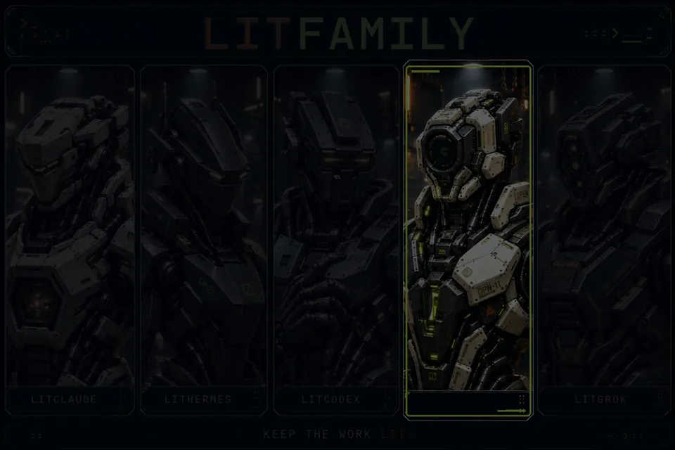</picture></p>

<p align="center">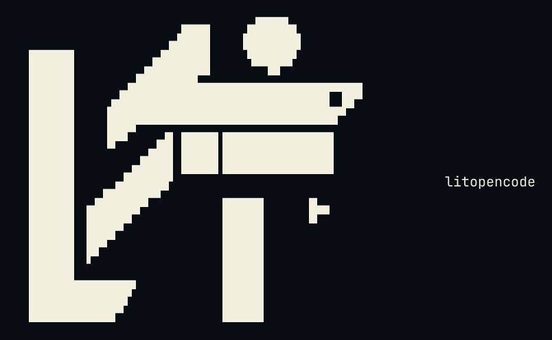</p>

<details>
<summary>Copy ASCII logo</summary>

```text
                             ▄▄▄▄
                   ▗███▌   ▗██████▖
 ▗▄▄▄▄▄          ▗▟████▌   ▝██████▘
 ▐█████        ▗▟██████▌    ▝▀▜█▀▘
 ▐█████      ▗▟███████▄▄▄▄▄▄▄▄▄▄▄▄▄▄▄▄▄▄▄▄
 ▐█████    ▗▟█████████████████████████ ▐█▀
 ▐█████    ████████████████████████████▀
 ▐█████    ██▛▘   ▄ ▄▄▄▄▖▄▄▄▄▄▄▄▄▄▄▄▄▄▖
 ▐█████    ▀    ▄██ ████▌█████████████▌
 ▐█████       ▄████ ████▌█████████████▌
 ▐█████     ▄█████▛                                 litopencode
 ▐█████  ▗▟█████▀▘       ▄▄▄▄▄     ▗▖
 ▐█████ ▐█████▀          █████     ▐▛▀
 ▐█████ ▐███▀            █████
 ▐█████ ▐█▀              █████
 ▐█████ ▝                █████
 ▐█████▄▄▄▄▄▄▄▖          █████
 ▐███████████▛           █████
 ▐██████████▀            █████

```

</details>

# LitOpenCode

[English](./README.md) · [한국어](./README-Ko-KR.md)

**Keep the work lit.**

<p align="center"></p>
<p align="center"></p>

<p align="center">
<a href="#install"></a>
<a href="./LICENSE"></a>
</p>

<p align="center">
<a href="./docs/reference.md"> Docs</a> &nbsp; <a href="#install">Install</a> &nbsp; <a href="#skills-at-a-glance">Skills</a> &nbsp; <a href="#ignition-motion"> Ignition</a> &nbsp; <a href="./LICENSE"> MIT</a>
</p>

LitOpenCode adds workflow agents, slash commands, and a local evidence ledger to OpenCode.

You keep using OpenCode the way you do now. Add `lit` to a prompt, or type `/lit`, and LitOpenCode picks a workflow for the job. OpenCode still runs the model and asks for permission the way it always has; the plugin's part is to keep notes in your project.

## Why it exists

> **The spark is yours.**<br>
> **Bring it to your work.**

A bug to fix. A screen to build. A project to finish.

Starting takes one line. Keeping going is the hard part. When a conversation runs long or a session ends, you have to work out where you stopped: what you decided, what you checked, and what comes next.

LitOpenCode keeps that in the project. It writes down the goal, the plan, the results it verified, and the next steps, so another session can read them and carry on.

```text
Plan → Build → Verify → Leave the next step
```

That's what "keeping the work lit" is about: when a session ends, the work is ready for the next one to pick up. It runs inside the tool you already use, and it needs no other LitFamily product.

## Install

You need Node.js with npm, and OpenCode. Then run:

```sh
LIT_PACKAGE='@litfamily/litopencode@latest'
npm exec --package "$LIT_PACKAGE" -- litopencode install
```

Restart OpenCode, press **Tab**, and pick **lit-loop**.

Along the way the installer asks which models to use, how much freedom to give the agents, and how replies should look. Permissions start at `safe`, where OpenCode asks you before acting. Logins and API keys stay with the provider you already set up in OpenCode.

On the OpenAI provider, a fresh install plans and reviews with GPT-6 Astra (`gpt-6-astra`) at `xhigh`, and does the building and research with GPT-6 Luna (`gpt-6-luna`) at `max`. You can pick other supported models and effort levels during install.

If you'd like to see the changes first, or skip the questions, add one of these:

```sh
npm exec --package @litfamily/litopencode@latest -- litopencode install --dry-run  # preview changes
npm exec --package @litfamily/litopencode@latest -- litopencode install --yes     # use defaults; preserve saved choices
```

`--dry-run` prints what it would change and writes nothing. `--yes` skips the questions, takes the defaults, and keeps any choices you saved on an earlier install.

What install actually does is small. It adds the plugin to OpenCode's config and copies LitOpenCode's commands and skills into your OpenCode config folder. Your routes, which say which model handles each kind of work, are kept in `~/.config/opencode/litopencode.json`. If you set `XDG_CONFIG_HOME`, that whole config folder moves with it. Routes you've already customized are left as they are. The [installation and model reference](./docs/reference.md#install) covers custom roots, provider choices, terminal behavior, and unattended setup.

This checkout is `@litfamily/litopencode@1.0.13`. The registry's `@latest` can be different, so run `npm view @litfamily/litopencode version` when the exact version matters.

## Your first task

Start small. Open an empty folder in OpenCode, pick `lit-loop`, and send:

```text
lit Build a to-do list in one index.html with no dependencies; check adding and completing items, then leave results and next steps.
```

Your first result is `index.html`. Open it and try adding and completing an item.

When you come back later, `/lit-recap` reads the record and shows you the next step.

`/lit` starts the same workflow. Bigger jobs are worth planning first. Pick `lit-plan`, read the plan and approve it, run `/start-work`, and finish with `/review-work`. The planner only plans: it waits for explicit user confirmation and has no way to edit files or run shell commands. Once you approve, `lit-implement` carries the plan out.

Everything it records, from progress to the checks it ran, goes into `.litopencode/litgoal/` in your project. OpenCode itself has no place to keep a goal between sessions, so this folder is how the next session knows where you were. Some skills are written guidance only; they come into play when one of their listed routes picks them.

## What you will see on screen

Here is what LitOpenCode prints, so a healthy install looks familiar by the time you get there. Four pictures follow, and each is labelled as a capture or a sample. Every picture comes in a dark and a light version with the same text; your browser shows the one that matches its theme. The Jev hint has its own pictures under [What you will see](#what-you-will-see).

**The installer.** `litopencode install` lists five numbered steps, ticks each one off as it finishes, and ends with a green box. The box says the install is ready and what to do next: restart OpenCode, press Tab and choose lit-loop.

<p align="center"><picture><source media="(prefers-color-scheme: dark)" srcset="./docs/assets/readme/install-output-dark.webp" />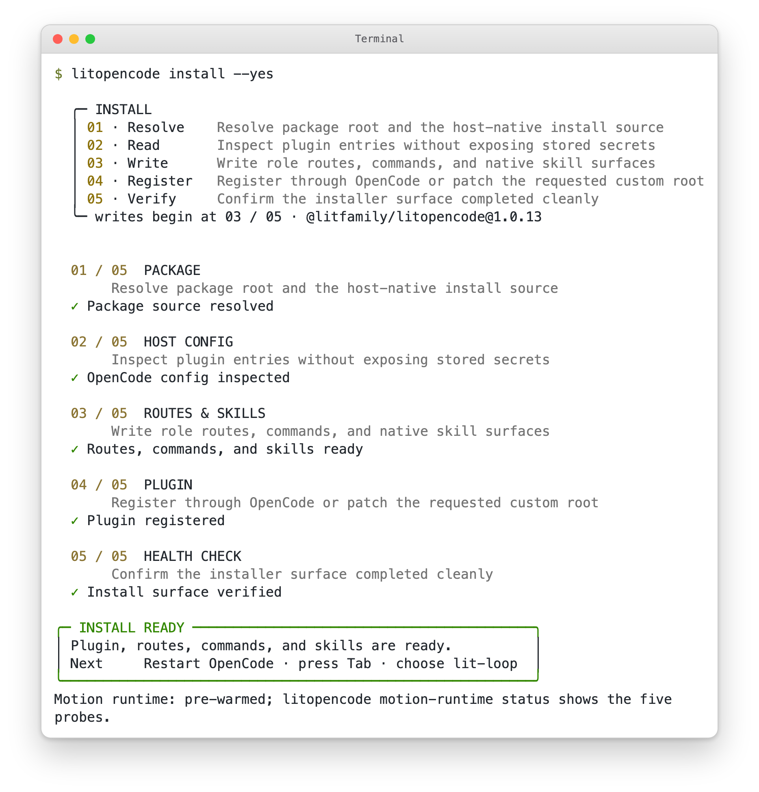</picture></p>

*Captured from the real `litopencode install --yes` in an isolated shell with an empty config folder. The command also prints a large logo banner above the steps, which the picture leaves out. The last line reports the machine the command ran on.*

**A health check.** `litopencode doctor` prints a long JSON report. Its install block answers the first question, whether everything is wired up, so the picture picks out three lines with `jq`. Three true values mean the plugin and its skills check out.

<p align="center"><picture><source media="(prefers-color-scheme: dark)" srcset="./docs/assets/readme/doctor-output-dark.webp" />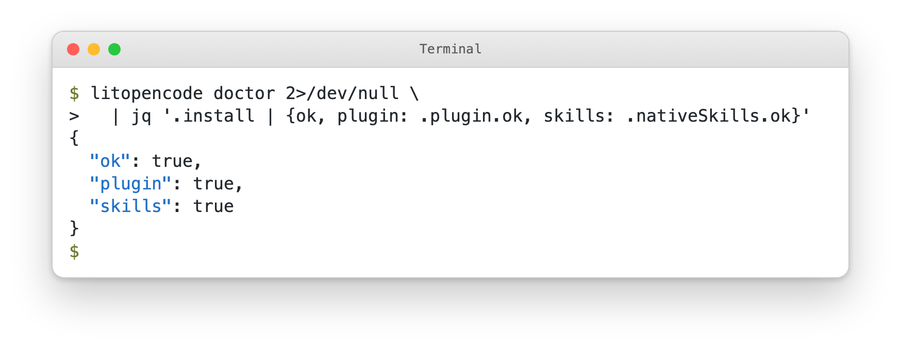</picture></p>

*Captured from the real `litopencode doctor` in the same isolated shell, with three fields picked out by `jq`.*

**The first prompt.** When a Lit workflow picks up your prompt, OpenCode shows a toast in the top-right corner for six seconds. It carries a five-row LIT mark, the words LIT IGNITED and the name of the workflow that started. It is the quickest sign that the route began; check the result yourself once the work finishes. [What you see when a route starts](#what-you-see-when-a-route-starts) has more.

<p align="center"><picture><source media="(prefers-color-scheme: dark)" srcset="./docs/assets/readme/ignition-toast-dark.webp" />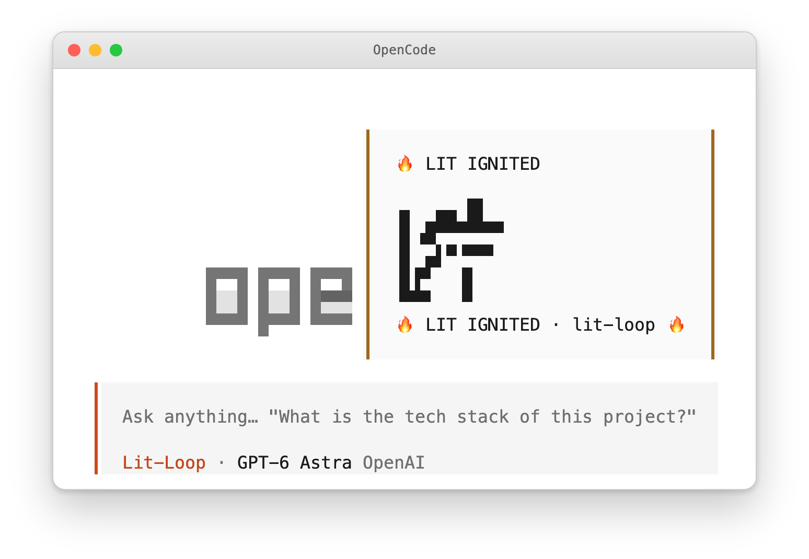</picture></p>

*Sample output: the toast text comes from the plugin's own activation function, and OpenCode drew it. No model ran. The workflow here is lit-loop; the toast names whichever workflow started.*

**The planner.** `lit-plan` plans and only reads. You can ask OpenCode which permissions it has: `opencode debug agent lit-plan` prints the agent as OpenCode sees it, and `jq` keeps the denied ones. Edit, bash and task are on the list, so the planner cannot change files, run shell commands or hand work to a helper agent. The list names question, plan_enter and plan_exit as well.

<p align="center"><picture><source media="(prefers-color-scheme: dark)" srcset="./docs/assets/readme/planner-permissions-dark.webp" />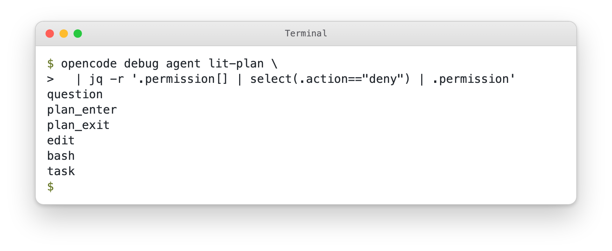</picture></p>

*Captured from the real `opencode debug agent lit-plan` in the same isolated shell, with LitOpenCode installed into an empty config folder. `jq` keeps the denied permissions.*

## Watch it in motion

Twenty-two seconds, one word. The film opens on `lit` set huge, shrinks it into a prompt, and follows what LitOpenCode does with it: a toast announces the workflow, the planner shows edit, bash and task locked, each step lands in a record, and a fresh session reads that record and carries on. The windows in the film are drawings of what this page describes, and nothing in it was captured from a live session. The type is [Pretendard](./docs/assets/readme/promo-source/Pretendard-OFL.txt), used under its open font license.

<p align="center"><picture><source media="(prefers-reduced-motion: reduce)" srcset="./docs/assets/readme/promo-still.webp" /></picture></p>

[Watch the film as an MP4](./docs/assets/readme/promo.mp4)

## Skills at a glance

Each row shows what a skill produces, how to open it, and what you get.

<table>
<tr><th>What it looks like</th><th>Skill</th><th>What you get</th></tr>
<tr>
<td>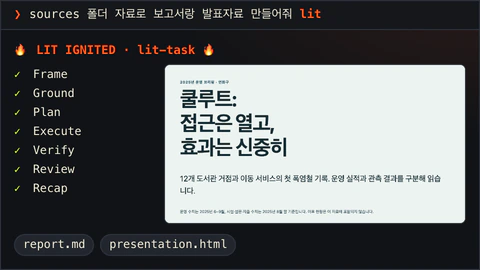</td>
<td><code>litwork</code> · <code>workflow-loop</code><br /><sub><code>lit</code> · <code>/litwork</code></sub></td>
<td>Add <code>lit</code> to a request. The work goes Frame, Ground, Plan, Execute, Verify, Review, Recap.</td>
</tr>
<tr>
<td>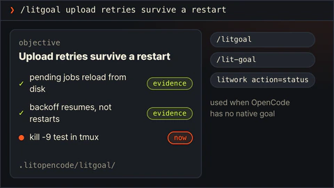</td>
<td><code>durable-litgoal</code><br /><sub><code>/litgoal</code> · <code>/lit-goal</code></sub></td>
<td>One goal with checkable criteria, kept on disk when OpenCode has no native goal.</td>
</tr>
<tr>
<td>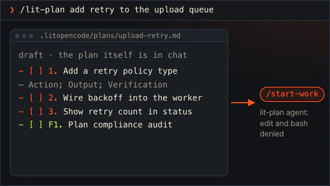</td>
<td><code>lit-plan</code><br /><sub><code>/lit-plan</code></sub></td>
<td>A checklist that stops at an approval gate. The lit-plan agent cannot edit files or run shell commands.</td>
</tr>
<tr>
<td>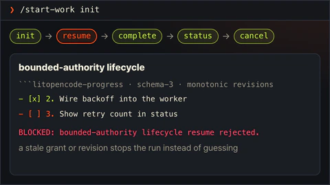</td>
<td><code>start-work</code><br /><sub><code>/start-work</code></sub></td>
<td>Runs an approved plan one slice at a time, and stops if its approval or plan revision has gone out of date.</td>
</tr>
<tr>
<td>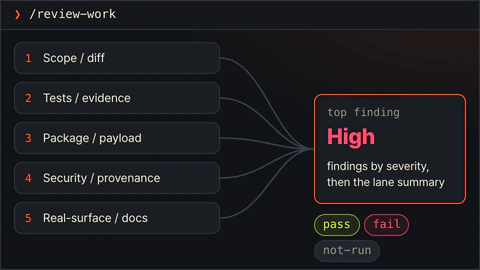</td>
<td><code>review-work</code><br /><sub><code>/review-work</code></sub></td>
<td>Reviews the change from five angles, lists findings worst first, and marks each angle pass, fail or not run.</td>
</tr>
<tr>
<td>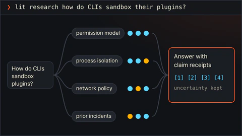</td>
<td><code>litresearch</code><br /><sub><code>lit research &lt;question&gt;</code> · <code>/litresearch</code></sub></td>
<td>Researches in rounds and keeps a source for each claim, along with what is still uncertain.</td>
</tr>
<tr>
<td>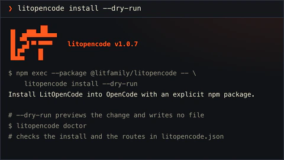</td>
<td><code>doctor-installer</code><br /><sub><code>litopencode install</code> · <code>litopencode doctor</code></sub></td>
<td>Installs LitOpenCode into OpenCode. <code>--dry-run</code> previews the change and writes nothing.</td>
</tr>
<tr>
<td>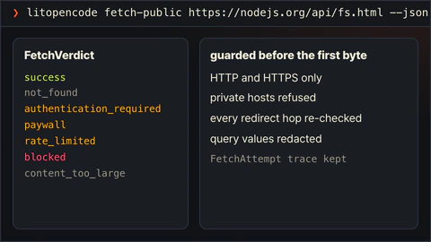</td>
<td><code>lit-fetch</code><br /><sub><code>/lit-fetch</code> · <code>litopencode fetch-public &lt;url&gt; --json</code></sub></td>
<td>Checks where the request can go, fetches the public page, then names the outcome, such as success, not found or paywall.</td>
</tr>
<tr>
<td>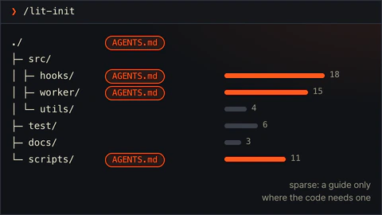</td>
<td><code>lit-init</code><br /><sub><code>/lit-init</code></sub></td>
<td>Writes sparse AGENTS.md guides, only where the code needs one.</td>
</tr>
<tr>
<td>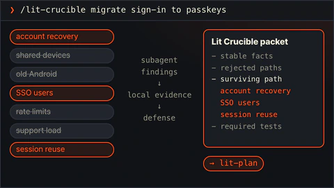</td>
<td><code>lit-crucible</code><br /><sub><code>/lit-crucible</code></sub></td>
<td>Pressure-tests a brief before planning. Only the risks that survive critique reach the plan.</td>
</tr>
<tr>
<td>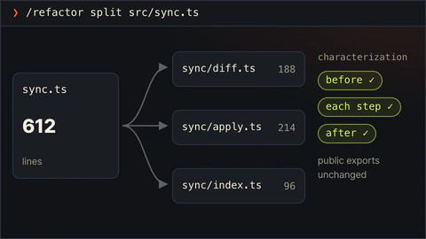</td>
<td><code>refactor</code><br /><sub><code>/refactor</code></sub></td>
<td>Restructures code while tests pin its behavior before and after every step.</td>
</tr>
<tr>
<td>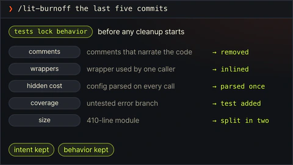</td>
<td><code>lit-burnoff</code><br /><sub><code>/lit-burnoff</code></sub></td>
<td>Cleans AI-written bloat out of a change set after tests lock what it does.</td>
</tr>
<tr>
<td>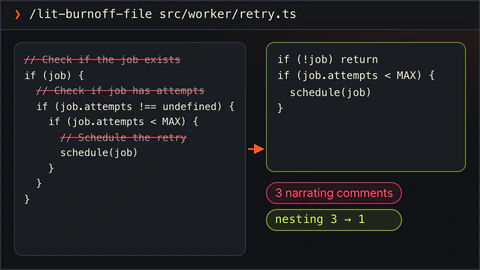</td>
<td><code>lit-burnoff-file</code><br /><sub><code>/lit-burnoff-file</code></sub></td>
<td>Cleans one just-edited file against its own diff.</td>
</tr>
<tr>
<td>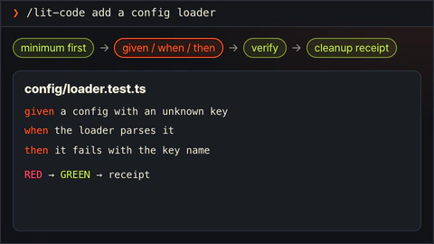</td>
<td><code>lit-code</code><br /><sub><code>/lit-code</code></sub></td>
<td>Writes the smallest code that does the job, with Given/When/Then tests and a note of what it cleaned up.</td>
</tr>
<tr>
<td>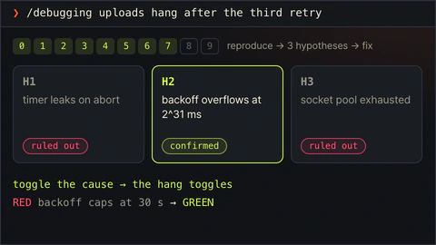</td>
<td><code>debugging</code><br /><sub><code>/debugging</code></sub></td>
<td>Reproduces the bug, tests at least three explanations, and fixes only the confirmed cause.</td>
</tr>
<tr>
<td>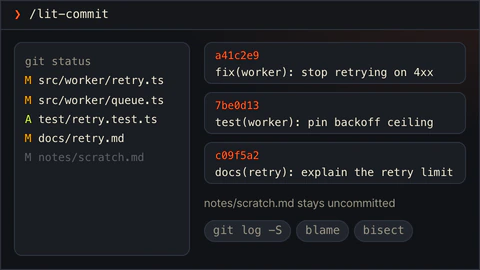</td>
<td><code>lit-commit</code><br /><sub><code>/lit-commit</code></sub></td>
<td>Splits your changes into atomic commits in the repo's own style and leaves unrelated work alone.</td>
</tr>
<tr>
<td>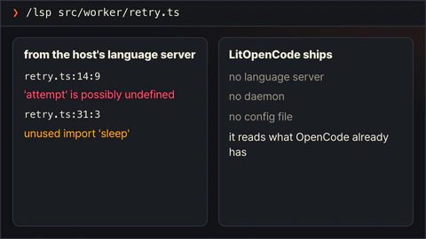</td>
<td><code>lsp</code><br /><sub><code>/lsp</code></sub></td>
<td>Reads errors and warnings from the language server OpenCode already runs; LitOpenCode brings none of its own.</td>
</tr>
<tr>
<td>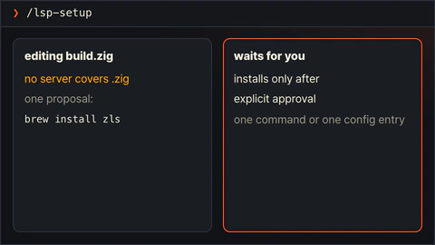</td>
<td><code>lsp-setup</code><br /><sub><code>/lsp-setup</code></sub></td>
<td>Proposes one install command when no server covers a file type, then waits for your approval.</td>
</tr>
<tr>
<td>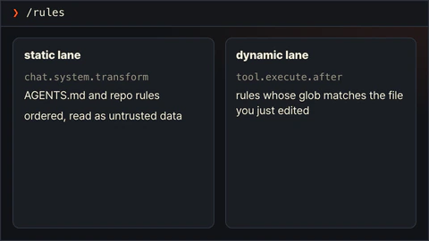</td>
<td><code>rules</code><br /><sub><code>/rules</code></sub></td>
<td>Loads repository rules in two lanes: once for the session, and again for files you edit.</td>
</tr>
<tr>
<td>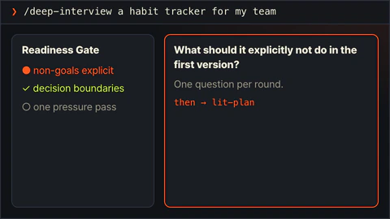</td>
<td><code>deep-interview</code><br /><sub><code>/deep-interview</code></sub></td>
<td>Asks one question at a time until it's clear what the work won't touch and which calls need your approval.</td>
</tr>
<tr>
<td>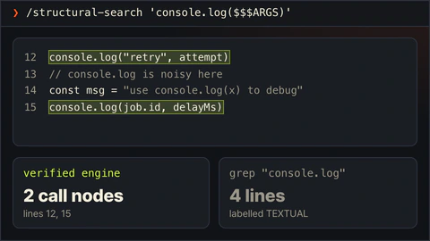</td>
<td><code>structural-search</code><br /><sub><code>/structural-search</code></sub></td>
<td>Confirms the search engine works, then finds code by its syntax shape. Plain text matches are labelled TEXTUAL.</td>
</tr>
<tr>
<td>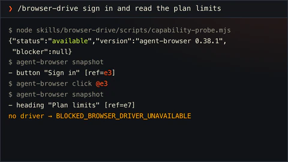</td>
<td><code>browser-drive</code><br /><sub><code>/browser-drive</code></sub></td>
<td>Checks that a browser driver is installed, then works a real page. Without one, it tells you.</td>
</tr>
<tr>
<td>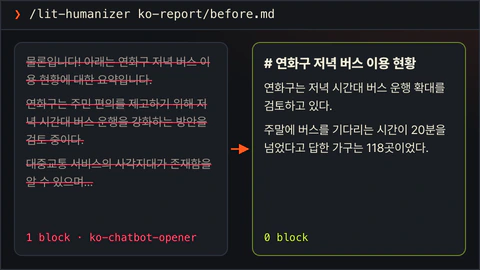</td>
<td><code>lit-humanizer</code><br /><sub><code>/lit-humanizer</code></sub></td>
<td>Rewrites stiff model prose in English or Korean, keeping the facts and honest hedges and cutting the filler.</td>
</tr>
<tr>
<td>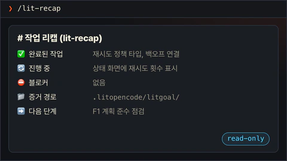</td>
<td><code>lit-recap</code><br /><sub><code>/lit-recap</code></sub></td>
<td>A read-only summary: done, in progress, blocked, where the evidence is, what comes next.</td>
</tr>
<tr>
<td>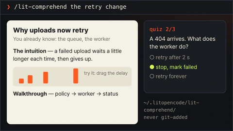</td>
<td><code>lit-comprehend</code><br /><sub><code>/lit-comprehend</code></sub></td>
<td>An explainer page for agent-written work: intuition first, then the walkthrough, then a short quiz.</td>
</tr>
<tr>
<td>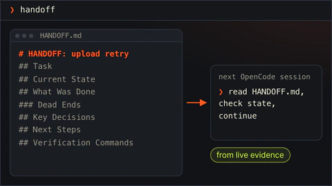</td>
<td><code>lit-handoff</code><br /><sub><code>handoff</code> · <code>/lit-handoff</code></sub></td>
<td>Type <code>handoff</code> to get a continuation file the next session can read and resume from.</td>
</tr>
<tr>
<td>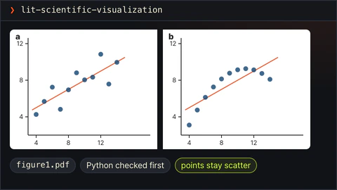</td>
<td><code>lit-scientific-visualization</code><br /><sub><code>/lit-scientific-visualization</code></sub></td>
<td>A journal-sized figure with vector and 600 DPI exports. The chart type follows the data.</td>
</tr>
<tr>
<td>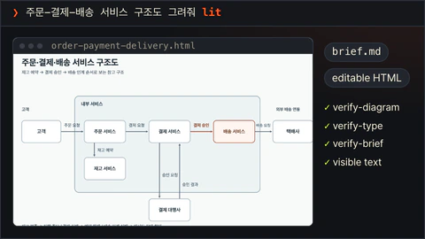</td>
<td><code>lit-diagram-drawer</code><br /><sub><code>skill picker</code></sub></td>
<td>A checked, editable diagram for slides and documents, with PNG and Office-safe SVG exports.</td>
</tr>
<tr>
<td>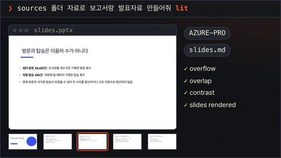</td>
<td><code>lit-pptx</code><br /><sub><code>skill picker</code></sub></td>
<td>Ask for slides with <code>lit</code> and get an editable PowerPoint deck from a Markdown source, AZURE-PRO by default. A QA gate and a rendered check follow. It is also in the skill picker.</td>
</tr>
<tr>
<td>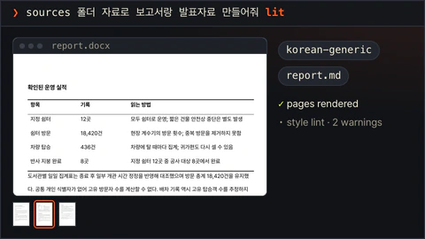</td>
<td><code>lit-docx</code><br /><sub><code>skill picker</code></sub></td>
<td>Ask for a report with <code>lit</code> and get a styled Word file with its Markdown source; Korean text uses korean-generic. Lint and a rendered page check follow. It is also in the skill picker.</td>
</tr>
<tr>
<td>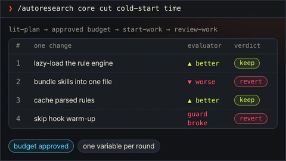</td>
<td><code>autoresearch</code><br /><sub><code>/autoresearch</code> · <code>/autoresearch-&lt;mode&gt;</code></sub></td>
<td>An approved, budgeted experiment loop. Each round changes one thing and keeps or reverts it.</td>
</tr>
<tr>
<td>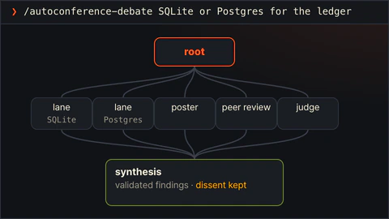</td>
<td><code>autoconference</code><br /><sub><code>/autoconference</code> · <code>/autoconference-&lt;mode&gt;</code></sub></td>
<td>A budgeted research conference: separate researchers, reviewers, and a synthesis that keeps disagreement.</td>
</tr>
<tr>
<td>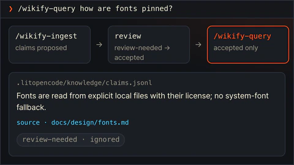</td>
<td><code>wikify</code><br /><sub><code>/wikify-ingest</code> · <code>/wikify-query</code></sub></td>
<td>Keeps reviewed project knowledge on disk and answers later questions from it, with sources.</td>
</tr>
<tr>
<td>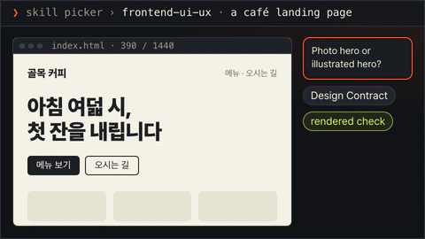</td>
<td><code>frontend-ui-ux</code><br /><sub><code>skill picker</code></sub></td>
<td>Builds a working interface and checks it with a measured probe in seven views: four widths, dark, reduced motion and 200% zoom. Open it from the skill picker.</td>
</tr>
<tr>
<td>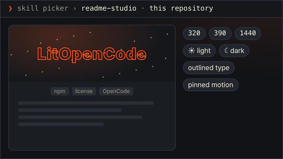</td>
<td><code>readme-studio</code><br /><sub><code>skill picker</code></sub></td>
<td>A factual README with an inspected cover and outlined type. Open it from the skill picker.</td>
</tr>
<tr>
<td>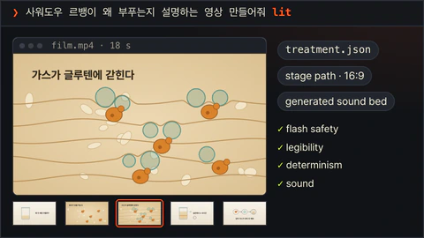</td>
<td><code>lit-typographic-motion</code><br /><sub><code>skill picker</code></sub></td>
<td>Ask for a video with <code>lit</code>. It writes a treatment, then draws a stage page or sets the words in motion; the film passes its checks and a look-over before you get it. It is also in the skill picker.</td>
</tr>
<tr>
<td>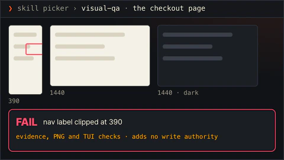</td>
<td><code>visual-qa</code><br /><sub><code>skill picker</code></sub></td>
<td>Looks at the real screen and shows you what it saw; it gets no permission to change files. Open it from the skill picker.</td>
</tr>
<tr>
<td>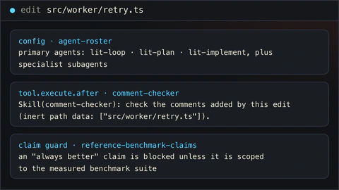</td>
<td><code>agent-roster</code> · <code>reference-benchmark-claims</code> · <code>native-goal-verdict</code> · <code>search-workflow-ideas</code> · <code>release-guardrails</code> · <code>comment-checker</code> · <code>tool-guards</code><br /><sub>runs on its own</sub></td>
<td>Runs on its own: registers the LitOpenCode agents, checks comments after edits, and blocks unscoped “always better” claims.</td>
</tr>
</table>

## Commands

Add `lit` to a prompt, or type a slash command. These are the ones you'll use most:

| Type | What happens |
| --- | --- |
| `lit` at the end of a prompt, `/lit`, or `/litwork` | Start a task with a clear scope, build it, and record what was checked. |
| `lit-plan` or `/lit-plan` | Prepare a plan before implementation. |
| `/start-work <approved-plan>` | Execute an approved plan. |
| `/review-work` | Review the change and its evidence. |
| `handoff` or `/lit-handoff` | Leave resumable context: the current result and the next step, for another session. |
| `/lit-recap` | Read a short recap from local state. |
| `/litresearch` or `/lit-research` | Research with a source for each claim. Helpers work in parallel when OpenCode allows it, and one after another when it doesn't. |
| `/lit-code`, `/debugging`, `/refactor` | Get coding, debugging, or refactoring guidance. |
| `/lit-korean` | Improve Korean prose without changing its meaning. |
| `/lit-scientific-visualization` | Use the packaged scientific-visualization workflow. |

A bare `handoff`, typed on its own, works the same as `/lit-handoff`. To have the handoff written for you when the conversation fills up, see [Automatic handoff](#automatic-handoff).

A route sets the work up; the model inside OpenCode does it. When the reply says a step ran or a visual check passed, open the file or the page and see for yourself before you rely on it.

Autoresearch, Autoconference, Wikify, UI/UX, and the two-lane repository rules engine are in the [full route and skill reference](./docs/reference.md#core-commands). Old skill names keep working as aliases for one release; the [migration notes](./docs/migration.md#skill-id-renames) list them.

## How it works

OpenCode loads the plugin when it reads its config. From then on, when you send a prompt or a command, LitOpenCode decides which workflow fits and which installed skills it needs. As the work moves along, its tools and hooks write down what happened in your project, and that record is what you read when you come back.

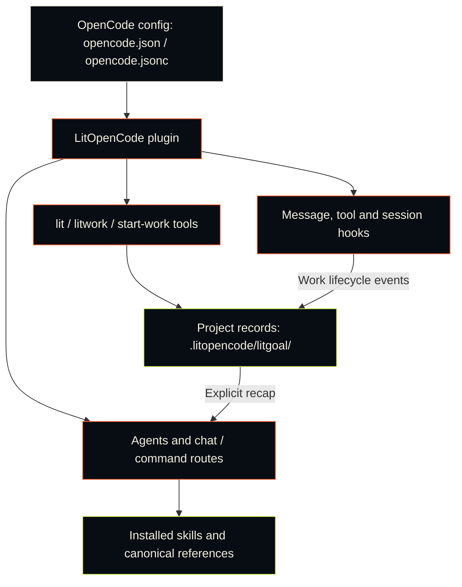
```mermaid
flowchart TD
    Config["OpenCode config: opencode.json / opencode.jsonc"] --> Plugin["LitOpenCode plugin"]
    Plugin --> Routes["Agents and chat / command routes"]
    Plugin --> Tools["lit / litwork / start-work tools"]
    Plugin --> Hooks["Message, tool and session hooks"]
    Routes --> Skills["Installed skills and canonical references"]
    Tools --> Records["Project records: .litopencode/litgoal/"]
    Hooks -->|Work lifecycle events| Records
    Records -->|Explicit recap| Routes
    classDef host fill:#080D14,stroke:#F2EFDF,color:#F2EFDF
    classDef lit fill:#080D14,stroke:#FF6337,color:#F2EFDF
    classDef local fill:#080D14,stroke:#D7F75B,color:#F2EFDF
    class Config host
    class Plugin,Routes,Tools,Hooks lit
    class Skills,Records local
```

### What you see when a route starts

You can tell when a Lit route has started. The reply opens with a bold ignition line, and OpenCode pops up a warning-style toast for six seconds. If your terminal can draw the mark's glyphs, the toast shows a five-row logo above `🔥 LIT IGNITED · <discipline> 🔥`; if it can't, you get just that line. Either way, that's your sign the workflow is under way; check the result yourself once it's done.

<p align="center"></p>

<p align="center"><a href="./docs/assets/readme/ignition-film.mp4"></a></p>

The poster opens the optional film, so the video only plays when you choose it.

### Design, READMEs, and diagrams

`frontend-ui-ux` builds interfaces. Describe what you want in enough detail and it carries the work through to a screen that works, then renders it and looks. It only stops to ask about design choices that matter, and it remembers your answers. If you ask it to review or plan, it reads and leaves your files alone.

`readme-studio` writes READMEs from what is really in the repository and builds covers on your machine. You pick it from OpenCode's skill tool, since it has no slash command of its own. It comes with helpers that turn type into outlines and pinned Remotion and HyperFrames recipes. If no image generator is available, it says so with `IMAGE_GENERATION_UNAVAILABLE` and can carry on from a background you give it. How the page finally looks on GitHub or npm is something to check separately.

`lit-diagram-drawer` is for concept diagrams: it draws them, checks them on your machine, and exports them. It installs nothing as long as the renderer and a browser are already there, and it imports existing diagrams safely. Pick it from OpenCode's skill picker, or end a clear diagram request with `lit`, and the workflow tells OpenCode to load it before drawing. It has no slash command or chat route of its own. Product screens belong to `frontend-ui-ux`, and figures of measured scientific data to `lit-scientific-visualization`.

### Word reports and slide decks

`lit-docx` turns a Markdown source into an editable Word report. `lit-pptx` compiles slides into an editable PowerPoint deck. Ask for a report or slides with `lit`, and OpenCode is told to load the matching skill; ask for both and it loads both.

Korean reports use the korean-generic style unless you ask for another. Decks start from the AZURE-PRO design and the Pretendard font. The first time you use either skill, it installs the exact tool versions it needs into a cache of LitOpenCode's own. Both keep the Markdown source as well as the finished file, and both run their structure and quality checks. If LibreOffice is installed, they also ask for a look at the rendered pages. Publisher styles, editing an existing DOCX, PDF conversion, learning a template and embedding fonts are covered in the installed skills. To see whether everything is ready, run `litopencode doctor`; it only reports and installs nothing.

### Writing and the browser

Use `/lit-humanizer` when a piece of writing needs a real rewrite or a careful read. It keeps the meaning, the writer's voice, and the qualifiers that matter. The older commands `/lit-korean`, `/text-naturalization`, `/text-neutralization` and `/korean-ai-slop-remover` still work and lead to the same place. It also watches what the agent writes. When the agent is about to save a supported text file with obvious drafting leftovers in it, the write is stopped; weaker style signals only come back as advice. Word and PowerPoint files, and PDFs whose text can be extracted, are checked right after they're created.

`browser-drive` needs the `agent-browser` engine from [vercel-labs/agent-browser](https://github.com/vercel-labs/agent-browser), which you install yourself: run `npm install -g agent-browser`, then `agent-browser install`, and check the result with `node skills/browser-drive/scripts/capability-probe.mjs`. The lowest version it has been checked with is 0.34.0. A newer, well-formed version is accepted and reported as newer than that.

## Automatic handoff

A long conversation eventually fills the model's context window, and whatever falls out is forgotten. Automatic handoff saves your place before that happens. It is off until you turn it on, and the percent is yours to pick: LitOpenCode has no default percent.

Once it is on, LitOpenCode watches how full the context window is. When the conversation reaches your percent and the current turn ends, it asks the model to write a handoff. It then checks that the handoff file was really saved, compacts the conversation, and puts the start of that handoff back in front of the model on the next turn.

OpenCode lets a plugin start compaction, so on OpenCode every step runs by itself:

| Step | On OpenCode |
| --- | --- |
| Notice that your percent was reached | Automatic |
| Ask the model for a handoff | Automatic |
| Check that the handoff was saved | Automatic. Without a saved handoff the conversation is left as it is and a short toast tells you |
| Compact the conversation | Automatic |
| Load the handoff again | Automatic, once, as background notes |

The model writes the handoff, and a model can miss an instruction. That is why the check comes before the compaction. If OpenCode cannot start the compaction, a toast tells you once: "Handoff saved. Run /compact now."

To turn it on, send `lit-handoff auto on 70` as a chat message, or run `/lit-handoff auto on 70`, with the number you want in place of 70. `lit-handoff auto off` turns it off and remembers your number, so a later `lit-handoff auto on` without a number reuses it. `lit-handoff auto status` shows where things stand. The setting is saved in your project's `.litopencode` folder.

If you prefer the environment, set `LITOPENCODE_AUTO_HANDOFF=1` and set `LITOPENCODE_AUTO_HANDOFF_PERCENT` to a whole number from 1 to 99. The environment wins over the saved setting. The config file holds the same two values in an `autoHandoff` block. A percent outside 1 to 99 switches the feature off, and `litopencode doctor` says why.

Pick a percent below the point where OpenCode compacts by itself. With the limits LitOpenCode installs, that point is 90% of the window, and doctor warns when your percent is at or above it, because OpenCode would compact first and the handoff would have no time to run. The [reference](./docs/reference.md#automatic-handoff) lists every setting, what is written to disk, and how the reload works.

## Safety and updates

The planner can only plan. `lit-plan` has its `edit`, `bash` and `task` permissions denied, so it can't change files, run commands or hand work to another agent. You can loosen permissions for the rest of the work by choosing the `balanced` or `yolo` mode on purpose. Even then the planner stays read-only, and a helper agent can't start helpers of its own.

When LitOpenCode fetches a public page, it first checks where the request is going, checks each redirect, and caps how much it downloads. The fetched text is read as data; instructions inside it aren't followed.

LitOpenCode can update itself. On interactive startup, and after an install or doctor run succeeds, it may check for a new release, and it does that in the foreground, so you may wait a moment. To turn automatic updates off, pass `--no-auto-update` or set `LITOPENCODE_NO_AUTO_UPDATE=1`.

Skill learning has been removed. If an earlier release left learning records in a project's `.litopencode` folder, LitOpenCode no longer reads, changes or deletes them; they're yours to keep or remove. [More on that state](./docs/reference.md#skill-learning-state).

## Jev skill hint (optional)

Sometimes the right skill isn't obvious from a prompt. This optional hint asks an outside model for a second opinion. It is off by default.

When you turn it on, each eligible chat turn asks Jev, TypeSafe's hosted typed-decision model, which LitOpenCode skill fits the prompt. If Jev names one of LitOpenCode's own skills with enough confidence, the turn gets one advisory line naming that skill. It's only a suggestion: the model still decides whether to load the skill, and the hint gives no permission and starts no tool. Slash commands, child sessions, turns a lit route already claimed, and prompts under four characters are skipped.

To turn it on, set both variables in the environment that starts OpenCode:

```sh
export LITOPENCODE_JEV=1
export TYPESAFE_API_KEY=<your own TypeSafe key>
```

**Once it's on, each eligible prompt leaves your machine and goes to TypeSafe (typesafe.ai).** Before sending, LitOpenCode cuts the prompt to 2,000 characters and replaces home paths, e-mail addresses and token-shaped strings. It never sends files, tool output or earlier turns. Everything else in the prompt goes as written, so hostnames, customer names, or a password that isn't written as `password=...` would be sent too.

The key needs care as well. Because `TYPESAFE_API_KEY` is exported in the shell that starts OpenCode, the agent's own tools can read it. Make a key just for this feature and give it a low spending limit. TypeSafe bills your own account, at about $0.04 per million input tokens.

The hint never holds a turn up for long. Each request stops after 1.5 seconds and isn't retried; if it fails, the turn carries on as usual, with one short note the first time it happens in a session.

You can always see whether it's working. `litopencode doctor` reports `Jev skill hint: off`, `on`, or `flag on but TYPESAFE_API_KEY missing`, and never shows the key. On the first eligible turn of each session, a `✦ Jev skill hint is ON` toast shows once. When a turn gets a hint, a short toast such as `Jev → lit-humanizer (0.27s)` names the skill and the request time; when the feature is off or no skill fits, nothing pops up. [What you will see](#what-you-will-see) shows each of these.

To turn it off, unset `LITOPENCODE_JEV` or set it to anything other than `1`.

Tuning variables and the debug trace are in the [Jev skill hint reference](./docs/reference.md#jev-skill-hint-optional).

### What you will see

Jev is quiet on screen. When it's on you'll notice two things: a small toast in the top-right corner of OpenCode, and one line in `litopencode doctor`. Here is each one, so you know what to expect before you turn it on.

**In the terminal.** `litopencode doctor` is the quickest check. With nothing set it says the hint is off. Set the flag without a key and it says the key is missing, which is the line to act on if you expected hints and none arrive. With both set it says on. It never prints the key.

<p align="center">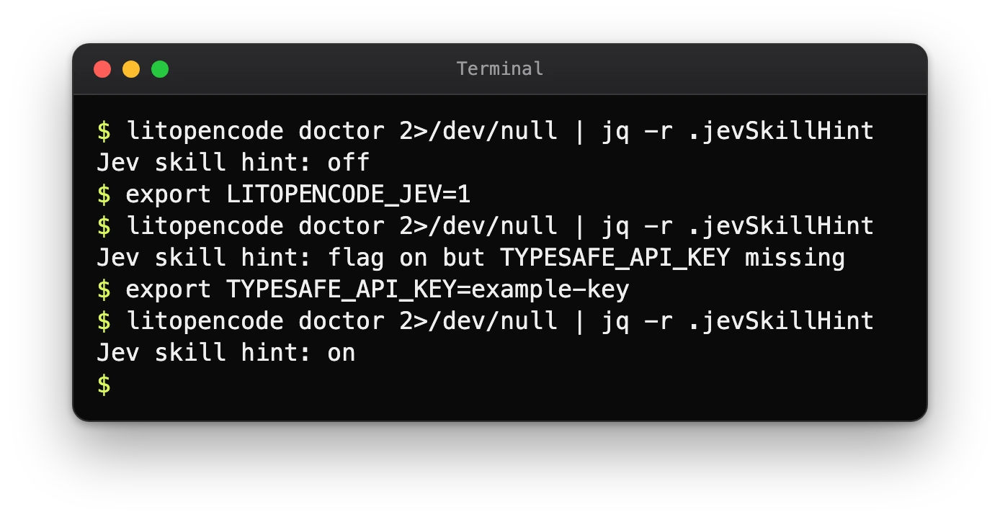</p>

*Captured from the real `litopencode doctor` in an isolated shell, with the Jev line picked out by `jq`. The key in the picture is a placeholder; doctor only checks that a key exists.*

**The first prompt of a session.** A toast announces that the hint is on. The feature sends prompts out of your machine, so it says so once per session in case you forgot you had switched it on. If Jev has no suggestion for that prompt, this is all you see.

<p align="center">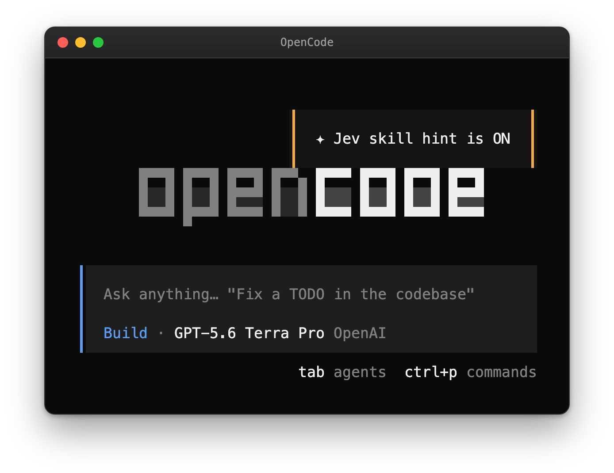</p>

*Sample output: the toast text and style come from the plugin's own toast function, and OpenCode drew it. No request went to TypeSafe.*

**A first prompt that gets a hint.** OpenCode shows one toast at a time, so the notice and the hint share a box. The notice is the title, and the suggested skill and the request time sit below it. The skill and the time here are examples.

<p align="center">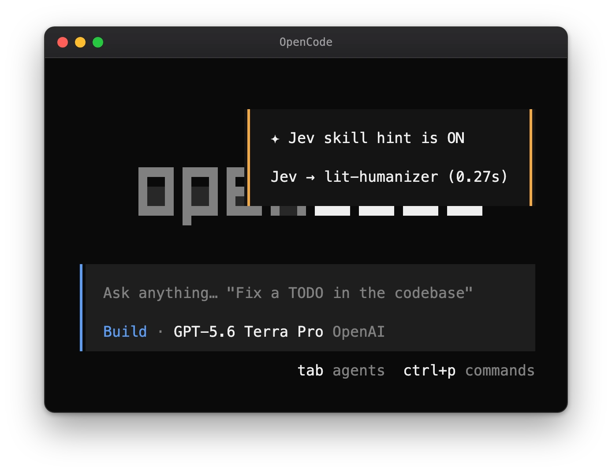</p>

*Sample output, produced the same way. The skill name and the time are examples.*

**Later prompts.** Each prompt that gets a hint shows a quieter toast with only the skill and the time. When no skill fits, or Jev is off, nothing appears.

<p align="center">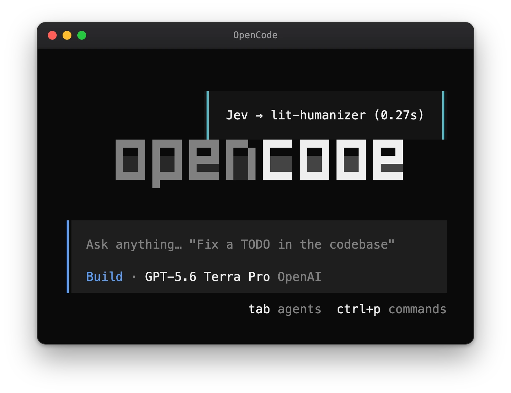</p>

*Sample output, produced the same way. The skill name and the time are examples.*

The suggestion itself is one sentence naming the skill. It goes to the model and isn't shown as something you typed.

## Troubleshooting

If the result doesn't match what the agent reported, tell it what you actually saw.

To check that the package is installed and your configuration is sound, run:

```sh
npm exec --package @litfamily/litopencode@latest -- litopencode doctor
```

The [installation and model reference](./docs/reference.md#install) goes deeper.

Two skills-folder setups can surprise you, and install and `doctor` point out both. The first is a skills folder, `<root>/skills`, that is a symlink to somewhere else. Install follows the link and writes LitOpenCode's skill folders wherever it points, so you get a warning when that place is inside a git repository. The second is a skill with the same name in another folder OpenCode reads, such as `~/.agents/skills`, `~/.claude/skills` or a project skills folder. OpenCode may load that copy instead of LitOpenCode's. See [symlinked native skills root and shadow copies](./docs/reference.md#symlinked-native-skills-root-and-shadow-copies).

## Uninstall

There's no `litopencode uninstall` command. Removing it by hand takes a few steps:

1. Delete the `@litfamily/litopencode` or `@litfamily/litopencode@<version>` entry from the `plugin` array in OpenCode's `opencode.jsonc` (or a custom root's `opencode.json`). Remove any legacy `litopencode` package entries too.
2. If you installed it globally, remove the npm binary:

   ```sh
   npm uninstall -g @litfamily/litopencode
   ```

3. Look over the installed command and skill files before you remove the installer's copies, and keep anything you created or edited.
4. Restart OpenCode.

Keep `litopencode.json` if you still want its routes, and keep a project's `.litopencode/` records if you plan to resume. The [removal reference](./docs/reference.md#remove) has the details.

## License

MIT. See [LICENSE](./LICENSE).

The reference material bundled for `lit-handoff` and `lit-scientific-visualization` lives in `vendor/handoff/` and `vendor/scientific-visualization/`. Their numbered license and provenance files are kept as source attribution.

## Links

### Documentation

- [Workflow reference](./docs/reference.md): models, permissions, host hooks, every skill, and reproducible verification.
- [한국어 상세 안내](./docs/reference-Ko-KR.md)
- [Migration notes](./docs/migration.md)
- [Terminal mark and activation probes](./docs/lit-mark.md)
- [Changelog](./CHANGELOG.md)
- [Release checklist](./docs/release-checklist.md), for maintainers. It stays in this repository and is not part of the npm package.

### Contributing

- [Contributing](./CONTRIBUTING.md) · [Support](./SUPPORT.md) · [Security](./SECURITY.md)
- [Code of conduct](./CODE_OF_CONDUCT.md) · [Privacy and network behavior](./docs/privacy.md)

### LITFAMILY


LitClaude · LitHermes · LitCodex · LitOpenCode · LitGrok.
Five armored machines for five independent products, each working in its own host.

### Ignition motion

[](./docs/assets/readme/ignition-film.mp4)

[Watch the 10-second film](./docs/assets/readme/ignition-film.mp4) · [Animated GIF](./docs/assets/readme/ignition-readme.gif) · [Lucide icon license](./docs/assets/readme/Lucide-LICENSE.txt) · [ASCII font license](./docs/assets/readme/JetBrainsMono-OFL.txt)

The editable, low-bandwidth vector version of the cover is [docs/assets/cover.svg](./docs/assets/cover.svg).
