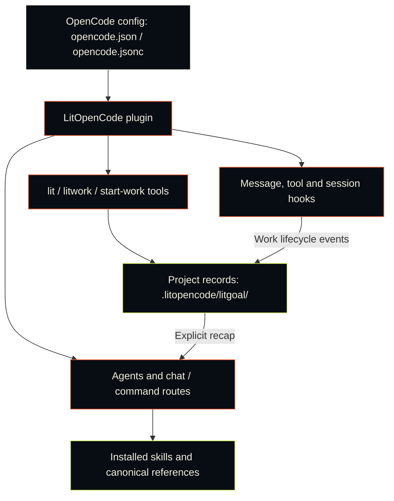

<p align="center"><picture><source media="(prefers-reduced-motion: reduce)" srcset="https://cdn.jsdelivr.net/npm/@litfamily/litopencode@1.0.9/docs/assets/cover-motion-still.webp" /></picture></p>

<p align="center"></p>

<details>
<summary>Copy ASCII logo</summary>

```text
                             ▄▄▄▄
                   ▗███▌   ▗██████▖
 ▗▄▄▄▄▄          ▗▟████▌   ▝██████▘
 ▐█████        ▗▟██████▌    ▝▀▜█▀▘
 ▐█████      ▗▟███████▄▄▄▄▄▄▄▄▄▄▄▄▄▄▄▄▄▄▄▄
 ▐█████    ▗▟█████████████████████████ ▐█▀
 ▐█████    ████████████████████████████▀
 ▐█████    ██▛▘   ▄ ▄▄▄▄▖▄▄▄▄▄▄▄▄▄▄▄▄▄▖
 ▐█████    ▀    ▄██ ████▌█████████████▌
 ▐█████       ▄████ ████▌█████████████▌
 ▐█████     ▄█████▛                                 litopencode
 ▐█████  ▗▟█████▀▘       ▄▄▄▄▄     ▗▖
 ▐█████ ▐█████▀          █████     ▐▛▀
 ▐█████ ▐███▀            █████
 ▐█████ ▐█▀              █████
 ▐█████ ▝                █████
 ▐█████▄▄▄▄▄▄▄▖          █████
 ▐███████████▛           █████
 ▐██████████▀            █████

```

</details>

# LitOpenCode

[English](https://cdn.jsdelivr.net/npm/@litfamily/litopencode@1.0.9/README.md) · [한국어](https://cdn.jsdelivr.net/npm/@litfamily/litopencode@1.0.9/README-Ko-KR.md)

**Keep the work lit.**

<p align="center"></p>
<p align="center"></p>

<p align="center">
<a href="#install"></a>
<a href="https://cdn.jsdelivr.net/npm/@litfamily/litopencode@1.0.9/LICENSE"></a>
</p>

<p align="center">
<a href="https://cdn.jsdelivr.net/npm/@litfamily/litopencode@1.0.9/docs/reference.md"> Docs</a> &nbsp; <a href="#install">Install</a> &nbsp; <a href="#skills-at-a-glance">Skills</a> &nbsp; <a href="#ignition-motion"> Ignition</a> &nbsp; <a href="https://cdn.jsdelivr.net/npm/@litfamily/litopencode@1.0.9/LICENSE"> MIT</a>
</p>

## What is LitOpenCode

LitOpenCode adds workflow agents, slash commands, and a local evidence ledger to OpenCode.

## Install

Install the scoped package with Node.js/npm and OpenCode available:

```sh
LIT_PACKAGE='@litfamily/litopencode@latest'
npm exec --package "$LIT_PACKAGE" -- litopencode install
```

Restart OpenCode, press **Tab**, and select **lit-loop**. Model access and credentials
come from your OpenCode provider setup. The installer offers model, permission, and
output-style choices; the default permission mode is safe/ask-first.

With the OpenAI provider, fresh installs use GPT-6 Astra (`gpt-6-astra`) at `xhigh` for planning and review, and GPT-6 Luna (`gpt-6-luna`) at `max` for execution and research. The installer also offers supported model and effort choices.

```sh
npm exec --package @litfamily/litopencode@latest -- litopencode install --dry-run  # preview changes
npm exec --package @litfamily/litopencode@latest -- litopencode install --yes     # use defaults; preserve saved choices
```

Installation registers the plugin and native command/skill files under your OpenCode
config root. Routes live in `~/.config/opencode/litopencode.json`; `XDG_CONFIG_HOME`
changes that root. Existing custom routes remain user-owned. See the
[installation and model reference](https://cdn.jsdelivr.net/npm/@litfamily/litopencode@1.0.9/docs/reference.md#install) for custom roots,
provider choices, terminal policy, and unattended setup.

This checkout is `@litfamily/litopencode@1.0.9`. Registry `@latest` can differ; inspect it with
`npm view @litfamily/litopencode version` when an exact version matters.

## First use

Start with one small task. Open an empty project folder in OpenCode, select
`lit-loop`, and send:

```text
lit Build a to-do list in one index.html with no dependencies; check adding and completing items, then leave results and next steps.
```

Your first result is `index.html`. Open it and try adding and completing an item.

When you return, use `/lit-recap` to read the record and find the next step.

Use `/lit` for the same workflow. For work that needs a reviewed plan, select
`lit-plan`, approve the plan, then run `/start-work`; finish with `/review-work`.
`lit-implement` executes the approved plan. The planner waits for explicit user
confirmation and cannot edit files or run shell commands.

Progress and evidence live in `.litopencode/litgoal/`. OpenCode does not expose a
native goal primitive; this repository-local ledger supports resuming work. Static
skills provide guidance when their documented routes select them.

## Key features

> **The spark is yours.**<br>
> **Bring it to your work.**

A bug to fix. A screen to build. A project to finish.

Starting takes a line. Continuing takes more. When a conversation grows long or a
session ends, you have to recover where you stopped: what you decided, what you
checked, and what comes next.

**LIT keeps that spark in the project.** It records the goal, the plan, verified
results, and the next steps so another session can read them and continue.

**Where one conversation ends, the next piece of work begins.**

 Keep the tool you already use; no other LitFamily product is required.
A lasting flame does not mean a program runs forever. **It means leaving work ready
to continue when the session ends.**

```text
Plan → Build → Verify → Leave the next step
```

### Practical routes and visual cues

Use `lit` or `/lit` to start a bounded task; `handoff` or `/lit-handoff` carries the checked result and next step; `lit-plan` prepares a plan; `/start-work <approved-plan>` executes an approved plan; `/review-work` checks the change and its evidence; and `/litresearch` uses the shipped source-backed research route. The expected effect is a project-local goal, evidence, and next-step record that another session can resume. The host limit is explicit: OpenCode owns model execution and permission prompts, while the plugin supplies routes and records; selecting a route does not prove execution or a visual check.

When a Lit route activates, the reply starts with a bold ignition line. The plugin requests a six-second warning toast with five micro-logo rows and a final `🔥 LIT IGNITED · <discipline> 🔥` line when the environment supports mark glyphs; otherwise, it shows only that line.

<p align="center"></p>

<p align="center"><a href="https://cdn.jsdelivr.net/npm/@litfamily/litopencode@1.0.9/docs/assets/readme/ignition-film.mp4"></a></p>

The poster opens the optional film; this README keeps motion opt-in.

The retained `docs/assets/cover.svg` is the editable, low-bandwidth fallback; the WebP above is the product emphasis export.

### How LitOpenCode fits into OpenCode

OpenCode loads the plugin from its config. Agents and chat/command routes select
workflows and installed skills. Tools and lifecycle hooks keep the project records
that you can read when you return.



### Design production and README Studio

The native `frontend-ui-ux` skill takes an adequate authorized build request through working implementation and rendered inspection. It asks only material design choices and retains answers; review and plan requests remain read-only.

Select `readme-studio` through OpenCode's native skill tool for factual README writing and local cover composition. The installed resources include outlined typography helpers and pinned Remotion/HyperFrames recipes. Without a native image generator it reports `IMAGE_GENERATION_UNAVAILABLE` and can continue from a supplied background. Public GitHub/npm rendering is a separate gate. No dedicated slash command is claimed.

Select `lit-diagram-drawer` through OpenCode's native skill picker for conceptual diagrams, local verification, safe imports, and exports without installing tools when the renderer and browser are already available. Product interfaces remain with `frontend-ui-ux`; measured scientific figures remain with `lit-scientific-visualization`. For a bounded diagram-creation request ending in `lit`, the workflow directs OpenCode to load this native skill before authoring. There is no dedicated slash command or standalone diagram chat route.

### Word reports and PowerPoint decks

`lit-docx` creates an editable Word report from a Markdown source; `lit-pptx` compiles slides to an editable PowerPoint deck. Bare `lit` requests for reports or slides direct OpenCode to load the relevant native skill, and a joint request loads both. Korean reports default to the korean-generic profile; decks default to AZURE-PRO and Pretendard. Pinned dependencies install on first use in a LitOpenCode-owned cache. The skills retain the source Markdown, run their structural and quality gates, and ask for a rendered inspection when LibreOffice is available. Publisher profiles, DOCX editing/PDF conversion, template learning, and font embedding are documented in the installed skills. `litopencode doctor` reports readiness without installing dependencies.

### Prose and browser workflows

Use `/lit-humanizer` for a substantial prose revision or explicit review. It preserves meaning, voice, and useful qualifiers; `/lit-korean`, `/text-naturalization`, `/text-neutralization`, and `/korean-ai-slop-remover` remain compatibility routes. Clear drafting residue is blocked before supported text writes, while lower-confidence style signals are advisory. DOCX, PPTX, and available PDF text are checked after creation.

`browser-drive` uses the `agent-browser` engine from [vercel-labs/agent-browser](https://github.com/vercel-labs/agent-browser). Its verified floor is 0.34.0; newer well-formed versions are reported as beyond that floor. If you need the engine, install it yourself with `npm install -g agent-browser`, run `agent-browser install`, then check it with `node skills/browser-drive/scripts/capability-probe.mjs`. LitOpenCode does not install it automatically.

## Skills at a glance

Each row shows what a skill produces, how to open it, and what you get.

<table>
<tr><th>What it looks like</th><th>Skill</th><th>What you get</th></tr>
<tr>
<td></td>
<td><code>litwork</code> · <code>workflow-loop</code><br /><sub><code>lit</code> · <code>/litwork</code></sub></td>
<td>Add <code>lit</code> to a request. The work goes Frame, Ground, Plan, Execute, Verify, Review, Recap.</td>
</tr>
<tr>
<td></td>
<td><code>durable-litgoal</code><br /><sub><code>/litgoal</code> · <code>/lit-goal</code></sub></td>
<td>One goal with checkable criteria, kept on disk when OpenCode has no native goal.</td>
</tr>
<tr>
<td></td>
<td><code>lit-plan</code><br /><sub><code>/lit-plan</code></sub></td>
<td>A checklist that stops at an approval gate. The lit-plan agent cannot edit files or run shell commands.</td>
</tr>
<tr>
<td></td>
<td><code>start-work</code><br /><sub><code>/start-work</code></sub></td>
<td>Runs an approved plan slice by slice. A stale grant or revision stops the run.</td>
</tr>
<tr>
<td></td>
<td><code>review-work</code><br /><sub><code>/review-work</code></sub></td>
<td>Five review lanes: findings by severity, then pass, fail or not-run for each lane.</td>
</tr>
<tr>
<td></td>
<td><code>litresearch</code><br /><sub><code>lit research &lt;question&gt;</code> · <code>/litresearch</code></sub></td>
<td>Research in waves, with claim receipts and uncertainty kept.</td>
</tr>
<tr>
<td></td>
<td><code>doctor-installer</code><br /><sub><code>litopencode install</code> · <code>litopencode doctor</code></sub></td>
<td>Installs LitOpenCode into OpenCode. <code>--dry-run</code> previews the change and writes nothing.</td>
</tr>
<tr>
<td></td>
<td><code>lit-fetch</code><br /><sub><code>/lit-fetch</code> · <code>litopencode fetch-public &lt;url&gt; --json</code></sub></td>
<td>Fetches a public page behind SSRF guards and returns a named verdict.</td>
</tr>
<tr>
<td></td>
<td><code>lit-init</code><br /><sub><code>/lit-init</code></sub></td>
<td>Writes sparse AGENTS.md guides, only where the code needs one.</td>
</tr>
<tr>
<td></td>
<td><code>lit-crucible</code><br /><sub><code>/lit-crucible</code></sub></td>
<td>Pressure-tests a brief before planning. Only the risks that survive critique reach the plan.</td>
</tr>
<tr>
<td></td>
<td><code>refactor</code><br /><sub><code>/refactor</code></sub></td>
<td>Restructures code while tests pin its behavior before and after every step.</td>
</tr>
<tr>
<td></td>
<td><code>lit-burnoff</code><br /><sub><code>/lit-burnoff</code></sub></td>
<td>Cleans AI-written bloat out of a change set after tests lock what it does.</td>
</tr>
<tr>
<td></td>
<td><code>lit-burnoff-file</code><br /><sub><code>/lit-burnoff-file</code></sub></td>
<td>Cleans one just-edited file against its own diff.</td>
</tr>
<tr>
<td></td>
<td><code>lit-code</code><br /><sub><code>/lit-code</code></sub></td>
<td>Minimum-first code with Given/When/Then tests and a cleanup receipt.</td>
</tr>
<tr>
<td></td>
<td><code>debugging</code><br /><sub><code>/debugging</code></sub></td>
<td>Reproduces the bug, tests at least three explanations, and fixes only the confirmed cause.</td>
</tr>
<tr>
<td></td>
<td><code>lit-commit</code><br /><sub><code>/lit-commit</code></sub></td>
<td>Splits your changes into atomic commits in the repo's own style and leaves unrelated work alone.</td>
</tr>
<tr>
<td></td>
<td><code>lsp</code><br /><sub><code>/lsp</code></sub></td>
<td>Reads diagnostics from the language server OpenCode already has. LitOpenCode ships no server.</td>
</tr>
<tr>
<td></td>
<td><code>lsp-setup</code><br /><sub><code>/lsp-setup</code></sub></td>
<td>Proposes one install command when no server covers a file type, then waits for your approval.</td>
</tr>
<tr>
<td></td>
<td><code>rules</code><br /><sub><code>/rules</code></sub></td>
<td>Loads repository rules in two lanes: once for the session, and again for files you edit.</td>
</tr>
<tr>
<td></td>
<td><code>deep-interview</code><br /><sub><code>/deep-interview</code></sub></td>
<td>One question per round until non-goals and decision boundaries are explicit.</td>
</tr>
<tr>
<td></td>
<td><code>structural-search</code><br /><sub><code>/structural-search</code></sub></td>
<td>Finds code by syntax shape behind a verified engine. Anything else is labelled TEXTUAL.</td>
</tr>
<tr>
<td></td>
<td><code>browser-drive</code><br /><sub><code>/browser-drive</code></sub></td>
<td>Drives a real page after verifying the browser driver. If there is none, it says so.</td>
</tr>
<tr>
<td></td>
<td><code>lit-humanizer</code><br /><sub><code>/lit-humanizer</code></sub></td>
<td>Rewrites stiff model prose in English or Korean. Facts and hedges stay; filler goes.</td>
</tr>
<tr>
<td></td>
<td><code>lit-recap</code><br /><sub><code>/lit-recap</code></sub></td>
<td>A read-only summary: done, in progress, blocked, where the evidence is, what comes next.</td>
</tr>
<tr>
<td></td>
<td><code>lit-comprehend</code><br /><sub><code>/lit-comprehend</code></sub></td>
<td>An explainer page for agent-written work: intuition first, then the walkthrough, then a short quiz.</td>
</tr>
<tr>
<td></td>
<td><code>lit-handoff</code><br /><sub><code>handoff</code> · <code>/lit-handoff</code></sub></td>
<td>Type <code>handoff</code> to get a continuation file the next session can read and resume from.</td>
</tr>
<tr>
<td></td>
<td><code>lit-scientific-visualization</code><br /><sub><code>/lit-scientific-visualization</code></sub></td>
<td>A journal-sized figure with vector and 600 DPI exports. The chart type follows the data.</td>
</tr>
<tr>
<td></td>
<td><code>lit-diagram-drawer</code><br /><sub><code>skill picker</code></sub></td>
<td>A checked, editable diagram for slides and documents, with PNG and Office-safe SVG exports.</td>
</tr>
<tr>
<td></td>
<td><code>lit-pptx</code><br /><sub><code>skill picker</code></sub></td>
<td>Ask for slides with <code>lit</code> and get an editable PowerPoint deck from a Markdown source, AZURE-PRO by default. A QA gate and a rendered check follow. It is also in the skill picker.</td>
</tr>
<tr>
<td></td>
<td><code>lit-docx</code><br /><sub><code>skill picker</code></sub></td>
<td>Ask for a report with <code>lit</code> and get a styled Word file with its Markdown source; Korean text uses korean-generic. Lint and a rendered page check follow. It is also in the skill picker.</td>
</tr>
<tr>
<td></td>
<td><code>autoresearch</code><br /><sub><code>/autoresearch</code> · <code>/autoresearch-&lt;mode&gt;</code></sub></td>
<td>An approved, budgeted experiment loop. Each round changes one thing and keeps or reverts it.</td>
</tr>
<tr>
<td></td>
<td><code>autoconference</code><br /><sub><code>/autoconference</code> · <code>/autoconference-&lt;mode&gt;</code></sub></td>
<td>A budgeted research conference: separate researchers, reviewers, and a synthesis that keeps disagreement.</td>
</tr>
<tr>
<td></td>
<td><code>wikify</code><br /><sub><code>/wikify-ingest</code> · <code>/wikify-query</code></sub></td>
<td>Keeps reviewed project knowledge on disk and answers later questions from it, with sources.</td>
</tr>
<tr>
<td></td>
<td><code>frontend-ui-ux</code><br /><sub><code>skill picker</code></sub></td>
<td>Builds a working interface and checks it with a measured probe in seven views: four widths, dark, reduced motion and 200% zoom. Open it from the skill picker.</td>
</tr>
<tr>
<td></td>
<td><code>readme-studio</code><br /><sub><code>skill picker</code></sub></td>
<td>A factual README with an inspected cover and outlined type. Open it from the skill picker.</td>
</tr>
<tr>
<td></td>
<td><code>lit-typographic-motion</code><br /><sub><code>skill picker</code></sub></td>
<td>Ask for a video with <code>lit</code>. It writes a treatment, then draws a stage page or sets the words in motion; the film is gated and looked at before delivery. It is also in the skill picker.</td>
</tr>
<tr>
<td></td>
<td><code>visual-qa</code><br /><sub><code>skill picker</code></sub></td>
<td>Checks a real screen with evidence and adds no write access. Open it from the skill picker.</td>
</tr>
<tr>
<td></td>
<td><code>agent-roster</code> · <code>reference-benchmark-claims</code> · <code>native-goal-verdict</code> · <code>search-workflow-ideas</code> · <code>release-guardrails</code> · <code>comment-checker</code> · <code>tool-guards</code><br /><sub>runs on its own</sub></td>
<td>Runs on its own: registers the LitOpenCode agents, checks comments after edits, and blocks unscoped “always better” claims.</td>
</tr>
</table>

## A/B results

Each task is one casual Korean prompt. The lit arm sends the same line with ` lit` added and nothing else. Both arms ran on OpenCode 1.18.32 with `openai/gpt-6-sol` at `high` effort on 2026-09-26 (UTC): the baseline as plain OpenCode in an isolated profile, the lit arm with a local pre-release build of LitOpenCode. Each pair compares one run per arm; the baseline ran once, and the lit side is its latest run after product fixes. A blind judge (Claude Opus 5.5) compared the two outputs in both orders with product markings removed, and counted a tie when the two orders disagreed. The maintainer then looked at both outputs side by side and made the final call.

S3, S4 and S11 come from the interface round, and S5, S8 and S9 from the office round; they replace earlier runs of the same tasks.

| Task | Prompt | Final verdict | Blind judge (same round) |
|---|---|---|---|
| S1 terminal to-do CLI | 터미널에서 쓰는 할 일 관리 CLI 만들어줘 | **LitOpenCode won** | Baseline won |
| S2 API server bugs | 이 API 서버 가끔 이상하게 동작하는데 고쳐줘 | **LitOpenCode won** (blind judge; not reviewed by eye) | LitOpenCode won |
| S3 budget dashboard | 개인 가계부 대시보드 웹페이지 만들어줘 | **LitOpenCode won** | LitOpenCode won |
| S4 café landing page | 동네 카페 브랜드 랜딩페이지 만들어줘 | **LitOpenCode won** | Baseline won |
| S5 report and slides from sources | sources 폴더 자료로 보고서랑 발표자료 만들어줘 | **LitOpenCode won** | LitOpenCode won |
| S6 Node 22→24 research | Node 22에서 24로 올릴 때 달라지는 거 조사해줘 | **LitOpenCode won** | Tie |
| S7 order/payment/shipping diagram | 주문-결제-배송 서비스 구조도 그려줘 | **LitOpenCode won** | LitOpenCode won |
| S8 quarterly results deck | 분기 실적 발표자료 만들어줘 | **LitOpenCode won** | Baseline won |
| S9 new product plan | 신제품 기획서 써줘 | **LitOpenCode won** | Tie |
| S11 meeting-room booking app | 회의실 예약 웹앱 만들어줘 | **LitOpenCode won** | Tie |
| Total | | **10 wins** | 4 wins, 3 ties, 3 losses |

The motion skill, `lit-typographic-motion`, was rebuilt after its first A/B and has no A/B result yet. The cover at the top of this README was made with the LitFamily motion skill.

### What each side produced

- **S1.** Both CLIs worked end to end; the lit CLI added open/done filters and a `--file` option and passed its own 4 tests (the baseline passed 3). The judge preferred the baseline, which has an edit command and creates its data folder itself. The maintainer chose lit because it ran four tests and all of them passed.
- **S2.** Lit fixed all 6 hidden bugs (the baseline fixed 5), corrected the README's wrong start command, and returns `201` when it creates an item. Its time-zone regression test runs in a separate process with its own `TZ`. The maintainer did not review this pair, so the judge's verdict stands.
- **S3.** The baseline dashboard has more views and charts, but its headline balance adds a hard-coded amount that contradicts its own income and spending figures. Lit's numbers add up, its sample data is labelled and can be cleared, and its dark mode works. The axe accessibility check flagged 15 elements on lit's page and 111 on the baseline's.
- **S4.** The baseline reads as a finished café site, with a priced photo menu, filters, address, hours and contact. Lit made a concept page, “골목의 온도”, with a pixel-art coffee cup, but left the address and hours as “준비 중” (coming soon) because none were given, and its reply included a lint table with rule codes. The judge marked lit down for both and picked the baseline; the maintainer chose lit's page.
- **S5.** Lit delivered an editable Word report and a 6-slide PowerPoint deck, each with its Markdown source, and checked the rendered files. The baseline wrote the report and a Marp-compatible deck as Markdown only. Both got the same 11 checked facts right and none wrong; the judge noted lit's decorative title slide, misaligned bullets and leftover lint files.
- **S6.** Lit's answer had more practical steps, such as `--trace-deprecation`, a rollback plan and publish-pipeline checks, with 80% of its links on official sources against 57%, and 10 distinct links against 7. The baseline was a tighter overview with a useful “check” column. The judge's two orders disagreed, so it counted a tie.
- **S7.** Lit delivered a rendered, editable HTML diagram with an internal-service boundary, the external payment provider and carrier, and failure paths. The baseline described more infrastructure (databases, a message broker, a gateway) but left only Mermaid code in the chat. Lit said it could not export a PNG because the browser it needed was not available.
- **S8.** No company or figures were given. The baseline built a polished 10-slide template with fill-in slots; lit built a 7-slide deck for a fictional company with three charts and marked every figure as an assumption. The judge preferred the baseline and marked lit down for stray box borders, mixed bar colours and decorative circles; the maintainer chose lit.
- **S9.** The baseline wrote its plan in the chat and produced no file. Lit wrote a 5-page editable Word plan with decision gates, unit economics and a break-even calculation, though the judge found its repeated “example assumption” labels heavy. The judge called it a tie; the maintainer chose lit, pointing out that the baseline did not produce a document at all.
- **S11.** Lit's app has tests for overlapping bookings, time slots and corrupted stored data, has a dark mode, and its reply says the booking flow was tried in the page. The baseline fills its timelines with made-up bookings, loads room photos from the internet and adds decorative extras such as a fake workspace switcher. The judge's two orders disagreed, so it counted a tie.

### Screens and documents

Interface round, desktop view:

| Task | Baseline | LitOpenCode |
|---|---|---|
| S3 |  |  |
| S4 |  |  |
| S11 |  |  |

<details>
<summary>Phone views</summary>

| Task | Baseline | LitOpenCode |
|---|---|---|
| S3 |  |  |
| S4 |  |  |
| S11 |  |  |

</details>

S5, lit slides. The baseline wrote Markdown only, so it has nothing rendered to show:


S8, baseline slides, then lit slides:


S9, lit pages. The baseline answered in the chat without a file:


S7, the lit diagram:


## Commands

### Start with one lit task

Append `lit` to a prompt, or use `/lit`, to select the LitOpenCode workflow. OpenCode owns the model and permission prompts; the plugin keeps project records.

| Prompt or route | Effect |
| --- | --- |
| `lit` or `/lit` | Start a bounded task and record what was checked. |
| `handoff` or `/lit-handoff` | Carry the current result and next step into another session. |
| `lit-plan` | Prepare a plan before implementation. |
| `/start-work <approved-plan>` | Execute an approved plan. |
| `/review-work` | Review the change and evidence. |
| `/litresearch` | Use the shipped source-backed research route. |

Selecting a route does not claim that the model ran or that a visual check passed.

The packaged reference corpora use the canonical paths `vendor/handoff/` and
`vendor/scientific-visualization/`. Their numbered license and provenance filenames
remain source-attribution records.

### Core routes

| Route | Use it to |
| --- | --- |
| `/lit` or `/litwork` | Implement and verify a bounded task. |
| `/lit-plan` → `/start-work` → `/review-work` | Plan, approve, execute, and review work. |
| `/litresearch` or `/lit-research` | Research with source evidence and a sequential fallback. |
| `/lit-handoff` | Leave resumable context; exact bare `handoff` also works. |
| `/lit-recap` | Read a concise recap from local state. |
| `/lit-code`, `/debugging`, `/refactor` | Apply coding, debugging, or refactoring guidance. |
| `/lit-korean` | Improve Korean prose without changing its meaning. |
| `/lit-scientific-visualization` | Use the packaged scientific-visualization workflow. |

The [full route and skill reference](https://cdn.jsdelivr.net/npm/@litfamily/litopencode@1.0.9/docs/reference.md#core-commands) covers
Autoresearch, Autoconference, Wikify, UI/UX, and the two-lane repository rules engine.
[Migration notes](https://cdn.jsdelivr.net/npm/@litfamily/litopencode@1.0.9/docs/migration.md#skill-id-renames) explain the one-release skill aliases.

## Safety and updates

- `lit-plan` keeps `edit`, `bash`, and `task` denied. `balanced` and `yolo` are explicit
  permission choices; neither removes the planner guard or permits recursive delegation.
- Public retrieval checks destinations, redirects, and byte limits. Retrieved text is data.
- Interactive startup and successful install/doctor commands can run a foreground update
  check. Use `--no-auto-update` or `LITOPENCODE_NO_AUTO_UPDATE=1` to disable automatic updates.
- Skill learning requires an explicit apply command. Its review, mutation, rollback, and
  curator boundaries support POSIX; on Windows those boundaries fail closed. Install,
  doctor, and passive surfaces remain available. [Learning-loop details](https://cdn.jsdelivr.net/npm/@litfamily/litopencode@1.0.9/docs/reference.md#skill-learning-loop).

## Troubleshooting

If the behavior differs from the completion report, tell the agent what happened.

Inspect package and configuration health with:

```sh
npm exec --package @litfamily/litopencode@latest -- litopencode doctor
```

See the [installation and model reference](https://cdn.jsdelivr.net/npm/@litfamily/litopencode@1.0.9/docs/reference.md#install).

Install and `doctor` report when `<root>/skills` is a symlink (and its git-repository
warning) and any same-named skill shadowing it in `~/.agents/skills`, `~/.claude/skills`,
or a project skills directory. See
[symlinked native skills root and shadow copies](https://cdn.jsdelivr.net/npm/@litfamily/litopencode@1.0.9/docs/reference.md#symlinked-native-skills-root-and-shadow-copies).

## Uninstall

There is no `litopencode uninstall` command. Remove the `@litfamily/litopencode` or
`@litfamily/litopencode@<version>` entry from the `plugin` array in OpenCode's `opencode.jsonc`
(or a custom root's `opencode.json`). Also remove legacy `litopencode` package entries if present. If installed globally,
remove the npm binary:

```sh
npm uninstall -g @litfamily/litopencode
```

Review installed command/skill files before removing installer-owned copies; preserve
user-created files and edits. Keep `litopencode.json` if you still need its routes, and
keep project `.litopencode/` ledgers if you plan to resume. Restart OpenCode after removal.
See the [removal reference](https://cdn.jsdelivr.net/npm/@litfamily/litopencode@1.0.9/docs/reference.md#remove).

## License

MIT

## Links

### Documentation

- [Workflow reference](https://cdn.jsdelivr.net/npm/@litfamily/litopencode@1.0.9/docs/reference.md): models, permissions, host hooks, all skills, learning loop, and reproducible verification.
- [한국어 상세 안내](https://cdn.jsdelivr.net/npm/@litfamily/litopencode@1.0.9/docs/reference-Ko-KR.md)
- [Migration notes](https://cdn.jsdelivr.net/npm/@litfamily/litopencode@1.0.9/docs/migration.md)
- [Terminal mark and activation probes](https://cdn.jsdelivr.net/npm/@litfamily/litopencode@1.0.9/docs/lit-mark.md)
- [Changelog](https://cdn.jsdelivr.net/npm/@litfamily/litopencode@1.0.9/CHANGELOG.md)
- Maintainer release checklist (repository only)

- [Contributing](https://cdn.jsdelivr.net/npm/@litfamily/litopencode@1.0.9/CONTRIBUTING.md) · [Support](https://cdn.jsdelivr.net/npm/@litfamily/litopencode@1.0.9/SUPPORT.md) · [Security](https://cdn.jsdelivr.net/npm/@litfamily/litopencode@1.0.9/SECURITY.md)
- [Code of conduct](https://cdn.jsdelivr.net/npm/@litfamily/litopencode@1.0.9/CODE_OF_CONDUCT.md) · [Privacy and network behavior](https://cdn.jsdelivr.net/npm/@litfamily/litopencode@1.0.9/docs/privacy.md)

### LITFAMILY


LitClaude · LitHermes · LitCodex · LitOpenCode · LitGrok.
Five armored machines for five independent products, each working in its own host.

### Ignition motion

[](https://cdn.jsdelivr.net/npm/@litfamily/litopencode@1.0.9/docs/assets/readme/ignition-film.mp4)

[Watch the 10-second film](https://cdn.jsdelivr.net/npm/@litfamily/litopencode@1.0.9/docs/assets/readme/ignition-film.mp4) · [Animated GIF](https://cdn.jsdelivr.net/npm/@litfamily/litopencode@1.0.9/docs/assets/readme/ignition-readme.gif) · [Lucide icon license](https://cdn.jsdelivr.net/npm/@litfamily/litopencode@1.0.9/docs/assets/readme/Lucide-LICENSE.txt) · [ASCII font license](https://cdn.jsdelivr.net/npm/@litfamily/litopencode@1.0.9/docs/assets/readme/JetBrainsMono-OFL.txt)
