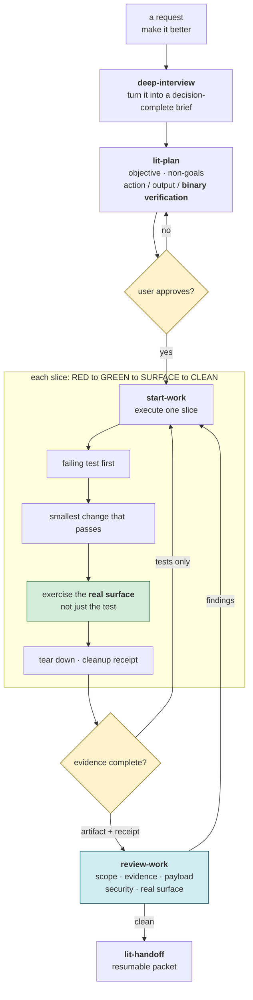
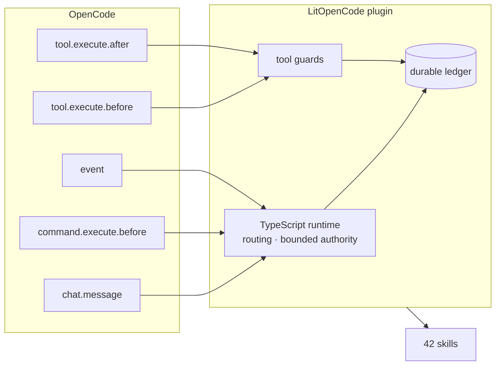
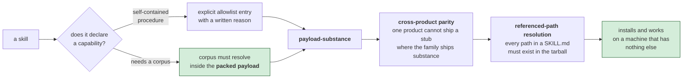

# LitOpenCode 워크플로 상세 안내

[빠른 시작](../README-Ko-KR.md) · [English](reference.md)

*워크플로를 한눈에 보면 이렇습니다. 계획은 항목마다 통과/실패가 분명한 검증이 있어야 승인되고, 구현 slice는 실제 surface에서 확인한 evidence와 정리 기록까지 남겨야 닫힙니다. 테스트 통과만으로는 완료가 아닙니다.*



## 설치

권장 설치:

scoped 패키지가 npm 설치 대상입니다. [패키지 이전 안내](migration.md#scoped-npm-package-migration)를 확인하세요.

```sh
npm exec --package @litfamily/litopencode@latest -- litopencode install
```

설정 변경을 미리 보거나 설치 상태를 확인할 수 있습니다.

```sh
npm exec --package @litfamily/litopencode@latest -- litopencode install --dry-run
npm exec --package @litfamily/litopencode@latest -- litopencode doctor
```

설치 명령은 OpenCode의 plugin installer를 통해 플러그인을 등록합니다.
`~/.config/opencode/litopencode.json`이 없을 때만 route 파일을 만들고, 기존 route는
그대로 둡니다. 기본 OpenCode 설정 파일은 `~/.config/opencode/opencode.jsonc`입니다.
`XDG_CONFIG_HOME`이 설정되어 있으면 `$XDG_CONFIG_HOME/opencode/opencode.jsonc`를 사용합니다.

*OpenCode의 이벤트가 플러그인으로 들어오면 TypeScript runtime이 route와 권한 경계를 적용하고, tool guard와 durable ledger로 결과를 남깁니다. 아래 흐름이 설치 후 실제로 연결되는 host surface입니다.*



권한과 모델은 명시적으로 선택합니다.

```sh
npm exec --package @litfamily/litopencode@latest -- litopencode install --permission-prompt
npm exec --package @litfamily/litopencode@latest -- litopencode install --permission-mode balanced
npm exec --package @litfamily/litopencode@latest -- litopencode install --yolo
npm exec --package @litfamily/litopencode@latest -- litopencode install --provider openai --model gpt-6-astra --effort xhigh
npm exec --package @litfamily/litopencode@latest -- litopencode install --provider openai --model gpt-5.6-luna --effort max
```

기본값은 safe/ask-first입니다. `balanced`와 `yolo`는 선택했을 때만 적용됩니다.
`install --yes`는 모든 선택 메뉴를 건너뛰고 저장된 출력 스타일을 유지합니다.
CI와 비대화형 터미널에서는 자동 질문을 생략하며, 명시한 질문 플래그는 계속 동작합니다.
`NO_COLOR`에서도 출력 스타일을 직접 선택할 수 있지만 색상·커서 이스케이프는 출력하지
않습니다. `TERM=dumb`이나 UTF-8이 아닌 로케일에서는 ANSI 장식 없이 `LIT` 문자를 표시합니다.
새로 설치하거나 초기화하면 계획·검토 및 `lit-loop`는 `openai/gpt-6-astra`/`xhigh`,
실행·연구 helper는 새 기본값인 `openai/gpt-6-luna`/`max`를 사용합니다. `gpt-6-sol`/`xhigh`는
코딩 리드 대안입니다. GPT-6 Astra와 GPT-6 Sol은 `low`, `medium`, `high`, `xhigh`, `max`, `ultra`를
모두 지원합니다. GPT-6 Luna는 `low`, `medium`, `high`, `xhigh`, `max`를 지원하지만 `ultra`는
지원하지 않습니다. 이전 세대 `gpt-5.6-sol`, `gpt-5.6-terra`, `gpt-5.6-luna`는 계속 선택할 수 있고,
현재 호스트 카탈로그에는 이 모델들의 지원 종료일이 등록되어 있지 않습니다. GPT-5.6 Luna는
`high`와 `max`만 지원하고 `xhigh`는 허용하지 않습니다. 이 제한은 GPT-6 Luna에는 적용되지 않습니다.
일반 설치와
업데이트는 이미 설정된 모델을 보존합니다. 명시적인 `--model-prompt`만 관리 모델 키를 다시 씁니다.
기존 GPT-5.6 계열의 `-fast` 의미는 유지하지만 `gpt-6-astra-fast` 별칭은 추가하지 않습니다.

### 모델 카탈로그 갱신

OpenAI 모델 ID, 역할 기본값, 선택 메뉴 항목과 effort 범위는 `src/cli/model-catalog.ts`에 모여 있습니다.
이 파일을 수정한 뒤 `npm run build`로 패키지용 JavaScript를 다시 생성하고,
`node --test test/gpt6-astra-routing.test.mjs`로 선택 메뉴, 기본 경로와 라우팅 동작을 확인합니다.
전역 설치가 필요하면 다음을 사용합니다.

```sh
npm install -g @litfamily/litopencode
litopencode install
```

## 처음 사용하기

설치 후 OpenCode를 재시작하고 Tab을 누르세요. agent 선택기에 다음 세 agent가 보여야 합니다.

| Agent | 역할 |
| --- | --- |
| `lit-loop` | 구현, 검증, 안전한 위임, 진행 기록 |
| `lit-plan` | 근거가 있는 계획 작성. `edit`, `bash`, `task` 권한은 허용하지 않음 |
| `lit-implement` | `/start-work` 이후 승인된 계획 실행 |

작업 순서는 다음과 같습니다.

1. `lit-plan`에 하나의 범위가 분명한 계획을 요청합니다.
2. 계획을 승인한 뒤 `/start-work`를 실행합니다.
3. 완료를 주장하기 전에 `/review-work`를 실행합니다.

## 주요 명령

| 경로 | 용도 |
| --- | --- |
| `/lit` | 일반 `lit-loop` 워크플로 시작 |
| `/litwork` | 제한된 작업 루프 진입 |
| `/lit-plan` | 읽기 전용 구현 계획 작성 |
| `/start-work` | 승인된 계획을 `lit-implement`로 실행 |
| `/review-work` | 초안 계획 또는 완료 작업 검토 |
| `/litresearch` 또는 `/lit-research` | 순차 대체 경로를 포함한 근거 기반 연구 |
| `/lit-handoff` | 이어서 작업할 수 있는 핸드오프 작성 |
| `/lit-recap` | 로컬 ledger와 세션 맥락으로 짧은 리캡 작성 |
| `/lit-scientific-visualization` | 패키지에 포함된 scientific-visualization 워크플로 사용 |
| `/lit-korean` | 의미를 바꾸지 않고 문장 흐름 검토 |
| `/text-neutralization` | neutralization 계약에 따른 문장 검토 |

그 밖에 `/refactor`, `/lit-burnoff`, `/lit-code`, `/debugging`, `/lit-commit`,
`/lsp`, `/lsp-setup`, `/rules`, `/deep-interview`, `/structural-search`,
`/autoresearch`, `/autoconference`, `/wikify-*` 경로가 있습니다. 이 경로는 안내 또는 제한된
로컬 동작을 추가합니다. 호스트 권한은 늘리지 않습니다.

### Durable loop 상태

LitOpenCode는 `.litopencode/litgoal/lit-loop/`에 goal 상태를 저장합니다. append-only
ledger에 진행 상황과 evidence를 기록합니다.

```sh
litopencode status
litopencode create-goals --session-id <id> --objective <text>
litopencode record-evidence --criterion-id <id> --kind <red|green|scenario|cleanup|note> --ref <ref>
litopencode checkpoint --summary <text>
litopencode complete-goals
```

`/start-work init|resume|cancel|complete|status <schema-3 JSON>`은 승인된 실행을 위한
bounded-authority 경로입니다. `resume`은 신뢰된 사용자 경로와 work, session, revision,
grant가 모두 맞을 때만 허용됩니다. 복사하거나 인용한 텍스트는 명령으로 처리하지 않습니다.

### UI 및 Visual QA 관리 헬퍼

`frontend-ui-ux`와 `visual-qa` 경로는 Node ESM 헬퍼와 제한된 읽기 전용
evidence를 사용합니다. 이 경로들은 workflow family의 scaffold나 status
헬퍼를 추가하지 않습니다.

### 관리되는 workflow family

Autoresearch와 Autoconference가 제한된 로컬 workflow를 위한 scaffold/status
헬퍼를 제공합니다. Wikify는 템플릿과 contract를 소유하지만 scaffold나
status helper는 제공하지 않습니다. Wikify probe는
`tool.execute.after`, `chat.message`, `command.execute.before`를 포함한
다섯 개 surface를 확인하며, 나머지 host hook surface는 Wikify contract에
기록되어 있습니다. Wikify는 `tool.execute.after`에서 하나의 제한된
`wikify` tool도 소유하고, Autoresearch나 Autoconference tool은 노출하지
않습니다.

## Release Readiness

출시 담당자는 [`release-checklist.md`](release-checklist.md)를
사용합니다. 이 문서는 현재 설치 동작만 설명합니다.

## 검증

LitOpenCode checkout에서 다음 검사를 실행합니다.

```sh
npm install
npm run build
npm test
npm run typecheck
npm run check:managed-skill-manifest
npm run scan:legacy-tokens
npm run check:version
npm run check:pack-payload
npm run qa:real-surface
npm pack --dry-run --json --ignore-scripts
```

쓰기 없는 로컬 probe:

```sh
node bin/litopencode.cjs doctor --root .
node bin/litopencode.cjs install --dry-run --root .
```

`doctor`는 package, route, command, skill, 로컬 상태를 쓰기 없이 확인합니다.

*패키지에 소스 파일이 있다는 사실만으로는 충분하지 않습니다. `npm pack` 결과 안에서 skill이 선언한 참조가 모두 해소되어야, 아무것도 없는 새 머신에서도 설치 후 동작한다고 말할 수 있습니다.*



## 제거

`uninstall` 서브커맨드는 없습니다. 전역 설치를 했다면 먼저 npm 패키지를 제거합니다.

```sh
npm uninstall -g @litfamily/litopencode
```

그 다음 OpenCode가 관리하는 `opencode.jsonc`(또는 custom root의 `opencode.json`)의
`plugin` 배열에서 `@litfamily/litopencode` 또는 `@litfamily/litopencode@<version>` 항목을 제거합니다.
더 이상 route가 필요하지 않을 때만 `~/.config/opencode/litopencode.json`을 제거하세요.
프로젝트의 `.litopencode/`는 별도 ledger와 receipt입니다. 나중에 재개할 계획이 없다면
그 상태를 버려도 되는지 확인한 뒤 직접 정리합니다.

## 안전과 업데이트

- `lit-plan`은 계획 전용입니다. `edit`, `bash`, `task` 권한을 허용하지 않습니다.
- `balanced`와 `yolo`는 선택형 권한 모드입니다. `balanced`에서는 위험한 shell 패턴이
  계속 ask로 남고, `yolo`도 planner의 deny guard와 하위 agent 재귀 위임을 풀지 않습니다.
- 패키지 시작과 대화형 `install`/`doctor` 성공 뒤에는 정확한 버전을 확인하는 foreground
  update barrier가 동작합니다. `--no-auto-update` 또는 `LITOPENCODE_NO_AUTO_UPDATE=1`로
  끌 수 있습니다. cache-only 알림은 `NO_UPDATE_NOTIFIER=1` 또는
  `LITOPENCODE_NO_UPDATE_CHECK=1`로 끌 수 있습니다.
- Public-source retrieval에는 SSRF 검사, redirect 검증, byte 제한, access verdict가
  있습니다. 가져온 본문은 명령이 아니라 데이터로 처리합니다.

## Jev 스킬 힌트 (선택)

`chat.message` hook이 TypeSafe의 판단 모델 Jev에게 사용자 턴에 맞는 runtime 스킬을 물을 수
있습니다. `LITOPENCODE_JEV=1`과 `TYPESAFE_API_KEY`가 모두 프로세스 환경에 있어야 켜지고, 그렇지
않으면 네트워크 요청을 하지 않습니다. 키는 환경 변수에서만 읽고 `Authorization` header로만
보내며, 파일·로그·화면에 남기지 않습니다.

- **대상 턴.** 루트 세션만 해당합니다. 슬래시 명령(`command.execute.before`가 펼친 명령 포함),
  lit 경로가 이미 처리한 턴, 첨부 파일 본문 같은 synthetic part, 공백을 뺀 4자 미만의
  프롬프트는 건너뜁니다. OpenCode는 `command.execute.before`가 받은 parts 배열이 아니라 새 배열을
  `chat.message`에 넘기므로, 명령은 세션에 표시를 남기고 그 세션의 다음 `chat.message`가 이
  표시를 소비합니다.
- **요청.** 조건에 맞는 턴마다 `POST https://api.typesafe.ai/v1/systemone`을 한 번 보내고
  다시 시도하지 않으며 리다이렉트도 따르지 않습니다(`redirect: "error"`). 본문에는 `model`,
  `state`, `questions`만 들어갑니다. `state`는 프롬프트 앞 8,000자에서 홈 경로를 `~`로, 이메일을
  `[email]`로, 토큰 형태의 문자열(`password=`/`token=`/`secret=` 형식의 대입과 키 자체 포함)을
  `[secret]`으로 바꾼 뒤 2,000자에서 자릅니다. 잘린 자리에 토큰 문자 8개 이상이 남으면 그것도
  `[secret]`이 됩니다. 호스트 이름이나 고객 이름처럼 토큰 형태가 아닌 내용은 그대로 전송됩니다.
  후보 목록은 runtime 스킬과 `none`입니다.
- **붙는 문장.** 힌트와 실패 안내는 `synthetic` text part로 붙습니다. OpenCode는 이 part를
  모델에 그대로 보내지만, 사용자가 쓴 글로 표시하거나 복사하지 않습니다.
- **응답.** HTTP 200, 올바른 JSON, 후보 id와 정확히 같은 `answers.which.choice`, 기준 이상의
  `answers.which.confidence`를 모두 만족할 때만 힌트를 붙입니다. 붙는 문장은 LitOpenCode가 정한
  고정 문장이며 응답 본문을 옮기지 않습니다.
- **실패 시.** 시간 초과, 네트워크 오류, 200이 아닌 상태, 잘못된 응답, 호출 한도 도달 때는 힌트
  없이 평소대로 진행합니다. 세션의 첫 실패에만 짧은 안내 한 줄이 붙습니다.
- **상태.** `litopencode doctor`의 `jevSkillHint` 값이 `Jev skill hint: off`, `on`,
  `flag on but TYPESAFE_API_KEY missing` 가운데 하나로 나옵니다.
- **화면 표시.** 세션에서 조건에 맞는 첫 턴에는 `warning` 알림에 `✦ Jev skill hint is ON`이
  뜹니다. 그 턴에 힌트도 붙으면 이 안내가 알림의 제목이 되고 `Jev → <skill> (<seconds>s)`가
  본문이 됩니다. TUI가 알림을 한 번에 하나만 유지하기 때문입니다. 이후 힌트가 붙는 턴에는
  `Jev → <skill> (<seconds>s)`만 담은 `info` 알림이 뜹니다. 실패 안내, `none` 응답, 건너뛴 턴에는
  아무것도 뜨지 않습니다. 두 알림 모두 OpenCode의 기본 표시 시간을 씁니다.

| 변수 | 기본값 | 효과 |
| --- | --- | --- |
| `LITOPENCODE_JEV` | 없음 | `1`이면 키가 있을 때 힌트를 켭니다. |
| `TYPESAFE_API_KEY` | 없음 | 본인의 TypeSafe 키입니다. 요금은 입력 토큰 100만 개당 약 0.04달러입니다. |
| `LITOPENCODE_JEV_MODEL` | `jev-1.13.0` | 요청에 담는 모델 이름입니다. |
| `LITOPENCODE_JEV_TIMEOUT_MS` | `1500` | 제한 시간(ms)이며 최대 `3000`입니다. |
| `LITOPENCODE_JEV_MAX_CALLS` | `200` | 세션당 요청 수 한도입니다. |
| `LITOPENCODE_JEV_MIN_CONFIDENCE` | `0.35` | 힌트를 붙이는 최소 확신도입니다. |
| `LITOPENCODE_JEV_TRACE` | 없음 | `1`이면 요청마다 `.litopencode/logs/jev-skill-hint.jsonl`에 시각, 프롬프트 SHA-256, 고른 id, 확신도, 지연 시간, HTTP 상태, 실패 사유를 한 줄씩 남깁니다. 프롬프트 본문, 키, 응답 본문은 남기지 않습니다. |

## 패키지 경로

- 패키지와 plugin id: `litopencode`
- CLI binary: `litopencode`
- 공개 export: `litopencode`, `litopencode/server`
- 전역 route 파일: `~/.config/opencode/litopencode.json`
- 프로젝트 override: `.litopencode/config.json`
- Durable 상태: `.litopencode/litgoal/`
- 사용자 상태 루트: `~/.litopencode/`

## 스킬 이름 변경

새 명령은 `/lit-crucible`, `/lit-init`, `/lit-commit`, `/lit-burnoff`, `/lit-burnoff-file`,
`/lit-korean`, `/lit-fetch`, `/lit-code`입니다. 이전 이름은 한 릴리스 동안 새 명령으로
연결되며, 이름 변경 안내가 한 줄 표시됩니다. 다음 마이너 버전에서 이전 이름을 제거합니다.
설치·업데이트는 새 복사본을 검증한 뒤 설치 도구가 관리하는 이전 이름의 스킬 디렉터리를
제거합니다. 사용자 소유 파일은 보존합니다. 자세한 내용은 [마이그레이션 안내](migration.md#skill-id-renames)를 참고하세요.

## 문서

- [빠른 시작](../README-Ko-KR.md)
- [English reference](reference.md)
- [Changelog](../CHANGELOG.md)
- [마이그레이션](migration.md)
- [터미널 마크](lit-mark.md)
- [출시 담당자 체크리스트](release-checklist.md)


## 설치된 원본 스킬 파일

`lit-handoff`와 `lit-scientific-visualization`의 원본은 선택한 OpenCode 설정 루트의
`skills/<id>/canonical/`에 그대로 설치합니다. 먼저 native 스킬의 `SKILL.md`를 읽고,
그 파일의 디렉토리를 기준으로 `exact_source_root`를 해석하세요. 슬래시 명령과
bare 경로도 같은 native 스킬 위치를 사용합니다. 프로젝트나 command 디렉토리를
기준으로 원본을 찾으면 안 됩니다. 패키지 설치에는 참조 파일 전체가 포함되며
개발자의 checkout이 필요하지 않습니다.

Doctor는 패키지 원본뿐 아니라 설치된 파일 목록과 해시도 확인합니다. Python이나
matplotlib이 없는 `DEGRADED` 상태와 설치 파일 누락은 별개입니다. 파일 누락은
무결성 오류이며, 어느 검사도 의존성을 자동으로 설치하지 않습니다.

재설치할 때 생성 표시가 없는 사용자 스킬은 보존합니다. 생성된 wrapper의 새
canonical 하위 트리는 패키지의 파일 목록과 해시가 일치할 때만 교체합니다.
수정·추가·누락된 파일이나 심볼릭 링크가 있으면 거부합니다. 변경한 파일은 관리
트리 밖에 백업한 뒤 다시 시도하세요. 이 하위 트리가 없는 이전 flat wrapper에는
누락된 원본을 추가할 수 있습니다. 기존에 생성된 wrapper와 배포 파일은 계속
설치 도구의 관리 대상이므로 교체될 수 있습니다. 모든 생성 파일의 편집 내용을
보존한다는 뜻은 아닙니다.


과학 스킬의 Python 모듈을 일반적으로 import하면 `__pycache__` 파일이 생길 수
있습니다. Doctor는 해당 경로를 `canonicalCacheFiles`에 표시합니다. 정상 파일인
CPython/PyPy 태그의 `.pyc`(최적화 태그 포함)가 해시가 그대로인 관리 대상 `.py`에
대응하는지 확인하며, 바이트코드를 실행하거나 그 내용을 신뢰하지 않습니다.
그 밖의 추가 파일, 원본 누락·수정, 파일이나 디렉토리의 심볼릭 링크는 계속 거부합니다.

캐시가 생긴 상태에서 재설치하면 이전 스킬 트리 전체를 native 스킬 탐색 범위 밖인
`<config-root>/.litopencode-canonical-backups/<unique-id>/skill`에 보관합니다.
`prepared.json`은 이동 전 기록이고 `receipt.json`은 보관 완료 기록과 캐시별
SHA-256을 담습니다. 실제로 사용할 위치에는 원본을 새로 복사하므로 보관한
바이트코드가 새 원본보다 먼저 실행되지 않습니다. 캐시 없는 재설치와 이전 flat
wrapper 이전에는 보관 사본이 필요하지 않습니다. 교체나 안전한 복귀가 실패하면
안내된 복구 경로를 보존하고 확인하세요. 설치 성공으로 간주하면 안 됩니다.
이 검사는 일반적인 사용과 감지한 경로 변경을 다루며, 적대적인 동시 파일 변경까지
막는다는 보장은 아닙니다.

## 심볼릭 링크된 native 스킬 루트와 다른 위치의 같은 이름 스킬

Install은 `<root>/skills`가 심볼릭 링크여도(예: `~/.config/opencode/skills`가 다른
디렉토리를 가리키는 경우) 의도적으로 그 링크를 따라가며, 이 경우에도 설치는
성공합니다. `install`과 `doctor` 모두 이제 이 링크를 보고하므로 조용히 다른 곳에
쓰는 일이 없습니다: 링크 경로, 실제로 해석된 대상 경로, 그리고 그 대상이 git
작업 트리 안에 있다면 저장소 루트까지 알려줍니다. 관리 대상 스킬 디렉토리가 그
저장소 안에 나타나기 때문입니다. 스킬 디렉토리가 개인 git 저장소를 가리키는
사용자라면 설치 후 그 저장소 안에 수십 개의 새 디렉토리가 생기는 것을 예상해야
합니다. 이 경고는 설치 실패가 아니라 링크를 다시 정리하라는 안내로 받아들이세요.

`doctor`는 이에 더해 `install.nativeSkills.shadowedSkills`를 보고합니다. 관리 대상
스킬 id마다, OpenCode가 함께 읽는 다른 스킬 루트에 같은 이름의 `<id>/SKILL.md`
사본이 있는지 확인합니다 — 사용자 수준의 `~/.agents/skills`, `~/.claude/skills`,
그리고 현재 작업 디렉토리 기준 프로젝트 수준의 `.opencode/skills`, `.claude/skills`,
`.agents/skills`가 대상입니다. OpenCode는 둘 중 어느 사본이든 불러올 수 있으며, 이
문서는 어느 쪽이 우선하는지 단정하지 않습니다. 해석한 경로가 관리 대상 native
스킬 루트와 같으면 같은 트리이므로 shadow로 표시하지 않고 제외합니다. Shadow
표시는 안내용이며 `nativeSkills.ok`나 doctor 전체의 `install.ok`를 바꾸지 않습니다.
보고된 shadow를 해결하려면 관리되지 않는 사본을 지우거나 이름을 바꾸세요. 그대로
두면 OpenCode가 LitOpenCode가 관리하는 사본 대신 그 사본을 불러올 수 있습니다.

## 디자인 제작과 README

OpenCode 네이티브 스킬 `frontend-ui-ux`는 충분한 구현 요청을 받으면 작업 화면을 만들고 렌더링을 확인합니다. 중요한 방향이 모호할 때만 질문하며 답변을 보존합니다. 검토·계획 요청은 읽기 전용입니다.

네이티브 스킬 도구에서 `readme-studio`를 선택하면 실제 저장소 정보로 README와 표지를 제작합니다. 로컬 글꼴의 윤곽선, Remotion/HyperFrames 예제, 정적·동적 출력 절차가 함께 설치됩니다. 이미지 생성 도구가 없으면 `IMAGE_GENERATION_UNAVAILABLE`을 알리고 제공된 배경으로 이어갑니다. 공개 GitHub/npm 렌더링 검증은 별도 단계입니다. 전용 슬래시 명령은 없습니다.

개념·편집·기술 다이어그램은 `lit-diagram-drawer` 네이티브 스킬 선택기에서 제작하고 검증합니다. 제품 인터페이스는 `frontend-ui-ux`, 측정된 과학 데이터 그림은 `lit-scientific-visualization`을 사용합니다.

`lit-docx`는 워드 보고서, `lit-pptx`는 파워포인트 발표자료를 만듭니다. `lit`과 함께 쓰면 요청한 형식의 네이티브 스킬을 선택하고, 마크다운 원본·품질 검사·렌더 확인을 유지합니다.
