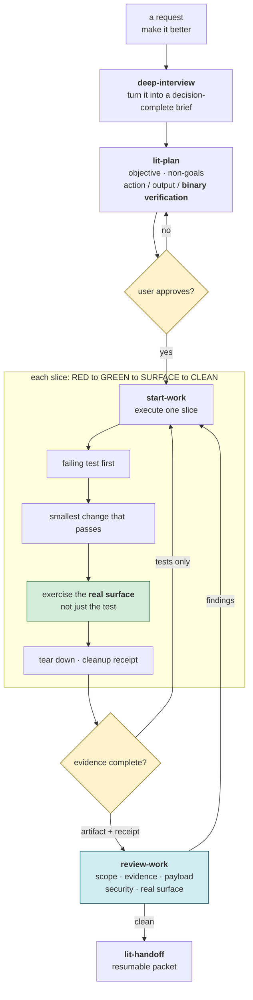
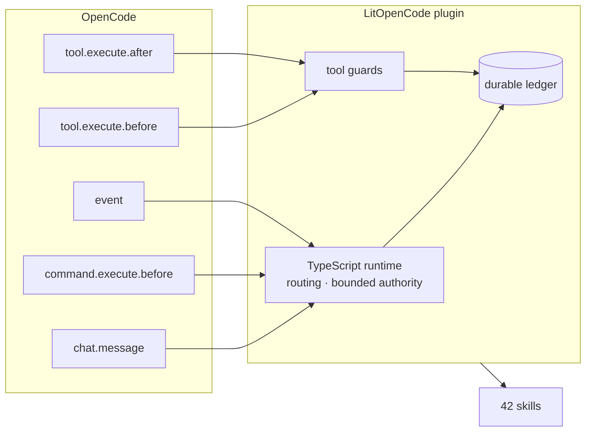
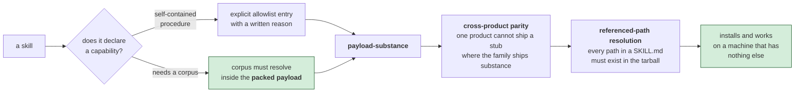

# LitOpenCode workflow reference

[Quick start](../README.md) · [한국어](reference-Ko-KR.md)

*Workflow discipline in one view: a plan earns approval only with binary checks, and a slice closes only after the real surface, evidence, and cleanup are complete. Tests alone do not close the slice.*



## Install

The command uses an explicit npm package and the preserved executable:

The scoped package is the npm install target. See [package migration](migration.md#scoped-npm-package-migration).

```sh
npm exec --package @litfamily/litopencode@latest -- litopencode install
```

Preview the config changes without writing them, or inspect an installed setup:

```sh
npm exec --package @litfamily/litopencode@latest -- litopencode install --dry-run
npm exec --package @litfamily/litopencode@latest -- litopencode doctor
```

The installer registers the plugin through OpenCode's plugin installer. It creates
`~/.config/opencode/litopencode.json` only when that route file is missing. Existing
routes remain user-owned. The default OpenCode config is
`~/.config/opencode/opencode.jsonc`, or `$XDG_CONFIG_HOME/opencode/opencode.jsonc`
when `XDG_CONFIG_HOME` is set.

*OpenCode provides the event surfaces; LitOpenCode turns them into bounded routes and guards, then records the durable ledger. This is the host connection behind the commands above.*



Optional permission and model choices are explicit:

```sh
npm exec --package @litfamily/litopencode@latest -- litopencode install --permission-prompt
npm exec --package @litfamily/litopencode@latest -- litopencode install --permission-mode balanced
npm exec --package @litfamily/litopencode@latest -- litopencode install --yolo
npm exec --package @litfamily/litopencode@latest -- litopencode install --provider openai --model gpt-6-astra --effort xhigh
npm exec --package @litfamily/litopencode@latest -- litopencode install --provider openai --model gpt-5.6-luna --effort max
npm exec --package @litfamily/litopencode@latest -- litopencode install --provider xai --model grok-4.6 --effort xhigh
npm exec --package @litfamily/litopencode@latest -- litopencode install --model-prompt
```

The interactive picker (`--model-prompt`, or a fresh TTY install) asks for a provider
(the OpenAI GPT-6 family or the previous GPT-5.6 generation, or xAI Grok), a LEAD model for the
planning/review categories, and a HELPER model for the execution/research categories; the helper
may use a different provider. New installs default to GPT-6 Astra/xhigh for lead, planning, and
review roles; GPT-6 Sol/xhigh is the coding-lead alternative, and GPT-6 Luna/max is the helper
default for execution, research, and ordinary workers.
GPT-6 Astra and Sol accept `low`, `medium`, `high`, `xhigh`, `max`, and `ultra`. GPT-6 Luna accepts
`low`, `medium`, `high`, `xhigh`, and `max`, but not `ultra`. The previous-generation
`gpt-5.6-sol`, `gpt-5.6-terra`, and `gpt-5.6-luna` remain selectable, and the current host catalog
has no retirement metadata for them. GPT-5.6 Luna accepts only `high` and `max`; `xhigh` remains
unsupported for that model. This previous-generation restriction does not apply to GPT-6 Luna.
xAI rows are the reasoning-capable Grok models from the host catalog, `grok-4.6` first.
`--subagent-model <provider/id>` and `--subagent-effort <e>` set the helper route from flags.
Legacy OpenAI `<id>-fast` aliases remain accepted and policy-checked as their base ids;
`gpt-6-astra-fast` is not invented or accepted. Choosing Grok
without an xAI credential prints a warning naming `XAI_API_KEY` and still writes the route.
An ordinary install or update preserves any already configured model. `--no-model-prompt` and
`--yes` also preserve existing routes; the explicit `--model-prompt` option rewrites managed keys
only.

`install --yes` skips every picker and keeps the saved output style. CI and non-TTY
installs skip automatic prompts; explicit prompt flags still work. `NO_COLOR` keeps
interactive style selection available without color or cursor escapes. Dumb terminals
and non-UTF-8 locales use the plain `LIT` wordmark without ANSI decoration.

The OpenCode config hook routes the lead categories and `lit-loop` to
`openai/gpt-6-astra` with native `reasoningEffort` (fresh/reset default `xhigh`).
Execution and research helpers use the fresh default `openai/gpt-6-luna`/`max`.
The hook registers only missing native Astra model metadata
(`reasoning`, no `temperature`, and tool calls); existing provider/model fields and host
agent overrides are preserved. `momus` and `litwork-reviewer` are never force-overwritten.
Unsupported or conflicting model/effort pairs fail validation before install success is reported.

### Refreshing the model catalog

`src/cli/model-catalog.ts` is the single catalog for OpenAI ids, role defaults, picker rows, and
effort bounds. After changing it, run `npm run build` to regenerate packaged JavaScript, then run
`node --test test/gpt6-astra-routing.test.mjs` to check the picker, defaults, and route behavior.

The default is safe/ask-first behavior. `balanced` and `yolo` are opt-in. A global
installation is also supported:

```sh
npm install -g @litfamily/litopencode
litopencode install
```

## First use

Restart OpenCode after installation and press Tab. The visible agent switcher should contain:

| Agent | Use it for |
| --- | --- |
| `lit-loop` | Implement, verify, delegate safely, and record durable progress. |
| `lit-plan` | Produce an evidence-backed plan. `edit`, `bash`, and `task` stay denied. |
| `lit-implement` | Execute an approved plan after `/start-work`. |

The normal workflow is:

1. Ask `lit-plan` for one bounded, verifiable plan.
2. Approve it, then run `/start-work`.
3. Run `/review-work` before making a completion claim.

The OpenCode-native workflow contract keeps practical delivery discipline: plans are
objective-achievable, use adaptive detail, and allow maximum safe subagent delegation.
`lit-plan` waits for explicit user confirmation; `/start-work` is an execution-only handoff
for an approved plan; `/review-work` checks the `DoneClaim` through a five-lane review.

## Core commands

| Route | Purpose |
| --- | --- |
| `/lit` | Start the normal `lit-loop` workflow. |
| `/litwork` | Enter the bounded work loop. |
| `/lit-plan` | Create a read-only implementation plan. |
| `/start-work` | Execute an approved plan through `lit-implement`. |
| `/review-work` | Review a draft plan or completed work. |
| `/litresearch` or `/lit-research` | Run evidence-backed research with a sequential fallback. |
| `/lit-handoff` | Create a resumable handoff; exact bare `handoff` also routes here. |
| `/lit-recap` | Read a concise recap from local ledger and session context. |
| `/lit-scientific-visualization` | Use the packaged scientific-visualization workflow. |
| `/lit-korean` | Review prose for natural phrasing without changing meaning. |
| `/text-neutralization` | Review prose with the neutralization contract. |

Additional static routes include `/refactor`, `/lit-burnoff`, `/lit-code`,
`/debugging`, `/lit-commit`, `/lsp`, `/lsp-setup`, `/rules`, `/deep-interview`,
`/structural-search`, the `/autoresearch` and `/autoconference` families, and the
`/wikify-*` routes. The Autoresearch, Autoconference, and Wikify families add guidance or
bounded local behavior; they do not silently grant new host authority. Frontend UI/UX also
ships a canonical frontend library for its offline, read-only design references.

The renamed routes are `/lit-crucible`, `/lit-init`, `/lit-commit`, `/lit-burnoff`,
`/lit-burnoff-file`, `/lit-korean`, `/lit-fetch`, and `/lit-code`. Previous names remain
compatibility redirects for one release and print one deprecation note. Install/update
removes installer-owned old skill directories after verifying their replacements; user-owned
files are preserved. See [migration notes](migration.md#skill-id-renames).

### Durable loop state

LitOpenCode owns durable goal state under `.litopencode/litgoal/lit-loop/`. The append-only
ledger records progress and evidence. The CLI can inspect and update that ledger:

```sh
litopencode status
litopencode create-goals --session-id <id> --objective <text>
litopencode record-evidence --criterion-id <id> --kind <red|green|scenario|cleanup|note> --ref <ref>
litopencode checkpoint --summary <text>
litopencode complete-goals
```

`/start-work init|resume|cancel|complete|status <schema-3 JSON>` is the bounded-authority
surface for approved execution. Resume requires the trusted user route and matching work,
session, revision, and grant; copied or quoted text is inert.

Native goal verdict: the OpenCode host surface does not currently expose a native goal primitive;
LitOpenCode uses `.litopencode/litgoal` instead. Static skills are installed under
`skills/*/SKILL.md` and remain documentation unless a documented OpenCode route selects them.

## Skill learning state

Earlier releases wrote observation, review, and mutation records under project `.litopencode`
directories. Current LitOpenCode does not read, modify, or remove those legacy files; they are inert
and remain under the project owner's control. Other project-local state such as the goal ledger and
knowledge store continues to work independently.

## Runtime Skills

*What matters at install time is the packed payload, not a source-tree listing: every declared skill must resolve its own references before it can be trusted on a fresh machine.*



<details>
<summary>Static skills available for native discovery</summary>

- <code>agent-roster</code>
- <code>lit-burnoff-file</code>
- <code>autoconference</code>
- <code>autoresearch</code>
- <code>browser-drive</code>
- <code>comment-checker</code>
- <code>debugging</code>
- <code>deep-interview</code>
- <code>doctor-installer</code>
- <code>durable-litgoal</code>
- <code>frontend-ui-ux</code>
- <code>readme-studio</code>
- <code>lit-commit</code>
- <code>lit-crucible</code>
- <code>lit-init</code>
- <code>lit-comprehend</code>
- <code>lit-handoff</code>
- <code>lit-plan</code>
- <code>lit-recap</code>
- <code>lit-scientific-visualization</code>
- <code>lit-diagram-drawer</code>
- <code>lit-pptx</code>
- <code>lit-docx</code>
- <code>lit-typographic-motion</code>
- <code>litresearch</code>
- <code>litwork</code>
- <code>lsp</code>
- <code>lsp-setup</code>
- <code>native-goal-verdict</code>
- <code>lit-code</code>
- <code>lit-fetch</code>
- <code>refactor</code>
- <code>reference-benchmark-claims</code>
- <code>release-guardrails</code>
- <code>lit-burnoff</code>
- <code>review-work</code>
- <code>rules</code>
- <code>search-workflow-ideas</code>
- <code>start-work</code>
- <code>structural-search</code>
- <code>lit-humanizer</code>
- <code>tool-guards</code>
- <code>visual-qa</code>
- <code>wikify</code>
- <code>workflow-loop</code>

</details>

### UI and Visual QA managed helpers

The `frontend-ui-ux` and `visual-qa` routes use Node ESM helpers and bounded,
read-only evidence. They do not add workflow-family scaffold or status helpers.

### Managed workflow families

Autoresearch and Autoconference provide the scaffold/status helpers for their
bounded local workflows. Wikify owns templates and contracts, but provides no scaffold or status
helper. Wikify probe checks five surfaces: `tool.execute.after`,
`chat.message`, `command.execute.before`, and the remaining host hook surfaces
listed in the Wikify contract. Wikify additionally owns one bounded `wikify`
tool on `tool.execute.after`; it does not expose Autoresearch or Autoconference
tools.

## Release Readiness

Use [`release-checklist.md`](release-checklist.md) for maintainer-only
release gates; this README documents the current installed behavior.

## Verify

From a LitOpenCode checkout, run the focused package and source gates:

```sh
npm install
npm run build
npm test
npm run typecheck
npm run check:managed-skill-manifest
npm run scan:legacy-tokens
npm run check:version
npm run check:pack-payload
npm run qa:real-surface
npm pack --dry-run --json --ignore-scripts
```

The no-write local probes are:

```sh
node bin/litopencode.cjs doctor --root .
node bin/litopencode.cjs install --dry-run --root .
```

`doctor` reports package, route, command, skill, and local-state health without writing.
The pack check proves that the compiled plugin, CLI, types, public skills, README, and
required docs are present while local state and source-only files stay out of the payload.
These checks are reproducible from a checkout.

## Remove

There is no `uninstall` subcommand. For a global install, remove the npm binary first:

```sh
npm uninstall -g @litfamily/litopencode
```

Then remove the `@litfamily/litopencode` or `@litfamily/litopencode@<version>` entry from the `plugin` array in
OpenCode's managed `opencode.jsonc` (or the custom root's `opencode.json`). Remove
`~/.config/opencode/litopencode.json` only when you no longer need its user-owned routes.
Project `.litopencode/` state is separate; preserve it for later resume or remove it only
when discarding that project's ledger and receipts is intentional.

## Safety and updates

- `lit-plan` remains planning-only: its `edit`, `bash`, and `task` permissions stay denied.
- `balanced` and `yolo` are opt-in permission modes. Dangerous shell patterns remain on ask in
  balanced mode; YOLO allows the configured OpenCode tools, but it does not weaken the planner's
  deny guard or allow recursive subagent delegation.
- Packaged startup and successful interactive `install`/`doctor` commands use a bounded,
  exact-version foreground update barrier. The staged installer runs on Node from `PATH` when
  the host binary is not Node (OpenCode's own runtime). The barrier keeps `~/.litopencode/`
  owner-only and, if that directory is unusable, skips the update and loads the current
  install. Disable it with `--no-auto-update` or
  `LITOPENCODE_NO_AUTO_UPDATE=1`. The cache-only notice can also be disabled with
  `NO_UPDATE_NOTIFIER=1` or `LITOPENCODE_NO_UPDATE_CHECK=1`.
- Public-source retrieval uses SSRF checks, redirect validation, byte limits, and access
  verdicts. Fetched text is treated as data, not as instructions.

- repository rules engine with two lanes:
  The static lane has a final encoded per-rule limit of 12,000 characters; static total remains 40,000.
  The dynamic lane has a final encoded per-rule limit of 4,000 characters; its total limit of 10,000 characters.
  Both retain complete rule fragments, XML entities, and code points.
  Metadata-only overflow emits a bounded digest/omission rule fragment.
- session-scoped rule delivery deduplicates matching content and stays bounded after compaction.

## Package surface

- Package and plugin id: `litopencode`
- CLI binary: `litopencode`
- Public exports: `litopencode` and `litopencode/server`
- Global route file: `~/.config/opencode/litopencode.json`
- Project overrides: `.litopencode/config.json`
- Durable state: `.litopencode/litgoal/`
- User state root: `~/.litopencode/`

## Documentation

- [Quick start](../README.md)
- [한국어 상세 안내](reference-Ko-KR.md)
- [Changelog](../CHANGELOG.md)
- [Migration notes](migration.md)
- [Terminal mark and activation probes](lit-mark.md)
- [Maintainer release checklist](release-checklist.md)


## Installed canonical skill assets

`lit-handoff` and `lit-scientific-visualization` install their exact authored source
inside `skills/<id>/canonical/` below the selected OpenCode config root. Read the
native skill's `SKILL.md` first and resolve its `exact_source_root` from that file's
directory. Slash and bare-route prompts use the same native skill location; the
project directory and command directory are not reference roots. A packed install
carries the full source closure and does not require the developer's checkout.

Doctor checks the installed file inventory and hashes as well as package source.
Missing Python or matplotlib is a separate `DEGRADED` capability result; missing
installed skill files are an integrity error. Neither check installs dependencies.

Repeat installation preserves an unmarked user-owned skill. For a managed wrapper,
the new canonical subtree must match its exact packaged files and hashes before
replacement; modified, foreign, missing, or symlinked content there causes refusal.
Back up your changes outside the managed tree before retrying. A previous flat
managed wrapper without this subtree can gain the missing assets. Existing generated
wrapper and distribution files remain installer-managed and can be replaced; this
is not a promise to preserve edits to every generated file.


Ordinary Python imports may create `__pycache__` files inside the scientific skill.
Doctor lists eligible paths in `canonicalCacheFiles`; it checks that each regular
CPython/PyPy tagged `.pyc` (including optimized tags) maps to an unchanged owned `.py`
source. It does not load or trust the bytecode contents. Other extras, missing or
modified sources, and symlinked files/directories still fail integrity checks.

On a cache-bearing repeat install, the previous whole skill tree is retained under
`<config-root>/.litopencode-canonical-backups/<unique-id>/skill`, outside native skill
discovery. `prepared.json` records the planned move; `receipt.json` records completed
retention and each cache SHA-256. A fresh canonical copy becomes active, so the retained
bytecode cannot override its source. Cacheless repeat and migration from a flat wrapper
need no retained backup. If replacement or safe rollback fails, preserve the reported
recovery paths and inspect them; do not assume installation succeeded. These checks
cover ordinary use and detected path changes, not hostile concurrent filesystem mutation.

## Symlinked native skills root and shadow copies

Install intentionally follows a symlinked `<root>/skills` (for example, when a host's
`~/.config/opencode/skills` is a symlink into another directory) and still succeeds. Both
`install` and `doctor` now report the link so that is never a silent write: the report
names the link path, its resolved target, and, if that target sits inside a git work
tree, the repository root, because managed skill directories will appear inside that
repository. A user whose skills directory points at a personal git repo should expect to
see dozens of new directories appear there after install; treat the warning as a prompt
to redirect the link, not as an install failure.

`doctor` additionally lists `install.nativeSkills.shadowedSkills`: for each managed skill
id, other skill roots OpenCode also reads that contain a same-named `<id>/SKILL.md`
copy — user-level `~/.agents/skills` and `~/.claude/skills`, and project-level
`.opencode/skills`, `.claude/skills`, and `.agents/skills` under the working directory.
OpenCode can load either copy; which one wins is not asserted here. A root whose
resolved path is identical to the managed native skills root is the same tree, not a
shadow, and is excluded. Shadowing is informational: it never flips `nativeSkills.ok` or
doctor's overall `install.ok`. To resolve a reported shadow, remove or rename the
unmanaged copy, or accept that OpenCode may prefer it over the LitOpenCode-managed one.

## Design production and README Studio

The native `frontend-ui-ux` skill takes an adequate authorized build request through working implementation and rendered inspection. It asks only material design choices and retains answers; review and plan requests remain read-only.

Select `readme-studio` through OpenCode's native skill tool for factual README writing and local cover composition. The installed resources include outlined typography helpers and pinned Remotion/HyperFrames recipes. Without a native image generator it reports `IMAGE_GENERATION_UNAVAILABLE` and can continue from a supplied background. Public GitHub/npm rendering is a separate gate. No dedicated slash command is claimed.
